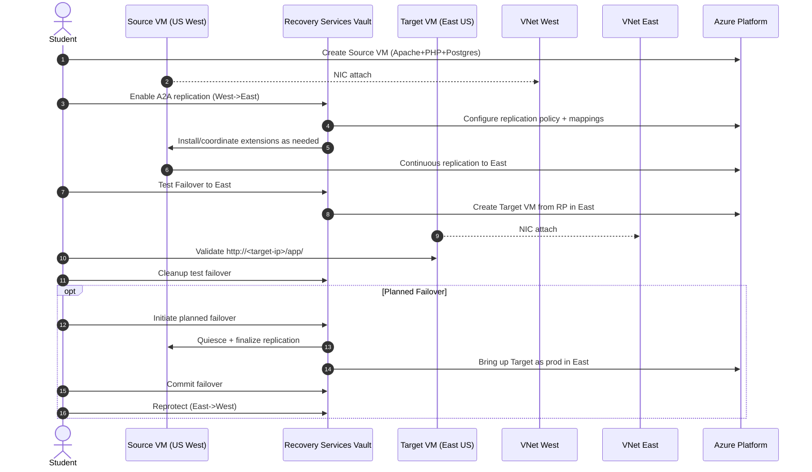

# Azure‑to‑Azure Linux (US West → East US) — Sequence

```mermaid
sequenceDiagram
    autonumber
    actor Student as Student
    participant SrcVM as Source VM (US West)
    participant Vault as Recovery Services Vault
    participant Target as Target VM (East US)
    participant WestVNet as VNet West
    participant EastVNet as VNet East
    participant Azure as Azure Platform

    Student->>Azure: Create Source VM (Apache+PHP+Postgres)
    SrcVM-->>WestVNet: NIC attach

    Student->>Vault: Enable A2A replication (West->East)
    Vault->>Azure: Configure replication policy + mappings
    Vault->>SrcVM: Install/coordinate extensions as needed
    SrcVM->>Azure: Continuous replication to East

    Student->>Vault: Test Failover to East
    Vault->>Azure: Create Target VM from RP in East
    Target-->>EastVNet: NIC attach
    Student->>Target: Validate http://<target-ip>/app/
    Student->>Vault: Cleanup test failover

    opt Planned Failover
        Student->>Vault: Initiate planned failover
        Vault->>SrcVM: Quiesce + finalize replication
        Vault->>Azure: Bring up Target as prod in East
        Student->>Vault: Commit failover
        Student->>Vault: Reprotect (East->West)
    end
```
