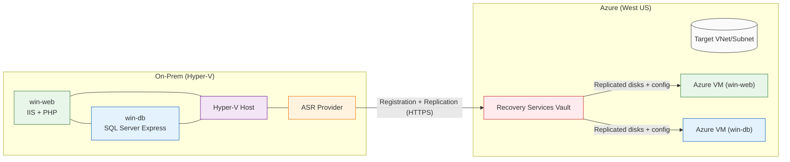

# Hyper‑V Windows → Azure (ASR)

```mermaid
flowchart LR
    subgraph OnPrem_HyperV["On-Prem (Hyper-V)"]
        WW["win-web\nIIS + PHP"]
        WD["win-db\nSQL Server Express"]
        HV["Hyper-V Host"]
        Provider["ASR Provider"]
        WW --- WD
        WW --- HV
        WD --- HV
        HV --- Provider
    end

    subgraph Azure_West["Azure (West US)"]
        RSV["Recovery Services Vault"]
        TVNet[(Target VNet/Subnet)]
        AWebVM["Azure VM (win-web)"]
        ADbVM["Azure VM (win-db)"]
    end

    Provider -- "Registration + Replication (HTTPS)" --> RSV
    RSV -- "Replicated disks + config" --> AWebVM
    RSV -- "Replicated disks + config" --> ADbVM

    %% Styles
    classDef web fill:#e8f5e9,stroke:#2e7d32,stroke-width:1px;
    classDef db fill:#e3f2fd,stroke:#1565c0,stroke-width:1px;
    classDef hv fill:#f3e5f5,stroke:#6a1b9a,stroke-width:1px;
    classDef agent fill:#fff3e0,stroke:#ef6c00,stroke-width:1px;
    classDef vault fill:#ffebee,stroke:#c62828,stroke-width:1px;
    classDef net fill:#fafafa,stroke:#424242,stroke-width:1px;

    %% Apply classes
    class WW,AWebVM web;
    class WD,ADbVM db;
    class HV hv;
    class Provider agent;
    class RSV vault;
    class TVNet net;

```
