# This module pulls together the usage of VM's to deploy a scalable and highly available using Scale and Availability with a simplistic sovereign AI model.

> [!TIP]
> This module has a separate file structure and the document to deploy the workload can be found here [AI Workload](AI_Workload_Folder/Module5_AI_Workload_Guide.md)

```mermaid
flowchart TD
    %% Mobile Client
    Mobile["📱  Mobile Device "] --> PublicLB["🌐  Azure Public Load Balancer "]

    %% Front-end Webservers VMSS
    subgraph FrontEndVMSS["🖥️  VM Scale Set Frontend"]
        direction TB
        PublicLB --> VM1["🧾  Ubuntu - Apache & PHP"]
        PublicLB --> VM2["🧾  Ubuntu - Apache & PHP"]
        PublicLB --> VM3["🧾  Ubuntu - Apache & PHP"]
    end

    %% Internal Load Balancer to Database
    FrontEndVMSS --> InternalLB["🔒  Azure Internal Load Balancer "]

    %% PostgreSQL Availability Set with Replication
    subgraph PGSet["🗄️  Availability Set - PostgreSQL "]
        direction LR
        subgraph FaultDomain1["💡 Fault Domain 1"]
            VMPrimary["📌  PostgreSQL Primary"]
        end
        subgraph FaultDomain2["💡 Fault Domain 2"]
            VMReplica["📄  PostgreSQL Replica (Streaming)"]
        end
    end

    InternalLB --> VMPrimary
    InternalLB --> VMReplica

    %% AI Model Server
    FrontEndVMSS --> AIModel["🤖  AI Model VM (CentOS / AlmaLinux)"]

    %% Data Flow
    VMPrimary -.->|Streaming Replication| VMReplica
```

