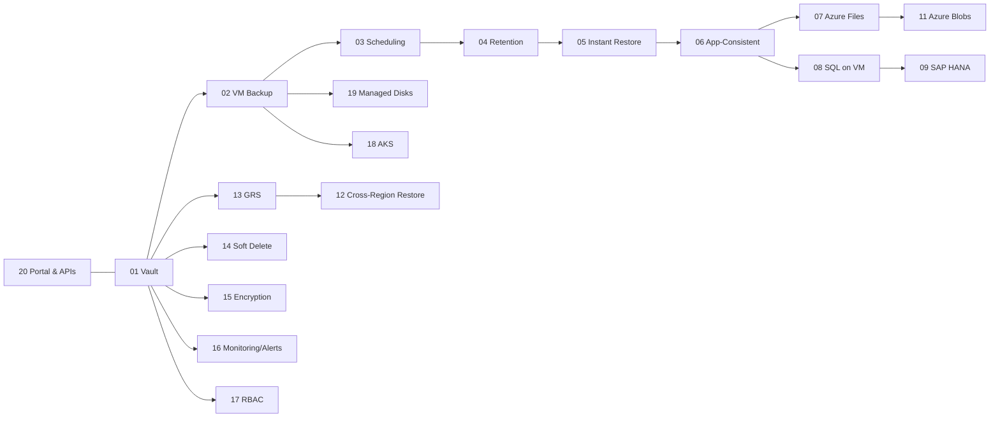

# Azure Backup Healthcare Workshop – Module Index

This file provides a quick navigation map for all **20 modules**, with pointers to scripts, diagrams, and learning goals.  
Place this file at the **root of the repository** (rename to `README.md` if you want it to be the main landing page).

> [!IMPORTANT]
> **HIPAA Context:** Treat all lab data as ePHI. Use test data only. Follow minimum-necessary access and least-privilege RBAC.

## Quick Start
```bash
cp config/env.sample config/.env
code config/.env      # fill in your values
bash infra/00_prereqs.sh
bash infra/01_create_rg_vnet.sh
bash infra/02_deploy_recovery_vault.sh
```

## Module Progression (Recommended Order)



## Table of Modules

| # | Module | What you’ll learn | Core script(s) | Diagrams | Est. Time |
|---:|---|---|---|---|---|
| 1 | [Azure Backup Vault](modules/Module01-Azure_Backup_Vault.md) | Centralized ePHI backup store; set redundancy & soft delete. | `infra/02_deploy_recovery_vault.sh` | assets/diagrams/module01_flow.mmd, assets/diagrams/module01_sequence.mmd | ~25–50 min |
| 2 | [Backup for Azure VMs](modules/Module02-Backup_for_Azure_VMs.md) | Protect Linux VM; on-demand backup; restore options overview. | `infra/03_backup_vm.sh` | assets/diagrams/module02_flow.mmd, assets/diagrams/module02_sequence.mmd | ~25–50 min |
| 3 | [Backup Scheduling](modules/Module03-Backup_Scheduling.md) | Daily schedule, time windows, policy assignment. | `infra/04_policies.sh` | assets/diagrams/module03_flow.mmd, assets/diagrams/module03_sequence.mmd | ~25–50 min |
| 4 | [Retention Policies](modules/Module04-Retention_Policies.md) | Daily/weekly/long-term retention; policy updates. | `infra/04_policies.sh` | assets/diagrams/module04_flow.mmd, assets/diagrams/module04_sequence.mmd | ~25–50 min |
| 5 | [Instant Restore](modules/Module05-Instant_Restore.md) | File/disk restore; mount recovery point. | `infra/05_instant_restore.sh` | assets/diagrams/module05_flow.mmd, assets/diagrams/module05_sequence.mmd | ~25–50 min |
| 6 | [Application Consistent Backups](modules/Module06-Application_Consistent_Backups.md) | Pre/post scripts; DB quiesce; VSS (Windows) overview. | `infra/06_app_consistent.sh` | assets/diagrams/module06_flow.mmd, assets/diagrams/module06_sequence.mmd | ~25–50 min |
| 7 | [Backup for Azure Files](modules/Module07-Backup_for_Azure_Files.md) | Protect Azure Files; point-in-time restore; policies. | `infra/07_backup_azure_files.sh` | assets/diagrams/module07_flow.mmd, assets/diagrams/module07_sequence.mmd | ~25–50 min |
| 8 | [Backup for SQL Server on Azure VMs](modules/Module08-Backup_for_SQL_Server_on_Azure_VMs.md) | Discover SQL workload; configure backups; DB restore. | `infra/08_backup_sql_on_vm.sh` | assets/diagrams/module08_flow.mmd, assets/diagrams/module08_sequence.mmd | ~25–50 min |
| 9 | [Backup for SAP HANA on Azure VMs](modules/Module09-Backup_for_SAP_HANA_on_Azure_VMs.md) | Register HANA; schedule; restore catalog. | `infra/09_backup_hana_on_vm.sh` | assets/diagrams/module09_flow.mmd, assets/diagrams/module09_sequence.mmd | ~25–50 min |
| 10 | [Backup for On-Premises Servers](modules/Module10-Backup_for_On-Premises_Servers.md) | MARS Agent; vault registration; recovery points. | `infra/10_backup_onprem_mars.sh` | assets/diagrams/module10_flow.mmd, assets/diagrams/module10_sequence.mmd | ~25–50 min |
| 11 | [Backup for Azure Blobs](modules/Module11-Backup_for_Azure_Blobs.md) | Versioning, soft delete, point-in-time restore. | `infra/11_backup_blobs.sh` | assets/diagrams/module11_flow.mmd, assets/diagrams/module11_sequence.mmd | ~25–50 min |
| 12 | [Cross-Region Restore](modules/Module12-Cross-Region_Restore.md) | Enable GRS; CRR workflow; validate restore. | `infra/12_cross_region_restore.sh` | assets/diagrams/module12_flow.mmd, assets/diagrams/module12_sequence.mmd | ~25–50 min |
| 13 | [Geo-Redundant Storage (GRS)](modules/Module13-Geo-Redundant_Storage_(GRS).md) | Set redundancy; cost/durability trade-offs. | `infra/13_grs_enable.sh` | assets/diagrams/module13_flow.mmd, assets/diagrams/module13_sequence.mmd | ~25–50 min |
| 14 | [Soft Delete](modules/Module14-Soft_Delete.md) | Enable/validate soft delete; undelete demo. | `infra/14_soft_delete.sh` | assets/diagrams/module14_flow.mmd, assets/diagrams/module14_sequence.mmd | ~25–50 min |
| 15 | [Encryption at Rest and In Transit](modules/Module15-Encryption_at_Rest_and_In_Transit.md) | CMK overview; TLS; key rotation plan. | `infra/15_encryption.sh` | assets/diagrams/module15_flow.mmd, assets/diagrams/module15_sequence.mmd | ~25–50 min |
| 16 | [Backup Alerts and Monitoring](modules/Module16-Backup_Alerts_and_Monitoring.md) | LA workspace; diagnostics; alert rules. | `infra/16_monitoring_alerts.sh` | assets/diagrams/module16_flow.mmd, assets/diagrams/module16_sequence.mmd | ~25–50 min |
| 17 | [Role-Based Access Control (RBAC)](modules/Module17-Role-Based_Access_Control_(RBAC).md) | Built-in roles; scoped assignments; PIM. | `infra/17_rbac.sh <user@contoso.com>` | assets/diagrams/module17_flow.mmd, assets/diagrams/module17_sequence.mmd | ~25–50 min |
| 18 | [Backup for Azure Kubernetes Service](modules/Module18-Backup_for_Azure_Kubernetes_Service.md) | PV backups; AKS registration; namespace restore. | `infra/18_backup_aks.sh` | assets/diagrams/module18_flow.mmd, assets/diagrams/module18_sequence.mmd | ~25–50 min |
| 19 | [Backup for Azure Managed Disks](modules/Module19-Backup_for_Azure_Managed_Disks.md) | Disk protection/restore outside VM context. | `infra/19_backup_managed_disks.sh` | assets/diagrams/module19_flow.mmd, assets/diagrams/module19_sequence.mmd | ~25–50 min |
| 20 | [Centralized Management via Azure Portal & APIs](modules/Module20-Centralized_Management_via_Azure_Portal_&_APIs.md) | az rest automation; tagging/governance. | `infra/20_portal_api.sh` | assets/diagrams/module20_flow.mmd, assets/diagrams/module20_sequence.mmd | ~25–50 min |

## Healthcare Compliance Focus by Module
- **Vault, Policies, Retention (M01–M04):** Data lifecycle governance; retention to meet organizational policy; auditing.  
- **Instant Restore & App Consistency (M05–M06):** Reduced RTO; validated integrity for EHR and imaging metadata (PostgreSQL, files).  
- **Workload Coverage (M07–M11, M18–M19):** Broadened protection for Azure Files, SQL/HANA on VM, Blobs, AKS PVs, and managed disks.  
- **Resilience & Security (M12–M17):** Cross-region restore, GRS, soft delete, encryption, alerting, and least-privilege RBAC.  
- **Operations (M20):** Command-line and API-driven governance for repeatable controls and reporting.

> [!TIP]
> After each module, document observations in `modules/lab-notes.md` and capture screenshots for audit readiness.

## On-Prem Lab Tie-in (Hyper‑V + VyOS)
- Use `scripts/onprem_vyos_ipsec_config.txt` to establish IPsec to Azure.  
- Provision test data with `scripts/backup_testdata.sh`.  
- Set up on-prem services: `scripts/onprem_postgres_init.sh`, `scripts/onprem_apache_init.sh`, `scripts/onprem_ai_server_init.sh`.

---
*Generated on 2025-08-13T01:11:22.441620Z*
