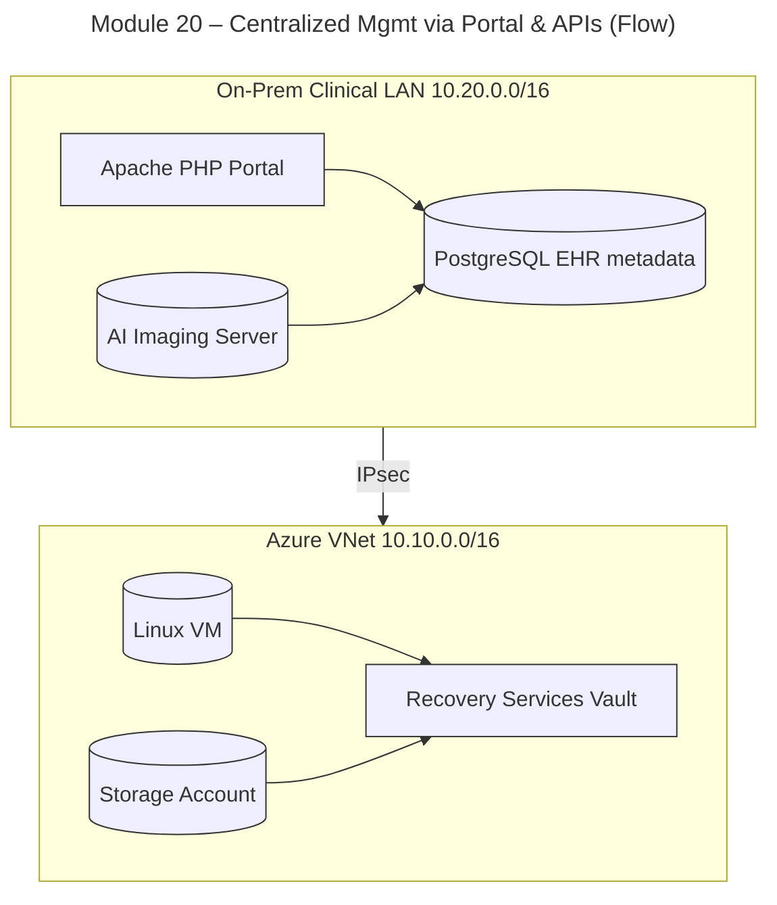
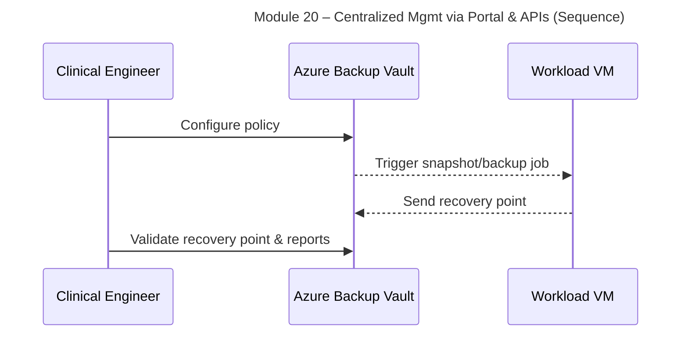

# Module 20: Centralized Mgmt via Portal & APIs

**Intent & Learning Objectives**  
This module introduces **Centralized Mgmt via Portal & APIs** and shows how to apply it in a healthcare context where electronic protected health information (ePHI) must be safeguarded under HIPAA. You will learn to: az rest calls, Automation scripts, Tagging/Governance.

> [!IMPORTANT]
> Healthcare context: Treat all data in this lab as if it were ePHI. Even in training, follow the **minimum necessary** principle and avoid using real patient data.

**Top Problems/Features this module addresses**  
- Consistent enterprise ops
- Repeatable automation


**Key Features Demonstrated**
- az rest calls
- Automation scripts
- Tagging/Governance

**Architecture Diagram (Flow)**  


**Sequence Diagram**  


## Prerequisites (Start Here)
1. Windows 11 with VS Code installed.
2. Azure subscription with Owner/Contributor permissions in a training resource group.
3. Open VS Code terminal (Bash) and run:
```bash
cp config/env.sample config/.env
code config/.env   # fill in values
```
4. Sign in and set subscription:
```bash
bash infra/00_prereqs.sh
```

## Step-by-Step Lab
1. Run the core script for this module:
```bash
bash infra/20_portal_api.sh
```
2. Validate results in Azure Portal and via CLI.
3. Document your observations in `modules/lab-notes.md`.

> [!TIP]
> You can re-run scripts; they are idempotent or safe to re-apply in this training context.

## Compliance Notes (HIPAA/HITECH)
- Ensure backups and logs are retained per your **organizational record retention** policy.
- Use **encryption at rest** and **TLS in transit**; limit who can restore data (least privilege).
- Maintain an **audit trail** for backup/restore events (Azure Monitor/LA workspace).

## Pros, Cons & Insights
**Pros**
- Centralized Mgmt via Portal & APIs improves resilience for clinical systems and reduces RTO/RPO.
- Integrates with Azure-native controls for monitoring and access.

**Cons**
- Misconfiguration can lead to gaps (e.g., policy not applied to new assets).
- Costs can increase with long-term retention or GRS; monitor usage.

> [!CAUTION]
> Restores of ePHI must follow your organization's **break-glass** procedures and approvals. Avoid exporting patient data to unmanaged endpoints.

**Validation**
- Capture screenshots of policies and recovery points.
- Perform a small restore test (e.g., non-sensitive file/database).

---

