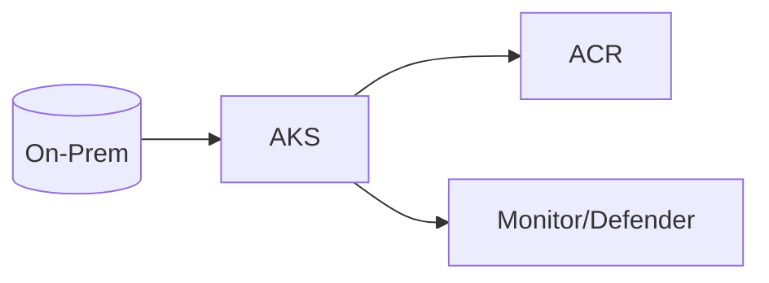
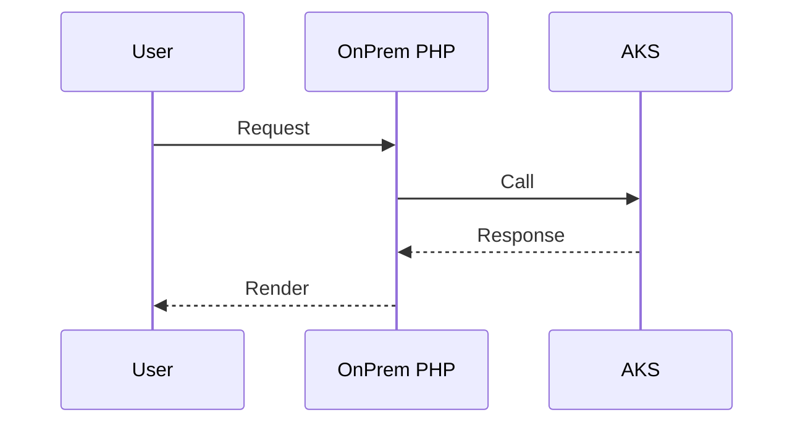

# Module 4: AKS Node Pools

**Intent & Learning Objectives**  
Segregate workloads by resource needs (e.g., compliance, performance) in healthcare clusters.

> [!IMPORTANT]
> Treat all lab data as ePHI. Use synthetic data only.

## Top Two Problems This Solves
1. Secure-by-default deployment for regulated data.
2. Repeatable automation for healthcare workloads.

## Architecture


**Sequence**


## Steps
```bash
cp config/env.sample config/.env
bash infra/00_prereqs.sh
bash infra/01_rg_vnet.sh
bash infra/module04_aks_node_pools.sh || true
```
