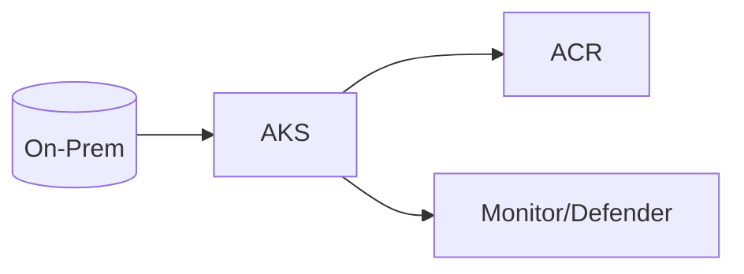
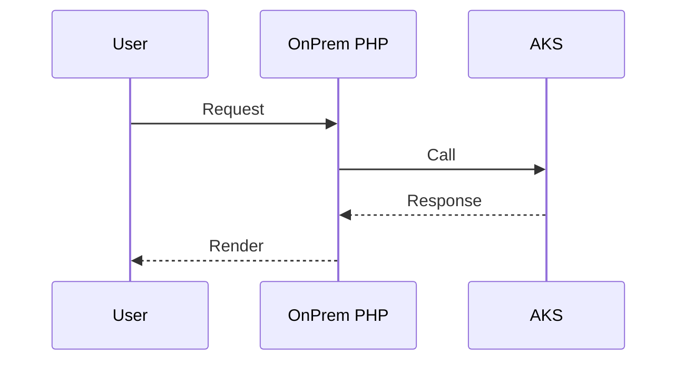

# Module 7: AKS Storage Integration

**Intent & Learning Objectives**  
Persistent storage for stateful healthcare apps (e.g., EHR/EMR).

> [!IMPORTANT]
> Treat all lab data as ePHI. Use synthetic data only.

## Top Two Problems This Solves
1. Secure-by-default deployment for regulated data.
2. Repeatable automation for healthcare workloads.

## Architecture


**Sequence**


## Steps
```bash
cp config/env.sample config/.env
bash infra/00_prereqs.sh
bash infra/01_rg_vnet.sh
bash infra/module07_aks_storage_integration.sh || true
```
