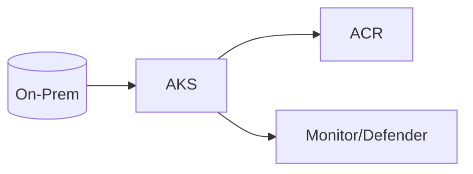
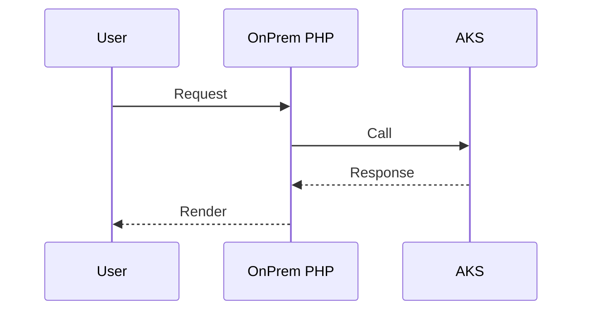

# Module 20: AKS Support for AI/ML Workloads

**Intent & Learning Objectives**  
Runs healthcare AI/ML models and analytics in containers at scale.

> [!IMPORTANT]
> Treat all lab data as ePHI. Use synthetic data only.

## Top Two Problems This Solves
1. Secure-by-default deployment for regulated data.
2. Repeatable automation for healthcare workloads.

## Architecture


**Sequence**


## Steps
```bash
cp config/env.sample config/.env
bash infra/00_prereqs.sh
bash infra/01_rg_vnet.sh
bash infra/module20_aks_support_for_ai_ml_workloads.sh || true
```
