# Azure Migrate Healthcare Workshop – Module Index

This file provides a quick navigation map for all **20 modules**, with pointers to scripts, diagrams, and learning goals.
Place this file at the **root of the repository** (rename to `README.md` if you want it to be the main landing page).

> [!IMPORTANT]
> **HIPAA Context:** Treat all lab data as ePHI. Use **test data only**. Follow minimum-necessary access and least-privilege **RBAC**.

## Repository Structure
```
├── .vscode/
├── app/
│   ├── ai/
│   └── web/
├── assets/
│   ├── docs/
│   ├── images/
│   └── diagrams/
├── config/
├── db/
├── infra/
├── modules/
├── scripts/
└── system/
```

## Quick Start
```bash
cp config/env.sample config/.env
code config/.env      # fill in your values
bash infra/01_create_rg_vnet.sh
bash infra/02_deploy_vpn_gateway.sh
```

## Module Progression (Recommended Order)

```mermaid
flowchart LR
  subgraph Foundational_Phases
    direction LR
    M01["01 Unified Portal"] --> M02["02 Discovery"] --> M03["03 Dependency Mapping"] --> M04["04 Assessment"] --> M05["05 Cost/TCO"] --> M06["06 Planning"]
  end
  M06 --> M07["07 Server Migration"]
  M07 --> M08["08 Database Migration"]
  M08 --> M09["09 Web App Migration"]
  M09 --> M10["10 Data Box"]
  M10 --> M11["11 Cutover"]
  M11 --> M12["12 Site Recovery"]
  M06 --> M13["13 Security Compliance"]
  M13 --> M14["14 Encryption"]
  M14 --> M15["15 RBAC"]
  M12 --> M16["16 Modernization"]
  M16 --> M17["17 Cloud for Healthcare"]
  M17 --> M18["18 AI & Analytics"]
  M15 --> M19["19 Purview"]
  M18 --> M19
  M19 --> M20["20 Monitoring"]
```


## Table of Modules

| # | Module | What you’ll learn | Core script(s) | Diagrams | Est. Time |
|---:|---|---|---|---|---|
| 1 | [Unified Azure Migrate Portal](modules/Module01-Unified_Azure_Migrate_Portal.md) | Azure Migrate hub overview; create project; navigate tools & tracking. | `infra/01_create_rg_vnet.sh` `infra/02_deploy_vpn_gateway.sh` | assets/diagrams/module01_flow.mmd | ~30–45 min |
| 2 | [Discovery & Inventory](modules/Module02-Discovery_and_Inventory.md) | Agentless/agent-based discovery; appliance setup; scope and tags. | `scripts/onprem_hyperv_appliance_setup.ps1` | assets/diagrams/module02_flow.mmd | ~30–60 min |
| 3 | [Dependency Mapping](modules/Module03-Dependency_Mapping.md) | Service map; network flows; change risk scoring. | (Portal-driven) | assets/diagrams/module03_flow.mmd | ~25–50 min |
| 4 | [Assessment & Readiness Analysis](modules/Module04-Assessment_and_Readiness_Analysis.md) | Sizing; readiness; blockers & remediation. | `infra/03_run_assessment.sh` | assets/diagrams/module04_flow.mmd | ~25–50 min |
| 5 | [Cost Estimation & TCO Analysis](modules/Module05-Cost_Estimation_&_TCO_Analysis.md) | Cost models; reservations; TCO export. | `infra/04_export_costs.sh` | assets/diagrams/module05_flow.mmd | ~25–50 min |
| 6 | [Migration Planning & Wave Scheduling](modules/Module06-Migration_Planning_&_Wave_Scheduling.md) | Waves; blackout windows; change control. | `assets/docs/wave_plan.md` | assets/diagrams/module06_flow.mmd | ~25–50 min |
| 7 | [Server Migration](modules/Module07-Server_Migration.md) | Replication; test migrations; cutover. | `infra/05_server_migration.sh` | assets/diagrams/module07_flow.mmd | ~30–60 min |
| 8 | [Database Migration Service Integration](modules/Module08-Database_Migration_Service_Integration.md) | Migrate PostgreSQL/SQL/Oracle; minimal downtime. | `infra/06_database_migration.sh` | assets/diagrams/module08_flow.mmd | ~30–60 min |
| 9 | [Web App Migration Assistant](modules/Module09-Web_App_Migration_Assistant.md) | Move LAMP/.NET apps to App Service. | `infra/07_web_app_migration.sh` | assets/diagrams/module09_flow.mmd | ~25–50 min |
| 10 | [Azure Data Box Integration](modules/Module10-Azure_Data_Box_Integration.md) | Bulk data transfers; DICOM images. | (Process) | assets/diagrams/module10_flow.mmd | ~20–40 min |
| 11 | [Minimal-Downtime Cutover](modules/Module11-Minimal-Downtime_Cutover.md) | Final sync; health checks; rollback plan. | (Portal-driven) | assets/diagrams/module11_sequence.mmd | ~25–50 min |
| 12 | [Azure Site Recovery Integration](modules/Module12-Azure_Site_Recovery_Integration.md) | Protect to DR region; test failover. | `infra/08_enable_asr.sh` | assets/diagrams/module12_flow.mmd | ~30–60 min |
| 13 | [Security & Compliance Assessment](modules/Module13-Security_&_Compliance_Assessment.md) | HIPAA/HITRUST policy; Defender for Cloud. | `infra/09_enable_security.sh` | assets/diagrams/module13_flow.mmd | ~25–50 min |
| 14 | [Encryption & Data Protection](modules/Module14-Encryption_&_Data_Protection.md) | Disk/TLS/CMK; double encryption. | `infra/10_configure_encryption.sh` | assets/diagrams/module14_flow.mmd | ~25–50 min |
| 15 | [Role-Based Access Control (RBAC)](modules/Module15-Role-Based_Access_Control_(RBAC).md) | Least privilege; PIM; custom roles. | `infra/11_rbac_setup.sh` `infra/11_rbac_customrole.sh` | assets/diagrams/module15_flow.mmd | ~20–40 min |
| 16 | [Application Modernization Tools](modules/Module16-Application_Modernization_Tools.md) | Containers/Functions; AKS; CI/CD. | `infra/12_containerize_ai.sh` `infra/13_deploy_aks.sh` | assets/diagrams/module16_flow.mmd | ~30–60 min |
| 17 | [Integration with Microsoft Cloud for Healthcare](modules/Module17-Integration_with_Microsoft_Cloud_for_Healthcare.md) | FHIR/DICOM services; ingestion pipelines. | `infra/14_deploy_health_data_services.sh` | assets/diagrams/module17_flow.mmd | ~30–60 min |
| 18 | [AI & Analytics Enablement](modules/Module18-AI_&_Analytics_Enablement.md) | Synapse/Fabric; notebooks; MLOps. | `infra/15_enable_analytics.sh` | assets/diagrams/module18_flow.mmd | ~30–60 min |
| 19 | [Data Governance with Microsoft Purview](modules/Module19-Data_Governance_with_Microsoft_Purview.md) | Classify PHI/FHIR/DICOM; lineage. | `infra/16_purview_setup.sh` | assets/diagrams/module19_flow.mmd | ~25–50 min |
| 20 | [Centralized Monitoring & Reporting](modules/Module20-Centralized_Monitoring_&_Reporting.md) | Dashboards; KQL; alerts. | `infra/17_monitoring_dashboard.sh` | assets/diagrams/module20_flow.mmd | ~25–50 min |

## On-Prem Lab Tie-in (Hyper-V + VyOS)
- Use `scripts/onprem_vyos_ipsec_config.txt` to establish IPsec to Azure.
- Provision test data with `scripts/onprem_postgres_init.sh`.
- Deploy app & AI services with `scripts/onprem_apache_init.sh` and `scripts/onprem_ai_server_init.sh`.
