# Azure Monitor Healthcare Workshop – Module Index
> [!IMPORTANT]
> **HIPAA Context:** Use only synthetic/test data. Enforce least-privilege RBAC and encrypt in transit/at rest.
## Quick Start
```bash
cp config/env.sample config/.env
code config/.env
bash infra/00_prereqs.sh
bash infra/01_create_rg_vnet.sh
bash infra/02_setup_metrics_vm.sh
```
## Module Progression

```mermaid
flowchart LR
  M01["01 Azure Monitor Metrics"]
  M02["02 Azure Monitor Logs"]
  M03["03 Activity Log Monitoring"]
  M04["04 Alerts and Notifications"]
  M05["05 Dashboards and Visualization"]
  M06["06 Application Insights"]
  M07["07 Network Monitoring"]
  M08["08 Container Monitoring"]
  M09["09 VM Insights"]
  M10["10 Service Health Monitoring"]
  M11["11 Workbooks"]
  M12["12 Azure Monitor for SAP Solutions"]
  M13["13 Azure Monitor for SQL"]
  M14["14 Azure Monitor for Storage"]
  M15["15 Defender for Cloud Integration"]
  M16["16 Compliance Monitoring"]
  M17["17 Healthcare Log Analytics Solutions"]
  M18["18 Custom Log Ingestion"]
  M19["19 Sentinel Integration"]
  M20["20 Automated Remediation"]
M01 --> M02 --> M03 --> M04 --> M05 --> M06 --> M07 --> M08 --> M09 --> M10 --> M11 --> M12 --> M13 --> M14 --> M15 --> M16 --> M17 --> M18 --> M19 --> M20
```


## Table of Modules

| # | Module | Summary | Scripts | Diagrams | Time |
|---:|---|---|---|---|---|
| 1 | [Module01-Azure_Monitor_Metrics.md](modules/Module01-Azure_Monitor_Metrics.md) | Collects and analyzes performance metrics from healthcare resources. | `infra` | assets/diagrams/module01_*.mmd | ~30–60m |
| 2 | [Module02-Azure_Monitor_Logs.md](modules/Module02-Azure_Monitor_Logs.md) | Centralized log collection and KQL querying for healthcare workloads. | `infra` | assets/diagrams/module02_*.mmd | ~30–60m |
| 3 | [Module03-Activity_Log_Monitoring.md](modules/Module03-Activity_Log_Monitoring.md) | Tracks control-plane changes to Azure resources for auditing/compliance. | `infra` | assets/diagrams/module03_*.mmd | ~30–60m |
| 4 | [Module04-Alerts_and_Notifications.md](modules/Module04-Alerts_and_Notifications.md) | Automated alerts for performance, security, and compliance events. | `infra` | assets/diagrams/module04_*.mmd | ~30–60m |
| 5 | [Module05-Dashboards_and_Visualization.md](modules/Module05-Dashboards_and_Visualization.md) | Custom dashboards for real-time healthcare workload monitoring. | `infra` | assets/diagrams/module05_*.mmd | ~30–60m |
| 6 | [Module06-Application_Insights.md](modules/Module06-Application_Insights.md) | Deep application monitoring (requests, dependencies, exceptions, availability). | `infra` | assets/diagrams/module06_*.mmd | ~30–60m |
| 7 | [Module07-Network_Monitoring.md](modules/Module07-Network_Monitoring.md) | Monitor VPN/NSGs/flows and hybrid connectivity with Network Watcher. | `infra` | assets/diagrams/module07_*.mmd | ~30–60m |
| 8 | [Module08-Container_Monitoring.md](modules/Module08-Container_Monitoring.md) | Track AKS/Docker health, logs, and performance for microservices. | `infra` | assets/diagrams/module08_*.mmd | ~30–60m |
| 9 | [Module09-VM_Insights.md](modules/Module09-VM_Insights.md) | Process maps and dependency insights for VMs hosting PHI/PII. | `infra` | assets/diagrams/module09_*.mmd | ~30–60m |
| 10 | [Module10-Service_Health_Monitoring.md](modules/Module10-Service_Health_Monitoring.md) | Monitor Azure service status and resource health events. | `infra` | assets/diagrams/module10_*.mmd | ~30–60m |
| 11 | [Module11-Workbooks.md](modules/Module11-Workbooks.md) | Interactive analytics combining metrics and logs for healthcare teams. | `infra` | assets/diagrams/module11_*.mmd | ~30–60m |
| 12 | [Module12-Azure_Monitor_for_SAP_Solutions.md](modules/Module12-Azure_Monitor_for_SAP_Solutions.md) | Specialized monitoring for SAP (HANA/NetWeaver) in healthcare. | `infra` | assets/diagrams/module12_*.mmd | ~30–60m |
| 13 | [Module13-Azure_Monitor_for_SQL.md](modules/Module13-Azure_Monitor_for_SQL.md) | Advanced monitoring for SQL databases storing PHI/PII. | `infra` | assets/diagrams/module13_*.mmd | ~30–60m |
| 14 | [Module14-Azure_Monitor_for_Storage.md](modules/Module14-Azure_Monitor_for_Storage.md) | Track performance and access of storage accounts holding ePHI. | `infra` | assets/diagrams/module14_*.mmd | ~30–60m |
| 15 | [Module15-Defender_for_Cloud_Integration.md](modules/Module15-Defender_for_Cloud_Integration.md) | Unified security posture and threat detection telemetry. | `infra` | assets/diagrams/module15_*.mmd | ~30–60m |
| 16 | [Module16-Compliance_Monitoring.md](modules/Module16-Compliance_Monitoring.md) | Automated compliance checks for HIPAA/HITRUST and controls evidence. | `infra` | assets/diagrams/module16_*.mmd | ~30–60m |
| 17 | [Module17-Healthcare_Log_Analytics_Solutions.md](modules/Module17-Healthcare_Log_Analytics_Solutions.md) | Pre-built healthcare analytics (FHIR/HL7/EHR telemetry). | `infra` | assets/diagrams/module17_*.mmd | ~30–60m |
| 18 | [Module18-Custom_Log_Ingestion.md](modules/Module18-Custom_Log_Ingestion.md) | Ingest on-prem/custom logs into Azure Monitor. | `infra` | assets/diagrams/module18_*.mmd | ~30–60m |
| 19 | [Module19-Sentinel_Integration.md](modules/Module19-Sentinel_Integration.md) | SIEM for advanced detection, hunting, incident response. | `infra` | assets/diagrams/module19_*.mmd | ~30–60m |
| 20 | [Module20-Automated_Remediation.md](modules/Module20-Automated_Remediation.md) | Logic Apps/Runbooks to auto-resolve monitored issues. | `infra` | assets/diagrams/module20_*.mmd | ~30–60m |
