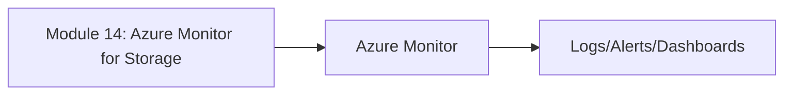
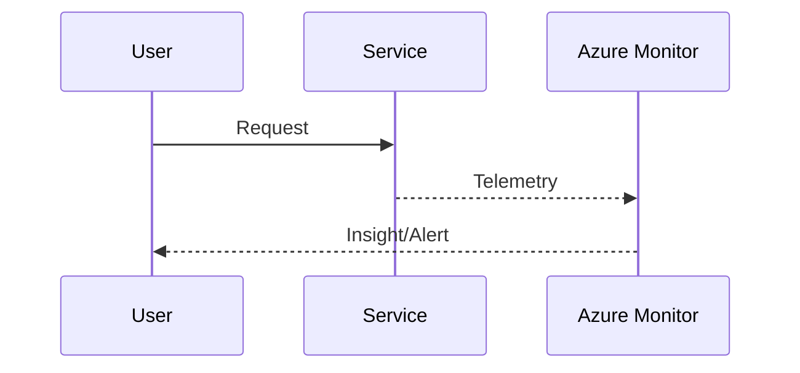

# Module 14: Azure Monitor for Storage

**Intent & Learning Objectives:**  
This module explains **Track performance and access of storage accounts holding ePHI.** in the context of healthcare (providers and payors). By the end, you will:  
- Understand the core concepts and **three key features** of Azure Monitor for Storage.  
- Deploy and configure Azure resources via **Bash (Azure CLI)** from VS Code.  
- Validate telemetry using **KQL** and visualize with **Azure Monitor**.

**Top Two Problems / Features**  
1. **Problem/Feature A:** Storage access auditing (read/write/delete).  
2. **Problem/Feature B:** Latency/throughput metrics for imaging archives.

> [!IMPORTANT]
> Treat all lab data as ePHI. Use only **synthetic** data. Apply least-privilege RBAC on Log Analytics and dashboards.

**Architecture Diagram**  
See: `assets/diagrams/module14_flow.mmd` and `assets/diagrams/module14_sequence.mmd`.




## Step-by-Step Lab

1. **Prepare environment**  
   ```bash
   cp config/env.sample config/.env
   code config/.env
   bash infra/00_prereqs.sh
   ```

2. **Deploy/Configure**  
   ```bash
   bash infra/15_storage_monitoring.sh
   ```

3. **Validate in Portal/KQL**  
   Example KQL:
   ```kusto
   StorageBlobLogs | take 10
   ```

4. **(Optional) Alerting/Visualization**  
   - Pin a chart to dashboard or create an alert as described in the module.

> [!CAUTION]
> Verify resource **locations** and **quotas**. Monitoring data at rest may be subject to org retention policy.

## Pros, Cons & Insights
**Pros:** Detects unauthorized access; capacity planning.  
**Cons:** Large event volumes for hot blobs/files.  
**Insights:** Enable immutability and soft-delete where appropriate.

## Compliance Notes
- **HIPAA/HITRUST:** Use Log Analytics RBAC; retain logs per policy (e.g., 90–365+ days).  
- **FHIR/DICOM:** Avoid placing PHI in diagnostic messages; instrument at metadata level if possible.  
- **Auditability:** Export Activity Logs and App logs for long-term archival if required.

> [!TIP]
> Commit your scripts/diagrams to source control and track changes like any production IaC.
