# Azure Networking for Healthcare – Workshop Index

> [!IMPORTANT]
> **HIPAA / HITRUST context:** Use **mock/test data only**. Treat all artifacts as ePHI for discipline. Enforce **least privilege RBAC**, **Private Endpoints**, **TLS 1.2+**, and **CMK** where indicated. Log access and changes for auditability.

This workshop is designed for **new computer engineers in healthcare** with **zero prior Azure experience**. You’ll progress from core networking fundamentals to hybrid and healthcare-specific integrations. Every module includes step-by-step labs, compliance callouts (**HIPAA**, **HITRUST**, **FHIR**, **DICOM**), and working scripts.

---

## Quick Start

```bash
# 1) Configure environment
cp config/env.sample config/.env
code config/.env  # set SUBSCRIPTION_ID, RG_NAME, LOCATION, etc.
source config/.env

# 2) Prepare Azure prerequisites
bash infra/00_prereqs.sh
```

> [!TIP]
> Work from **Windows + VS Code**. Use the **VS Code integrated terminal** or **Azure Cloud Shell (bash)**.
> Recommended extensions are pre-configured in `.vscode/`.

---

## Learning Path (Recommended Order)

```mermaid
flowchart LR
  M01["01 VNet"] --> M02["02 Subnets"] --> M03["03 NSG"] --> M04["04 Public IP"]
  M04 --> M05["05 Private Endpoints"] --> M06["06 Azure DNS"] --> M07["07 VNet Peering"]
  M07 --> M08["08 UDR"] --> M09["09 Firewall"] --> M10["10 Load Balancer"] --> M11["11 App Gateway (WAF)"]
  M11 --> M12["12 VPN Gateway"] --> M13["13 ExpressRoute"] --> M14["14 Bastion"]
  M14 --> M15["15 Front Door"] --> M16["16 Traffic Manager"]
  M16 --> M17["17 DDoS"] --> M18["18 Network Watcher"] --> M19["19 vWAN"] --> M20["20 MC4H Integration"]
```




> [!CAUTION]
> Some modules can incur additional cost (e.g., **WAF_v2**, **Front Door**, **ExpressRoute**, **Bastion**, **vWAN**, **Log Analytics**). Use a **training** subscription and clean up when finished:
> ```bash
> az group delete -n "$RG_NAME" --yes --no-wait
> ```

---

## Table of Modules

| # | Module | What you’ll learn | Core script(s) | Diagrams | Est. Time |
|---:|---|---|---|---|---|
| 1 | [Virtual Network (VNet)](modules/Module01-Virtual_Network_(VNet).md) | Core private network for Azure resources, enabling secure communication. | `infra/m01_vnet.sh` | `assets/diagrams/module01_flow.mmd`, `module01_sequence.mmd` | 40–60 min |
| 2 | [Subnets](modules/Module02-Subnets.md) | Logical segmentation within VNets for organizing workloads. | `infra/m02_subnets.sh` | `assets/diagrams/module02_flow.mmd`, `module02_sequence.mmd` | 35–50 min |
| 3 | [Network Security Groups (NSG)](modules/Module03-Network_Security_Groups_(NSG).md) | Stateful L4 filtering for subnets/NICs. | `infra/m03_nsg.sh` | `assets/diagrams/module03_flow.mmd`, `module03_sequence.mmd` | 45–60 min |
| 4 | [Public IP Addresses](modules/Module04-Public_IP_Addresses.md) | Public reachability for selected resources. | `infra/m04_public_ip.sh` | `assets/diagrams/module04_flow.mmd`, `module04_sequence.mmd` | 30–45 min |
| 5 | [Private Endpoints](modules/Module05-Private_Endpoints.md) | Private access to PaaS services over VNet. | `infra/m05_private_endpoints.sh` | `assets/diagrams/module05_flow.mmd`, `module05_sequence.mmd` | 60–90 min |
| 6 | [Azure DNS](modules/Module06-Azure_DNS.md) | Authoritative DNS zones and records; private DNS. | `infra/m06_azure_dns.sh` | `assets/diagrams/module06_flow.mmd`, `module06_sequence.mmd` | 45–60 min |
| 7 | [VNet Peering](modules/Module07-VNet_Peering.md) | Connect VNets across regions/subscriptions. | `infra/m07_vnet_peering.sh` | `assets/diagrams/module07_flow.mmd`, `module07_sequence.mmd` | 40–60 min |
| 8 | [User Defined Routes (UDR)](modules/Module08-User_Defined_Routes_(UDR).md) | Custom routing tables for traffic control. | `infra/m08_udr.sh` | `assets/diagrams/module08_flow.mmd`, `module08_sequence.mmd` | 40–60 min |
| 9 | [Azure Firewall](modules/Module09-Azure_Firewall.md) | Managed firewall for centralized protection. | `infra/m09_firewall.sh` | `assets/diagrams/module09_flow.mmd`, `module09_sequence.mmd` | 60–90 min |
| 10 | [Azure Load Balancer](modules/Module10-Azure_Load_Balancer.md) | L4 load balancing for TCP/UDP. | `infra/m10_load_balancer.sh` | `assets/diagrams/module10_flow.mmd`, `module10_sequence.mmd` | 60–90 min |
| 11 | [Application Gateway (WAF)](modules/Module11-Application_Gateway_(WAF).md) | Layer 7 load balancing + WAF for healthcare apps. | `infra/m11_app_gateway.sh` | `assets/diagrams/module11_flow.mmd`, `module11_sequence.mmd` | 75–110 min |
| 12 | [VPN Gateway](modules/Module12-VPN_Gateway.md) | Site-to-site (VyOS) or P2S VPN to Azure. | `infra/m12_vpn_gateway.sh` | `assets/diagrams/module12_flow.mmd`, `module12_sequence.mmd` | 75–120 min |
| 13 | [ExpressRoute](modules/Module13-ExpressRoute.md) | Private dedicated connectivity to Azure. | `infra/m13_expressroute.sh` | `assets/diagrams/module13_flow.mmd`, `module13_sequence.mmd` | 60–90 min |
| 14 | [Azure Bastion](modules/Module14-Azure_Bastion.md) | Browser-based RDP/SSH without public IPs. | `infra/m14_bastion.sh` | `assets/diagrams/module14_flow.mmd`, `module14_sequence.mmd` | 35–50 min |
| 15 | [Azure Front Door](modules/Module15-Azure_Front_Door.md) | Global HTTP/HTTPS load balancing and acceleration. | `infra/m15_front_door.sh` | `assets/diagrams/module15_flow.mmd`, `module15_sequence.mmd` | 60–90 min |
| 16 | [Traffic Manager](modules/Module16-Traffic_Manager.md) | DNS-based global traffic distribution. | `infra/m16_traffic_manager.sh` | `assets/diagrams/module16_flow.mmd`, `module16_sequence.mmd` | 45–75 min |
| 17 | [DDoS Protection](modules/Module17-DDoS_Protection.md) | Protection from volumetric DDoS attacks. | `infra/m17_ddos.sh` | `assets/diagrams/module17_flow.mmd`, `module17_sequence.mmd` | 30–45 min |
| 18 | [Network Watcher](modules/Module18-Network_Watcher.md) | Monitoring, diagnostics, and analytics. | `infra/m18_network_watcher.sh` | `assets/diagrams/module18_flow.mmd`, `module18_sequence.mmd` | 45–60 min |
| 19 | [Virtual WAN](modules/Module19-Virtual_WAN.md) | Large-scale branch connectivity and routing. | `infra/m19_virtual_wan.sh` | `assets/diagrams/module19_flow.mmd`, `module19_sequence.mmd` | 75–120 min |
| 20 | [Integration with Microsoft Cloud for Healthcare](modules/Module20-Integration_with_Microsoft_Cloud_for_Healthcare.md) | Secure networking for AHDS (FHIR/DICOM). | `infra/m20_mc4h.sh` | `assets/diagrams/module20_flow.mmd`, `module20_sequence.mmd` | 75–120 min |

---

## Repository Layout

```
AzureNetworkingHealthcareWorkshop/
├─ README.md
├─ modules/                     # 20 module markdown guides + lab notes
├─ infra/                       # Bash scripts (Azure CLI) per module
├─ assets/
│  ├─ diagrams/                 # Mermaid .mmd flow/sequence per module
│  ├─ docs/                     # Supplemental refs
│  └─ images/                   # Images embedded in modules
├─ app/
│  ├─ web/                      # PHP portal + probes
│  └─ ai/                       # Latency tester (Python)
├─ scripts/                     # Mock ePHI generator, VyOS config, helpers
├─ db/                          # Sample schema + seed
├─ config/                      # env.sample → .env for labs
└─ .vscode/                     # Editor settings + recommended extensions
```

---

## Compliance Focus by Module

- **Network Security & Access (M03–M11):** NSG rules, Private Endpoints + DNS, UDR + Firewall, L4/L7 load balancers and WAF.
- **Hybrid Connectivity (M12–M13, M19):** VPN Gateway, ExpressRoute (provider coordination), and Virtual WAN.
- **Secure Access (M14):** Azure Bastion (no public SSH/RDP).
- **Global Distribution (M15–M16):** Front Door and Traffic Manager for low-latency patient portal access.
- **Protection & Observability (M17–M18):** DDoS Standard and Network Watcher diagnostics.
- **Healthcare Services (M20):** Azure Health Data Services (FHIR/DICOM) with Private Endpoints and auditing.

> [!IMPORTANT]
> **FHIR/DICOM:** Use correct media types and RBAC scopes. Azure Health Data Services endpoints should be private and audited via diagnostics.

---

## Common Tasks

- **Generate mock ePHI data:**
  ```bash
  python3 scripts/mock_ephi_generator.py
  ```
- **Run a module script:**
  ```bash
  bash infra/m01_vnet.sh     # replace with the module you are working on
  ```
- **Clean up (delete lab resources):**
  ```bash
  bash scripts/azure_cleanup.sh
  ```

> [!CAUTION]
> Never upload real PHI/PII into training environments. Prefer **Managed Identities** and **RBAC** over shared keys when building apps.

---

## Troubleshooting

- **`az` not found**: Install Azure CLI or use Azure Cloud Shell.
- **Permissions**: Ensure your user has **Owner** or sufficient rights.
- **Private Endpoint DNS**: Configure **Private DNS zone** and linking; verify name resolution from your VM.
- **Provider coordination (ExpressRoute)**: Circuit creation is Azure-side only; you must work with the provider to complete provisioning.
