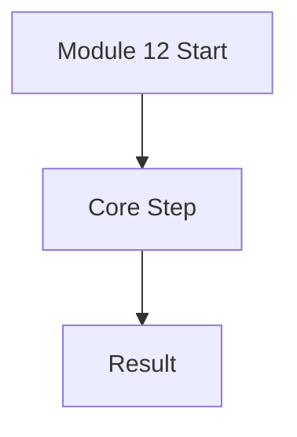
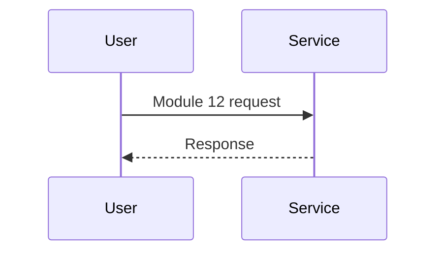

# Module 12: Built-in CI/CD Pipelines (OpenShift Pipelines)

**Intent & Learning Objectives:** Hands-on introduction to **Built-in CI/CD Pipelines (OpenShift Pipelines)** for healthcare workloads (HIPAA/HITRUST/FHIR/DICOM). You will start from zero and finish with a working, validated configuration.

> [!IMPORTANT]
> Top two problems this module solves: **Automation**, **Quality gates**.

**Key Features Demonstrated:** At least three core capabilities of built-in ci/cd pipelines (openshift pipelines) with step-by-step labs and verification.

## Architecture Diagram


## Sequence Diagram


## Step-by-Step
1. **Prepare Environment**  
   ```bash
   source config/.env
   ```
2. **Execute Core Script(s) / Commands**  
   ```bash
   # Scripts: infra/12_pipeline_setup.sh
   # (See comments inside each script for parameters and prerequisites)
   ```
3. **Validate**  
   Use `oc` and portal to verify status. Capture screenshots into `assets/images/` for audit evidence.

> [!CAUTION]
> Delete lab resources after completion to avoid costs. Never test with real PHI.

## Pros, Cons & Insights
- **Pros:** Secure-by-default patterns, Azure/Red Hat managed components, strong auditability.
- **Cons:** Cost of redundancy, learning curve for operators, need for disciplined IAM.
- **Insight:** Map technical controls to HIPAA safeguards (e.g., RBAC ↔ minimum necessary, TLS/mTLS ↔ transmission security).

### Sample CI/CD (Tekton)
- Apply Subscription: `bash infra/12_pipeline_setup.sh`
- Commit to GitHub; configure a PipelineRun to build `app/web/` PHP image and deploy to OpenShift.
