# Azure Site Recovery Hands‑On Workshop (VMware + Hyper‑V + Azure‑to‑Azure)

This hands‑on workshop lets a student configure and test **Azure Site Recovery (ASR)** across three scenarios:

1) **On‑prem Linux (VMware/ESXi)**: Apache + PHP web tier → **PostgreSQL** DB tier  
2) **On‑prem Windows (Hyper‑V)**: IIS + PHP web tier → **SQL Server Express** DB tier  
3) **Azure‑to‑Azure Linux**: Apache + PHP + **PostgreSQL** running in **US West**, replicated to **East US**

The sample apps show a simple PHP web page that reads from the database using a shared `trek_northwind` schema.

> **Prereqs:** Azure subscription with Contributor role; on‑prem access to **ESXi/vCenter** and **Hyper‑V**; outbound internet from on‑prem; local admin on all VMs; ability to create a Recovery Services vault and test VNets.

---

## 📑 Table of Contents

- [0) On‑Prem Lab Topology](#0-on-prem-lab-topology-you-provision)
- [1) Prep the Linux Web + DB (VMware/ESXi)](#1-prep-the-linux-web--db-vmwareesxi)
  - [Architecture (Mermaid)](#architecture-vmware-linux-to-azure)
  - [Linux Web Prep Script](#linux-web-prep-script-scriptslinux_vm_prepsh)
  - [Linux DB Prep Script](#linux-db-prep-script-scriptslinux_db_prep_postgressh)
  - [PHP App (Linux/Postgres)](#php-app-linuxpostgres-workloadslinux_vmwareweb)
  - [PostgreSQL Schema](#postgresql-schema-workloadslinux_vmwaredbtrek_northwindsql)
  - [Sequence Diagram](#sequence-vmware-linux-to-azure)
- [2) Prep the Windows IIS + SQL Server (Hyper‑V)](#2-prep-the-windows-iis--sql-server-hyper-v)
  - [Architecture (Mermaid)](#architecture-hyper-v-windows-to-azure)
  - [Windows IIS + SQL Prep Script](#windows-iis--sql-prep-script-scriptswindows_iis_sql_prepps1)
  - [PHP App (Windows/SQL Server)](#php-app-windows-sql-server-workloadswindows_hypervweb)
  - [SQL Server Schema (T‑SQL)](#sql-server-schema-workloadswindows_hypervdbtrek_northwind_mssqlsql)
  - [Sequence Diagram](#sequence-hyper-v-windows-to-azure)
- [3) Azure Setup (Vault, VNets, Peering)](#3-azure-setup-resource-groups-vnets-vault)
- [4) Enable ASR for On‑Prem VMware (Linux)](#4-enable-asr-for-on-prem-vmware-linux-workload)
- [5) Enable ASR for Hyper‑V (Windows)](#5-enable-asr-for-hyper-v-windows-workload)
- [6) Azure‑to‑Azure Linux (US West → East US)](#6-azure-to-azure-linux-in-west-us--east-us)
  - [Architecture (Mermaid)](#architecture-azure-to-azure-linux)
  - [A2A Enablement Script](#a2a-enablement-script-scriptsa2a_enable_replicationsh)
  - [Sequence Diagram](#sequence-azure-to-azure-linux)
- [7) Planned Failover / Reprotect](#7-planned-failover--reprotect-optional)
- [8) Cleanup](#8-cleanup)
- [App code (what the student sees)](#app-code-what-the-student-sees--quick-reference)
- [Common gotchas](#common-gotchas)
- [Overall Architecture (Mermaid)](#overall-architecture--mermaid)
- [Overall Failover Lifecycle (Sequence)](#overall-failover-lifecycle--sequence)

---

## Repo Layout (for reference)

```
azure-site-recovery-workshop/
├─ README.md
├─ scripts/
│  ├─ azure_setup.sh
│  ├─ azure_cleanup.sh
│  ├─ a2a_enable_replication.sh
│  ├─ linux_vm_prep.sh
│  ├─ linux_db_prep_postgres.sh
│  ├─ windows_iis_sql_prep.ps1
│  └─ mssql_init.sql
├─ workloads/
│  ├─ linux_vmware/
│  │  ├─ web/ (PHP app for Postgres)
│  │  └─ db/  (Postgres trek_northwind schema)
│  ├─ windows_hyperv/
│  │  ├─ web/ (PHP app for SQL Server)
│  │  └─ db/  (MSSQL trek_northwind schema)
│  └─ azure_uswest_linux/
│     ├─ web/ (PHP app)
│     └─ db/  (Postgres schema)
└─ diagrams/
```

---

## 0) On‑Prem Lab Topology (You provision)

### VMware/ESXi (Linux workload)
- **VM1**: `linux-web` (Ubuntu 22.04 or RHEL 9) – Apache + PHP
- **VM2**: `linux-db` (Ubuntu 22.04 or RHEL 9) – PostgreSQL
- Same L2 network or routed connectivity between web and db.

### Hyper‑V (Windows workload)
- **VM3**: `win-web` (Windows Server 2022/2025) – IIS + PHP
- **VM4**: `win-db`  (Windows Server 2022/2025) – SQL Server Express

> Keep VMs small (e.g., 2 vCPU, 4–8GB RAM). **Snapshot** before installing software so you can roll back for retests.

---

## 1) Prep the Linux Web + DB (VMware/ESXi)

### Architecture: VMware Linux → Azure
```mermaid
flowchart LR
    subgraph OnPrem_VMware["On‑Prem (VMware/ESXi)"]
        LW[linux-web<br>Apache + PHP]:::web
        LD[linux-db<br>PostgreSQL]:::db
        ESXi[ESXi Host]:::hv
        ASRApp[ASR Appliance (OVA)]:::agent
        LW --- LD
        LW --- ESXi
        LD --- ESXi
        ESXi --- ASRApp
    end

    subgraph Azure_West["Azure (West US)"]
        RSV[Recovery Services Vault]:::vault
        TVNet[(Target VNet/Subnet)]:::net
        AWebVM[Azure VM (linux-web)]:::web
        ADbVM[Azure VM (linux-db)]:::db
    end

    ASRApp -- "Discovery + Replication (HTTPS)" --> RSV
    RSV -- "Replicated disks + config" --> AWebVM
    RSV -- "Replicated disks + config" --> ADbVM
    TVNet -. optional peering .- RSV

    classDef web fill:#e8f5e9,stroke:#2e7d32,stroke-width:1px;
    classDef db fill:#e3f2fd,stroke:#1565c0,stroke-width:1px;
    classDef hv fill:#f3e5f5,stroke:#6a1b9a,stroke-width:1px;
    classDef agent fill:#fff3e0,stroke:#ef6c00,stroke-width:1px;
    classDef vault fill:#ffebee,stroke:#c62828,stroke-width:1px;
    classDef net fill:#fafafa,stroke:#424242,stroke-dasharray:3 3;
```

### Linux Web Prep Script (`scripts/linux_vm_prep.sh`)
> Also available at `scripts/linux_vm_prep.sh` in the repo.
```bash
#!/usr/bin/env bash
set -euo pipefail

# Detect distro and install Apache + PHP + pgsql client
if [ -f /etc/debian_version ]; then
  sudo apt-get update -y
  sudo apt-get install -y apache2 php php-pgsql php-cli unzip
  sudo a2enmod php* >/dev/null 2>&1 || true
  sudo systemctl enable --now apache2
elif [ -f /etc/redhat-release ]; then
  sudo dnf install -y httpd php php-pgsql php-cli unzip
  sudo systemctl enable --now httpd
else
  echo "Unsupported distro – please use Ubuntu or RHEL family."
  exit 1
fi

echo "Apache + PHP ready."
```

### Linux DB Prep Script (`scripts/linux_db_prep_postgres.sh`)
> Also available at `scripts/linux_db_prep_postgres.sh` in the repo.
```bash
#!/usr/bin/env bash
set -euo pipefail

if [ -f /etc/debian_version ]; then
  sudo apt-get update -y
  sudo apt-get install -y postgresql
  sudo systemctl enable --now postgresql
elif [ -f /etc/redhat-release ]; then
  sudo dnf install -y postgresql-server
  sudo /usr/bin/postgresql-setup --initdb || true
  sudo systemctl enable --now postgresql
else
  echo "Unsupported distro – please use Ubuntu or RHEL family."
  exit 1
fi

# Create DB trek_northwind if not exists
sudo -u postgres psql -tc "SELECT 1 FROM pg_database WHERE datname='trek_northwind';" | grep -q 1 || sudo -u postgres psql -c "CREATE DATABASE trek_northwind;"
echo "PostgreSQL ready."
```

### PHP App (Linux/Postgres) (`workloads/linux_vmware/web/`)
> Files also available under `workloads/linux_vmware/web/`.

`config.php.sample`
```php
<?php
// Path: workloads/linux_vmware/web/config.php.sample
// Copy this to config.php and fill in your DB values
return [
  'db' => [
    'driver' => 'pgsql',
    'host' => 'linux-db', // or IP
    'port' => 5432,
    'dbname' => 'trek_northwind',
    'user' => 'postgres',
    'password' => 'postgres'
  ]
];
```

`index.php`
```php
<?php
// Path: workloads/linux_vmware/web/index.php
$config = include __DIR__ . '/config.php';
$db = $config['db'];

$conn = new PDO("pgsql:host={$db['host']};port={$db['port']};dbname={$db['dbname']}",
                $db['user'], $db['password'], [PDO::ATTR_ERRMODE => PDO::ERRMODE_EXCEPTION]);

$rows = $conn->query("SELECT p.product_id, p.product_name, c.category_name, s.company_name, p.unit_price
                      FROM products p
                      JOIN categories c ON p.category_id=c.category_id
                      JOIN suppliers s ON p.supplier_id=s.supplier_id
                      ORDER BY p.product_id")->fetchAll(PDO::FETCH_ASSOC);
?>
<!doctype html><html><head><meta charset="utf-8"><title>Products (PostgreSQL)</title>
<style>body{font-family:system-ui,Segoe UI,Arial;padding:20px} table{border-collapse:collapse} td,th{border:1px solid #ccc;padding:6px 10px}</style>
</head><body>
<h2>Products (PostgreSQL)</h2>
<table>
<tr><th>ID</th><th>Name</th><th>Category</th><th>Supplier</th><th>Price</th></tr>
<?php foreach ($rows as $r): ?>
<tr>
<td><?=htmlspecialchars($r['product_id'])?></td>
<td><?=htmlspecialchars($r['product_name'])?></td>
<td><?=htmlspecialchars($r['category_name'])?></td>
<td><?=htmlspecialchars($r['company_name'])?></td>
<td><?=htmlspecialchars($r['unit_price'])?></td>
</tr>
<?php endforeach; ?>
</table>
<p>DB: <?=htmlspecialchars($db['host'])?> / <?=htmlspecialchars($db['dbname'])?></p>
</body></html>
```

`check.php`
```php
<?php
// Path: workloads/linux_vmware/web/check.php
phpinfo();
?>
<hr>
<?php
try {
  $config = include __DIR__ . '/config.php';
  $db = $config['db'];
  $conn = new PDO("pgsql:host={$db['host']};port={$db['port']};dbname={$db['dbname']}",
                  $db['user'], $db['password'], [PDO::ATTR_ERRMODE => PDO::ERRMODE_EXCEPTION]);
  echo "<p>PostgreSQL connection OK</p>";
} catch(Throwable $e) { echo "<p>DB ERROR: ".$e->getMessage()."</p>"; }
```

### PostgreSQL Schema (`workloads/linux_vmware/db/trek_northwind.sql`)
> Also available at `workloads/linux_vmware/db/trek_northwind.sql`.

```sql
-- Create the Northwind database
--CREATE DATABASE trek_northwind;

-- Connect to the trek_northwind database
\c trek_northwind;

-- Create the "categories" table
CREATE TABLE categories (
    category_id SERIAL PRIMARY KEY,
    category_name VARCHAR(255) NOT NULL,
    description TEXT
);

-- Create the "suppliers" table
CREATE TABLE suppliers (
    supplier_id SERIAL PRIMARY KEY,
    company_name VARCHAR(255) NOT NULL,
    contact_name VARCHAR(255),
    contact_title VARCHAR(255),
    address VARCHAR(255),
    city VARCHAR(255),
    postal_code VARCHAR(20),
    country VARCHAR(50),
    phone VARCHAR(20)
);

-- Create the "products" table
CREATE TABLE products (
    product_id SERIAL PRIMARY KEY,
    product_name VARCHAR(255) NOT NULL,
    supplier_id INT REFERENCES suppliers(supplier_id),
    category_id INT REFERENCES categories(category_id),
    quantity_per_unit VARCHAR(255),
    unit_price NUMERIC(10, 2),
    units_in_stock INT,
    units_on_order INT,
    reorder_level INT,
    discontinued BOOLEAN DEFAULT FALSE
);

-- Create the "customers" table
CREATE TABLE customers (
    customer_id VARCHAR(10) PRIMARY KEY,
    company_name VARCHAR(255) NOT NULL,
    contact_name VARCHAR(255),
    contact_title VARCHAR(255),
    homeworld VARCHAR(255), -- Star Trek Homeworld
    address VARCHAR(255),
    city VARCHAR(255),
    postal_code VARCHAR(20),
    country VARCHAR(50),
    phone VARCHAR(20)
);

-- Create the "orders" table
CREATE TABLE orders (
    order_id SERIAL PRIMARY KEY,
    customer_id VARCHAR(10) REFERENCES customers(customer_id),
    order_date VARCHAR(20), -- Using stardate as VARCHAR
    required_date VARCHAR(20),
    shipped_date VARCHAR(20),
    freight NUMERIC(10, 2),
    ship_name VARCHAR(255),
    ship_address VARCHAR(255),
    ship_city VARCHAR(255),
    ship_postal_code VARCHAR(20),
    ship_country VARCHAR(50)
);

-- Create the "order_details" table
CREATE TABLE order_details (
    order_id INT REFERENCES orders(order_id) ON DELETE CASCADE,
    product_id INT REFERENCES products(product_id) ON DELETE CASCADE,
    unit_price NUMERIC(10, 2),
    quantity INT,
    discount NUMERIC(3, 2),
    PRIMARY KEY (order_id, product_id)
);

-- Create the "employees" table
CREATE TABLE employees (
    employee_id SERIAL PRIMARY KEY,
    first_name VARCHAR(255),
    last_name VARCHAR(255),
    title VARCHAR(255),
    birth_date VARCHAR(20), -- Using stardate as VARCHAR
    hire_date VARCHAR(20), -- Using stardate as VARCHAR
    homeworld VARCHAR(255), -- Star Trek Homeworld
    address VARCHAR(255),
    city VARCHAR(255),
    postal_code VARCHAR(20),
    country VARCHAR(50),
    phone VARCHAR(20)
);

-- Insert data into categories table (Star Trek categories)
INSERT INTO categories (category_name, description) VALUES
('Weapons', 'Starfleet weapons and defense systems'),
('Medical Supplies', 'Equipment and supplies for starships and stations'),
('Engineering Equipment', 'Tools and systems for starship engineering'),
('Starship Parts', 'Components and parts for starships'),
('Recreational Items', 'Holodeck programs, games, and entertainment');

-- Insert data into suppliers table (fictional suppliers)
INSERT INTO suppliers (company_name, contact_name, contact_title, address, city, postal_code, country, phone) VALUES
('Federation Equipment', 'Benjamin Sisko', 'Captain', 'Deep Space Nine', 'Bajor', '12345', 'Federation', '555-1234'),
('Starfleet Medical', 'Beverly Crusher', 'Chief Medical Officer', 'USS Enterprise', 'Earth', '54321', 'Federation', '555-5678'),
('Klingon Engineering', 'Worf', 'Commander', 'Engineering', 'USS Enterprise', '99999', 'Klingon Empire', '555-9876'),
('Romulan Parts', 'Donatra', 'Commander', 'Romulan Star Empire', 'Romulus', '88888', 'Romulan Empire', '555-2468'),
('Ferengi Commerce', 'Quark', 'Bartender', 'Promenade', 'Deep Space Nine', '77777', 'Ferengi Alliance', '555-3579');

-- Insert data into products table (Star Trek items)
INSERT INTO products (product_name, supplier_id, category_id, quantity_per_unit, unit_price, units_in_stock, units_on_order, reorder_level) VALUES
('Phaser', 1, 1, '1 unit', 1999.99, 100, 50, 10),
('Medical Tricorder', 2, 2, '1 unit', 2999.99, 75, 25, 5),
('Warp Core', 3, 3, '1 unit', 100000.00, 10, 5, 2),
('Romulan Cloaking Device', 4, 4, '1 unit', 150000.00, 5, 2, 1),
('Holodeck Program', 5, 5, '1 program', 999.99, 500, 250, 50);

-- Insert data into customers table (Star Trek characters)
INSERT INTO customers (customer_id, company_name, contact_name, contact_title, homeworld, address, city, postal_code, country, phone) VALUES
('CUST001', 'USS Enterprise', 'Jean-Luc Picard', 'Captain', 'Earth', '1 Starfleet Blvd', 'San Francisco', '94110', 'Federation', '555-1111'),
('CUST002', 'Deep Space Nine', 'Kira Nerys', 'Colonel', 'Bajor', 'Promenade', 'Bajor', '56789', 'Federation', '555-2222'),
('CUST003', 'USS Discovery', 'Michael Burnham', 'Commander', 'Vulcan', 'Vulcan Science Academy', 'ShiKahr', '67890', 'Federation', '555-3333'),
('CUST004', 'Klingon Empire', 'Martok', 'Chancellor', 'QonoS', 'Great Hall', 'QonoS', '00001', 'Klingon Empire', '555-4444'),
('CUST005', 'Romulan Star Empire', 'Sela', 'Commander', 'Romulus', 'Imperial Palace', 'Romulus', '99999', 'Romulan Empire', '555-5555');

-- Insert data into orders table (with stardates)
INSERT INTO orders (customer_id, order_date, required_date, shipped_date, freight, ship_name, ship_address, ship_city, ship_postal_code, ship_country) VALUES
('CUST001', '47634.44', '47650.44', '47640.44', 500.00, 'USS Enterprise', '1 Starfleet Blvd', 'San Francisco', '94110', 'Federation'),
('CUST002', '48423.45', '48440.45', '48430.45', 250.00, 'Deep Space Nine', 'Promenade', 'Bajor', '56789', 'Federation'),
('CUST003', '48213.22', '48230.22', '48220.22', 1000.00, 'USS Discovery', 'Vulcan Science Academy', 'ShiKahr', '67890', 'Federation'),
('CUST004', '48923.30', '48940.30', '48935.30', 750.00, 'Klingon Empire', 'Great Hall', 'QonoS', '00001', 'Klingon Empire'),
('CUST005', '47923.89', '47940.89', '47935.89', 900.00, 'Romulan Star Empire', 'Imperial Palace', 'Romulus', '99999', 'Romulan Empire');

-- Insert data into order_details table
INSERT INTO order_details (order_id, product_id, unit_price, quantity, discount) VALUES
(1, 1, 1999.99, 5, 0.05),
(2, 2, 2999.99, 3, 0.10),
(3, 3, 100000.00, 1, 0.00),
(4, 4, 150000.00, 2, 0.00),
(5, 5, 999.99, 10, 0.15);

-- Insert data into employees table (Star Trek characters)
INSERT INTO employees (first_name, last_name, title, birth_date, hire_date, homeworld, address, city, postal_code, country, phone) VALUES
('William', 'Riker', 'First Officer', '2335-07-15', '2364-05-25', 'Earth', '1 Starfleet Blvd', 'San Francisco', '94110', 'Federation', '555-1212'),
('Jadzia', 'Dax', 'Science Officer', '2341-05-01', '2369-07-10', 'Trill', 'Promenade', 'Bajor', '56789', 'Federation', '555-1313'),
('Tilly', 'Sylvia', 'Ensign', '2245-11-02', '2256-10-14', 'Earth', 'Starfleet Academy', 'San Francisco', '94110', 'Federation', '555-1414'),
('Worf', 'Son of Mogh', 'Tactical Officer', '2340-12-09', '2364-05-01', 'QonoS', 'Great Hall', 'QonoS', '00001', 'Klingon Empire', '555-1515'),
('Odo', '', 'Security Chief', 'Unknown', '2369-08-10', 'Founders Homeworld', 'Promenade', 'Bajor', '56789', 'Federation', '555-1616');
```

### Sequence: VMware Linux → Azure
```mermaid
sequenceDiagram
    autonumber
    actor Student as Student
    participant Web as linux-web (VMware)
    participant DB as linux-db (VMware)
    participant ESXi as ESXi/vCenter
    participant Appliance as ASR Appliance (OVA)
    participant Vault as Recovery Services Vault
    participant Azure as Azure Compute (Target)
    participant TestVNet as Test VNet

    Student->>ESXi: Deploy ASR Appliance OVA
    ESXi-->>Appliance: Power on + network
    Student->>Appliance: Register to Vault
    Appliance->>Vault: Authenticate + Fabric Registration
    Student->>Appliance: Discover VMs (linux-web, linux-db)
    Appliance->>Vault: Inventory sync of discovered VMs

    Student->>Vault: Enable replication (target region, VNet, size, policy)
    Appliance->>Vault: Seed initial replication metadata
    Appliance->>Azure: Replicate disks (HTTPS) (continuous)
    Note over Appliance,Azure: Change tracking; RPO as per policy

    Student->>Vault: Test Failover (create test VMs)
    Vault->>Azure: Create test VMs from recovery points
    Azure->>TestVNet: Attach NICs
    Student->>Azure: Validate http://<test-ip>/app/
    Student->>Vault: Cleanup test failover (remove test VMs)

    opt Planned Failover (real DR)
        Student->>Vault: Initiate planned failover
        Vault->>Appliance: Request source shutdown
        Appliance->>ESXi: Orchestrate guest shutdown
        Appliance->>Azure: Sync last changes + finalize
        Vault->>Azure: Create production VMs
        Student->>Vault: Commit failover
        Student->>Vault: Reprotect (Azure->On‑prem)
    end
```

---

## 2) Prep the Windows IIS + SQL Server (Hyper‑V)

### Architecture: Hyper‑V Windows → Azure
```mermaid
flowchart LR
    subgraph OnPrem_HyperV["On‑Prem (Hyper‑V)"]
        WW[win-web<br>IIS + PHP]:::web
        WD[win-db<br>SQL Server Express]:::db
        HV[Hyper‑V Host]:::hv
        Provider[ASR Provider]:::agent
        WW --- WD
        WW --- HV
        WD --- HV
        HV --- Provider
    end

    subgraph Azure_West["Azure (West US)"]
        RSV[Recovery Services Vault]:::vault
        TVNet[(Target VNet/Subnet)]:::net
        AWebVM[Azure VM (win-web)]:::web
        ADbVM[Azure VM (win-db)]:::db
    end

    Provider -- "Registration + Replication (HTTPS)" --> RSV
    RSV -- "Replicated disks + config" --> AWebVM
    RSV -- "Replicated disks + config" --> ADbVM

    classDef web fill:#e8f5e9,stroke:#2e7d32,stroke-width:1px;
    classDef db fill:#e3f2fd,stroke:#1565c0,stroke-width:1px;
    classDef hv fill:#f3e5f5,stroke:#6a1b9a,stroke-width:1px;
    classDef agent fill:#fff3e0,stroke:#ef6c00,stroke-width:1px;
    classDef vault fill:#ffebee,stroke:#c62828,stroke-width:1px;
    classDef net fill:#fafafa,stroke:#424242,stroke-dasharray:3 3;
```

### Windows IIS + SQL Prep Script (`scripts/windows_iis_sql_prep.ps1`)
> Also available at `scripts/windows_iis_sql_prep.ps1` in the repo.
```powershell
param(
  [ValidateSet('WebOnly','DbOnly','All')]
  [string]$Role = 'All'
)

function Install-WebRole {
  Write-Host "Installing IIS + PHP..."
  Add-WindowsFeature Web-Server, Web-CGI, Web-Asp-Net45, Web-ISAPI-Ext, Web-ISAPI-Filter, Web-WebSockets
  # Install PHP (using official builds)
  $phpUri = "https://windows.php.net/downloads/releases/php-8.2.20-nts-Win32-vs16-x64.zip"
  $phpZip = "$env:TEMP\php.zip"
  Invoke-WebRequest $phpUri -OutFile $phpZip
  Expand-Archive $phpZip -DestinationPath "C:\PHP" -Force
  # Configure FastCGI
  & $env:windir\system32\inetsrv\appcmd.exe set config -section:system.webServer/fastCgi /+"[fullPath='C:\PHP\php-cgi.exe']" /commit:apphost
  & $env:windir\system32\inetsrv\appcmd.exe set config -section:system.webServer/handlers /+"[name='PHP_via_FastCGI',path='*.php',verb='GET,HEAD,POST',modules='FastCgiModule',scriptProcessor='C:\PHP\php-cgi.exe',resourceType='File']" /commit:apphost
  # php.ini minimal
  Copy-Item "C:\PHP\php.ini-production" "C:\PHP\php.ini" -Force
  (Get-Content "C:\PHP\php.ini").Replace(";extension_dir = \"ext\"", "extension_dir = \"ext\"") | Set-Content "C:\PHP\php.ini"
  Write-Host "IIS + PHP installed."
}

function Install-DbRole {
  Write-Host "Installing SQL Server Express + Tools..."
  $sqlUri = "https://go.microsoft.com/fwlink/?linkid=866658" # SQL 2019 Express bootstrapper
  $sqlExe = "$env:TEMP\sqlexpress.exe"
  Invoke-WebRequest $sqlUri -OutFile $sqlExe
  Start-Process -FilePath $sqlExe -ArgumentList "/QS /ACTION=Install /FEATURES=SQLEngine /INSTANCENAME=SQLEXPRESS /IACCEPTSQLSERVERLICENSETERMS /SECURITYMODE=SQL /SAPWD='P@ssw0rd!123' /TCPENABLED=1" -Wait

  # Install ODBC + PHP drivers for SQL Server
  $odbcUri = "https://go.microsoft.com/fwlink/?linkid=2246799" # ODBC 18
  $odbcMsi = "$env:TEMP\msodbcsql.msi"
  Invoke-WebRequest $odbcUri -OutFile $odbcMsi
  Start-Process msiexec.exe -ArgumentList "/i `"$odbcMsi`" /quiet IACCEPTMSODBCSQLLICENSETERMS=YES" -Wait

  $phpdrvUri = "https://github.com/microsoft/msphpsql/releases/download/v5.12.0/Windows-8.2.zip"
  $phpdrvZip = "$env:TEMP\php_sqlsrv.zip"
  Invoke-WebRequest $phpdrvUri -OutFile $phpdrvZip
  Expand-Archive $phpdrvZip -DestinationPath "$env:TEMP\php_sqlsrv" -Force
  Copy-Item "$env:TEMP\php_sqlsrv\*nts-x64\*.dll" "C:\PHP\ext\" -Force

  # Enable extensions in php.ini
  (Get-Content "C:\PHP\php.ini") + @("extension=php_sqlsrv.dll","extension=php_pdo_sqlsrv.dll") | Set-Content "C:\PHP\php.ini"

  Restart-Service W3SVC
  Write-Host "SQL Server Express installed and PHP SQL drivers enabled."
}

if ($Role -eq 'WebOnly' -or $Role -eq 'All') { Install-WebRole }
if ($Role -eq 'DbOnly'  -or $Role -eq 'All') { Install-DbRole }
```

### PHP App (Windows/SQL Server) (`workloads/windows_hyperv/web/`)
> Files also available under `workloads/windows_hyperv/web/`.

`config.php.sample`
```php
<?php
// Path: workloads/windows_hyperv/web/config.php.sample
return [
  'db' => [
    'driver' => 'sqlsrv',
    'server' => 'win-db\\SQLEXPRESS', // or IP\INSTANCE
    'dbname' => 'trek_northwind',
    'user' => 'sa',
    'password' => 'P@ssw0rd!123'
  ]
];
```

`index.php`
```php
<?php
// Path: workloads/windows_hyperv/web/index.php
$config = include __DIR__ . '/config.php';
$db = $config['db'];

$connectionInfo = ["Database"=>$db['dbname'], "UID"=>$db['user'], "PWD"=>$db['password']];
$conn = sqlsrv_connect($db['server'], $connectionInfo);
if (!$conn) { die("Connection failed: ".print_r(sqlsrv_errors(), true)); }

$sql = "SELECT p.product_id, p.product_name, c.category_name, s.company_name, p.unit_price
        FROM products p
        JOIN categories c ON p.category_id=c.category_id
        JOIN suppliers s ON p.supplier_id=s.supplier_id
        ORDER BY p.product_id";
$stmt = sqlsrv_query($conn, $sql);
?>
<!doctype html><html><head><meta charset="utf-8"><title>Products (SQL Server)</title>
<style>body{font-family:system-ui,Segoe UI,Arial;padding:20px} table{border-collapse:collapse} td,th{border:1px solid #ccc;padding:6px 10px}</style>
</head><body>
<h2>Products (SQL Server)</h2>
<table>
<tr><th>ID</th><th>Name</th><th>Category</th><th>Supplier</th><th>Price</th></tr>
<?php while ($row = sqlsrv_fetch_array($stmt, SQLSRV_FETCH_ASSOC)): ?>
<tr>
<td><?=htmlspecialchars($row['product_id'])?></td>
<td><?=htmlspecialchars($row['product_name'])?></td>
<td><?=htmlspecialchars($row['category_name'])?></td>
<td><?=htmlspecialchars($row['company_name'])?></td>
<td><?=htmlspecialchars($row['unit_price'])?></td>
</tr>
<?php endwhile; ?>
</table>
<?php sqlsrv_free_stmt($stmt); sqlsrv_close($conn); ?>
</body></html>
```

`check.php`
```php
<?php
// Path: workloads/windows_hyperv/web/check.php
phpinfo();
?>
<hr>
<?php
$config = include __DIR__ . '/config.php';
$db = $config['db'];
$connectionInfo = ["Database"=>$db['dbname'], "UID"=>$db['user'], "PWD"=>$db['password']];
$conn = sqlsrv_connect($db['server'], $connectionInfo);
if ($conn) { echo "<p>SQL Server connection OK</p>"; } else { echo "<p>DB ERROR: ".print_r(sqlsrv_errors(), true)."</p>"; }
```

### SQL Server Schema (`workloads/windows_hyperv/db/trek_northwind_mssql.sql`)
> Also available at `workloads/windows_hyperv/db/trek_northwind_mssql.sql`.

```sql
IF DB_ID('trek_northwind') IS NULL CREATE DATABASE trek_northwind;
GO
USE trek_northwind;
GO

IF OBJECT_ID('dbo.categories','U') IS NOT NULL DROP TABLE dbo.categories;
IF OBJECT_ID('dbo.suppliers','U') IS NOT NULL DROP TABLE dbo.suppliers;
IF OBJECT_ID('dbo.products','U') IS NOT NULL DROP TABLE dbo.products;
IF OBJECT_ID('dbo.customers','U') IS NOT NULL DROP TABLE dbo.customers;
IF OBJECT_ID('dbo.orders','U') IS NOT NULL DROP TABLE dbo.orders;
IF OBJECT_ID('dbo.order_details','U') IS NOT NULL DROP TABLE dbo.order_details;
IF OBJECT_ID('dbo.employees','U') IS NOT NULL DROP TABLE dbo.employees;
GO

CREATE TABLE dbo.categories (
  category_id INT IDENTITY(1,1) PRIMARY KEY,
  category_name NVARCHAR(255) NOT NULL,
  description NVARCHAR(MAX) NULL
);
CREATE TABLE dbo.suppliers (
  supplier_id INT IDENTITY(1,1) PRIMARY KEY,
  company_name NVARCHAR(255) NOT NULL,
  contact_name NVARCHAR(255),
  contact_title NVARCHAR(255),
  address NVARCHAR(255),
  city NVARCHAR(255),
  postal_code NVARCHAR(20),
  country NVARCHAR(50),
  phone NVARCHAR(20)
);
CREATE TABLE dbo.products (
  product_id INT IDENTITY(1,1) PRIMARY KEY,
  product_name NVARCHAR(255) NOT NULL,
  supplier_id INT FOREIGN KEY REFERENCES dbo.suppliers(supplier_id),
  category_id INT FOREIGN KEY REFERENCES dbo.categories(category_id),
  quantity_per_unit NVARCHAR(255),
  unit_price DECIMAL(10,2),
  units_in_stock INT,
  units_on_order INT,
  reorder_level INT,
  discontinued BIT DEFAULT 0
);
CREATE TABLE dbo.customers (
  customer_id NVARCHAR(10) PRIMARY KEY,
  company_name NVARCHAR(255) NOT NULL,
  contact_name NVARCHAR(255),
  contact_title NVARCHAR(255),
  homeworld NVARCHAR(255),
  address NVARCHAR(255),
  city NVARCHAR(255),
  postal_code NVARCHAR(20),
  country NVARCHAR(50),
  phone NVARCHAR(20)
);
CREATE TABLE dbo.orders (
  order_id INT IDENTITY(1,1) PRIMARY KEY,
  customer_id NVARCHAR(10) FOREIGN KEY REFERENCES dbo.customers(customer_id),
  order_date NVARCHAR(20),
  required_date NVARCHAR(20),
  shipped_date NVARCHAR(20),
  freight DECIMAL(10,2),
  ship_name NVARCHAR(255),
  ship_address NVARCHAR(255),
  ship_city NVARCHAR(255),
  ship_postal_code NVARCHAR(20),
  ship_country NVARCHAR(50)
);
CREATE TABLE dbo.order_details (
  order_id INT FOREIGN KEY REFERENCES dbo.orders(order_id) ON DELETE CASCADE,
  product_id INT FOREIGN KEY REFERENCES dbo.products(product_id) ON DELETE CASCADE,
  unit_price DECIMAL(10,2),
  quantity INT,
  discount DECIMAL(3,2),
  CONSTRAINT PK_order_details PRIMARY KEY (order_id, product_id)
);
CREATE TABLE dbo.employees (
  employee_id INT IDENTITY(1,1) PRIMARY KEY,
  first_name NVARCHAR(255),
  last_name NVARCHAR(255),
  title NVARCHAR(255),
  birth_date NVARCHAR(20),
  hire_date NVARCHAR(20),
  homeworld NVARCHAR(255),
  address NVARCHAR(255),
  city NVARCHAR(255),
  postal_code NVARCHAR(20),
  country NVARCHAR(50),
  phone NVARCHAR(20)
);

INSERT INTO dbo.categories (category_name, description) VALUES
(N'Weapons', N'Starfleet weapons and defense systems'),
(N'Medical Supplies', N'Equipment and supplies for starships and stations'),
(N'Engineering Equipment', N'Tools and systems for starship engineering'),
(N'Starship Parts', N'Components and parts for starships'),
(N'Recreational Items', N'Holodeck programs, games, and entertainment');

INSERT INTO dbo.suppliers (company_name, contact_name, contact_title, address, city, postal_code, country, phone) VALUES
(N'Federation Equipment', N'Benjamin Sisko', N'Captain', N'Deep Space Nine', N'Bajor', N'12345', N'Federation', N'555-1234'),
(N'Starfleet Medical', N'Beverly Crusher', N'Chief Medical Officer', N'USS Enterprise', N'Earth', N'54321', N'Federation', N'555-5678'),
(N'Klingon Engineering', N'Worf', N'Commander', N'Engineering', N'USS Enterprise', N'99999', N'Klingon Empire', N'555-9876'),
(N'Romulan Parts', N'Donatra', N'Commander', N'Romulan Star Empire', N'Romulus', N'88888', N'Romulan Empire', N'555-2468'),
(N'Ferengi Commerce', N'Quark', N'Bartender', N'Promenade', N'Deep Space Nine', N'77777', N'Ferengi Alliance', N'555-3579');

INSERT INTO dbo.products (product_name, supplier_id, category_id, quantity_per_unit, unit_price, units_in_stock, units_on_order, reorder_level, discontinued) VALUES
(N'Phaser', 1, 1, N'1 unit', 1999.99, 100, 50, 10, 0),
(N'Medical Tricorder', 2, 2, N'1 unit', 2999.99, 75, 25, 5, 0),
(N'Warp Core', 3, 3, N'1 unit', 100000.00, 10, 5, 2, 0),
(N'Romulan Cloaking Device', 4, 4, N'1 unit', 150000.00, 5, 2, 1, 0),
(N'Holodeck Program', 5, 5, N'1 program', 999.99, 500, 250, 50, 0);

INSERT INTO dbo.customers (customer_id, company_name, contact_name, contact_title, homeworld, address, city, postal_code, country, phone) VALUES
(N'CUST001', N'USS Enterprise', N'Jean-Luc Picard', N'Captain', N'Earth', N'1 Starfleet Blvd', N'San Francisco', N'94110', N'Federation', N'555-1111'),
(N'CUST002', N'Deep Space Nine', N'Kira Nerys', N'Colonel', N'Bajor', N'Promenade', N'Bajor', N'56789', N'Federation', N'555-2222'),
(N'CUST003', N'USS Discovery', N'Michael Burnham', N'Commander', N'Vulcan', N'Vulcan Science Academy', N'ShiKahr', N'67890', N'Federation', N'555-3333'),
(N'CUST004', N'Klingon Empire', N'Martok', N'Chancellor', N'QonoS', N'Great Hall', N'QonoS', N'00001', N'Klingon Empire', N'555-4444'),
(N'CUST005', N'Romulan Star Empire', N'Sela', N'Commander', N'Romulus', N'Imperial Palace', N'Romulus', N'99999', N'Romulan Empire', N'555-5555');

INSERT INTO dbo.orders (customer_id, order_date, required_date, shipped_date, freight, ship_name, ship_address, ship_city, ship_postal_code, ship_country) VALUES
(N'CUST001', N'47634.44', N'47650.44', N'47640.44', 500.00, N'USS Enterprise', N'1 Starfleet Blvd', N'San Francisco', N'94110', N'Federation'),
(N'CUST002', N'48423.45', N'48440.45', N'48430.45', 250.00, N'Deep Space Nine', N'Promenade', N'Bajor', N'56789', N'Federation'),
(N'CUST003', N'48213.22', N'48230.22', N'48220.22', 1000.00, N'USS Discovery', N'Vulcan Science Academy', N'ShiKahr', N'67890', N'Federation'),
(N'CUST004', N'48923.30', N'48940.30', N'48935.30', 750.00, N'Klingon Empire', N'Great Hall', N'QonoS', N'00001', N'Klingon Empire'),
(N'CUST005', N'47923.89', N'47940.89', N'47935.89', 900.00, N'Romulan Star Empire', N'Imperial Palace', N'Romulus', N'99999', N'Romulan Empire');

INSERT INTO dbo.order_details (order_id, product_id, unit_price, quantity, discount) VALUES
(1, 1, 1999.99, 5, 0.05),
(2, 2, 2999.99, 3, 0.10),
(3, 3, 100000.00, 1, 0.00),
(4, 4, 150000.00, 2, 0.00),
(5, 5, 999.99, 10, 0.15);

INSERT INTO dbo.employees (first_name, last_name, title, birth_date, hire_date, homeworld, address, city, postal_code, country, phone) VALUES
(N'William', N'Riker', N'First Officer', N'2335-07-15', N'2364-05-25', N'Earth', N'1 Starfleet Blvd', N'San Francisco', N'94110', N'Federation', N'555-1212'),
(N'Jadzia', N'Dax', N'Science Officer', N'2341-05-01', N'2369-07-10', N'Trill', N'Promenade', N'Bajor', N'56789', N'Federation', N'555-1313'),
(N'Tilly', N'Sylvia', N'Ensign', N'2245-11-02', N'2256-10-14', N'Earth', N'Starfleet Academy', N'San Francisco', N'94110', N'Federation', N'555-1414'),
(N'Worf', N'Son of Mogh', N'Tactical Officer', N'2340-12-09', N'2364-05-01', N'QonoS', N'Great Hall', N'QonoS', N'00001', N'Klingon Empire', N'555-1515'),
(N'Odo', N'', N'Security Chief', N'Unknown', N'2369-08-10', N'Founders Homeworld', N'Promenade', N'Bajor', N'56789', N'Federation', N'555-1616');
```

---

## 3) Azure Setup (Resource Groups, VNets, Vault)

Run the Azure CLI from **Cloud Shell** or local Bash (already logged in). This creates:

- **RGs**: `asr-lab-rg`, `asr-a2a-rg`
- **VNets**: `asr-vnet-west` (10.10.0.0/16) in **West US**, `asr-vnet-east` (10.20.0.0/16) in **East US**
- **Recovery Services Vault**: `asr-workshop-vault` (West US)
- Peering between VNets (optional, handy for tests).

### Azure Setup Script (`scripts/azure_setup.sh`)
> Also available at `scripts/azure_setup.sh` in the repo.
```bash
#!/usr/bin/env bash
set -euo pipefail

# Variables (adjust as needed)
LOC_WEST="westus"
LOC_EAST="eastus"
RG_MAIN="asr-lab-rg"
RG_A2A="asr-a2a-rg"
VNET_WEST="asr-vnet-west"
VNET_EAST="asr-vnet-east"
VAULT="asr-workshop-vault"

# VNets
az group create -n "$RG_MAIN" -l "$LOC_WEST"
az group create -n "$RG_A2A" -l "$LOC_WEST"
az network vnet create -g "$RG_MAIN" -n "$VNET_WEST" --address-prefixes 10.10.0.0/16 --subnet-name default --subnet-prefix 10.10.1.0/24 -l "$LOC_WEST"
az network vnet create -g "$RG_MAIN" -n "$VNET_EAST" --address-prefixes 10.20.0.0/16 --subnet-name default --subnet-prefix 10.20.1.0/24 -l "$LOC_EAST"

# Optional peering (handy for tests)
az network vnet peering create -g "$RG_MAIN" -n west-to-east --vnet-name "$VNET_WEST" --remote-vnet "$VNET_EAST" --allow-vnet-access
az network vnet peering create -g "$RG_MAIN" -n east-to-west --vnet-name "$VNET_EAST" --remote-vnet "$VNET_WEST" --allow-vnet-access

# Recovery Services Vault
az backup vault create -g "$RG_MAIN" -n "$VAULT" -l "$LOC_WEST"
# Enable Cross Region Restore / soft delete defaults remain
echo "Created vault $VAULT in $LOC_WEST"
```

---

## 4) Enable ASR for On‑Prem VMware (Linux workload)

### In the Azure Portal
1. Create/confirm **Recovery Services vault** `asr-workshop-vault` (or reuse from step 3).
2. In the vault: **Site Recovery** → **Replicate** → **Source**: *VMware vSphere* → target **Azure**.
3. Download and deploy the **ASR appliance OVA** to your **ESXi** host.
4. In the appliance UI, register to your vault and **discover** `linux-web` & `linux-db`.
5. Back in the vault: select discovered VMs → choose **target region** (e.g., West US), **VNet**, **subnet**, **VM size**, **OS** (Linux), **disk type**, and **cache storage** (managed disks).
6. Create a **replication policy** (e.g., RPO 15 min, app-consistent every 1 hr) and **enable replication**.

### Test failover
- In the vault → **Replicated items** → select a VM → **Test failover** to a non-production **test VNet**.
- Verify the web app in Azure VM (HTTP `/app/`).
- **Cleanup test failover** when done.

---

## 5) Enable ASR for Hyper‑V (Windows workload)

### Install Provider on Hyper‑V host
1. In the **Recovery Services vault**: **Site Recovery** → **Prepare infrastructure** → **Hyper‑V**.
2. Download and install the **Azure Site Recovery Provider** on the **Hyper‑V host** and **register** it to the vault.
3. Add the **Hyper‑V host** to the vault **fabric**.

### Protect VMs
- In the vault → **Replicate** → **Source**: *Hyper‑V* → pick **win-web** and **win-db**.
- Choose **target region**, **VNet**, **subnet**, **storage/managed disks**, **Windows** OS, and a **replication policy**.
- Start replication and wait for **Protected** status.

### Test failover
- As above: **Test failover** both VMs, validate site, then **cleanup** test failover.

### Sequence: Hyper‑V Windows → Azure


---

## 6) Azure‑to‑Azure Linux (in West US → East US)

### Architecture: Azure‑to‑Azure Linux
```mermaid
flowchart LR
    subgraph Azure_West["Azure (US West) – Source"]
        VNetW[(VNet West)]:::net
        SrcVM[Linux VM<br>Apache + PHP + PostgreSQL]:::web
        RSV[Recovery Services Vault]:::vault
    end

    subgraph Azure_East["Azure (East US) – Target"]
        VNetE[(VNet East)]:::net
        TgtVM[Linux VM (replicated target)]:::web
    end

    SrcVM --- VNetW
    RSV <-- "A2A Replication" --> SrcVM
    RSV -- "Create target (failover/test)" --> TgtVM
    TgtVM --- VNetE

    classDef web fill:#e8f5e9,stroke:#2e7d32,stroke-width:1px;
    classDef vault fill:#ffebee,stroke:#c62828,stroke-width:1px;
    classDef net fill:#fafafa,stroke:#424242,stroke-dasharray:3 3;
```

### Linux Web + DB (create the app VM in **US West**)
SSH to the VM and run:
```bash
sudo bash ./scripts/linux_vm_prep.sh

sudo mkdir -p /var/www/html/app
sudo cp -r workloads/azure_uswest_linux/web/* /var/www/html/app/
sudo cp /var/www/html/app/config.php.sample /var/www/html/app/config.php
sudo chown -R www-data:www-data /var/www/html || sudo chown -R apache:apache /var/www/html

# optional local Postgres
sudo bash ./scripts/linux_db_prep_postgres.sh
sudo -u postgres psql -f workloads/azure_uswest_linux/db/trek_northwind.sql
```

### A2A Enablement Script (`scripts/a2a_enable_replication.sh`)
> Also available at `scripts/a2a_enable_replication.sh` in the repo.
```bash
#!/usr/bin/env bash
set -euo pipefail

# This script demonstrates enabling Azure-to-Azure replication
# for a *single* Linux VM already running in West US.
# Prereqs: az extension add --name site-recovery

RG="asr-lab-rg"
VAULT="asr-workshop-vault"
VM_NAME="${1:-a2a-linux-web}"

# Ensure extension
az extension add --name site-recovery >/dev/null 2>&1 || true

# Enable replication (uses defaults; tweak for your environment)
az recoveryservices replication-protection enable \
  --resource-group "$RG" \
  --vault-name "$VAULT" \
  --source-vm-id "$(az vm show -g "$RG" -n "$VM_NAME" --query id -o tsv)" \
  --target-resource-group "$RG" \
  --target-network-id "$(az network vnet show -g "$RG" -n asr-vnet-east --query id -o tsv)" \
  --target-subnet-name default

echo "Requested A2A replication for VM $VM_NAME → East US"
```

### Sequence: Azure‑to‑Azure Linux


---

## 7) Planned Failover / Reprotect (optional)

When comfortable with test failover, try a **planned failover** for one workload:
1. In the vault, pick the VM → **Failover** → **Planned**.
2. Shut down source VM (if prompted), complete failover to Azure.
3. Once running in Azure, **Reprotect** to replicate back.

---

## 8) Cleanup

### Azure Cleanup Script (`scripts/azure_cleanup.sh`)
> Also available at `scripts/azure_cleanup.sh` in the repo.
```bash
#!/usr/bin/env bash
set -euo pipefail
RG_MAIN="asr-lab-rg"
RG_A2A="asr-a2a-rg"

echo "WARNING: This will delete resource groups $RG_MAIN and $RG_A2A"
read -p "Type 'yes' to continue: " ans
[ "$ans" == "yes" ] || exit 1

az group delete -n "$RG_MAIN" --yes --no-wait
az group delete -n "$RG_A2A" --yes --no-wait
echo "Cleanup requested."
```

---

## App code (what the student sees) – Quick Reference

### Linux/Apache/Postgres app (same as above)
See the Linux section for `config.php.sample`, `index.php`, and `check.php`.

### Windows/IIS/SQL Server app (same as above)
See the Windows section for `config.php.sample`, `index.php`, and `check.php`.

### Azure A2A Linux app
Uses the same PHP + Postgres pattern as the VMware Linux workload.

---

## Common gotchas

- **Agent/Appliance**: Ensure the ASR appliance/Provider can reach Azure endpoints (HTTPS), and DNS resolves.
- **Credentials**: VMware discovery needs vCenter/ESXi creds; Hyper‑V needs host registration.
- **Networking**: Use test VNets/Subnets and NSGs that allow HTTP/SSH/RDP for validation.
- **Disk/OS mapping**: Verify OS type and boot disk mapping during “Replicate” wizard.
- **Database**: If the web page is blank, check PHP extensions (`pdo_pgsql` or `sqlsrv`) and file permissions.

---

## Overall Architecture – (Mermaid)

```mermaid
flowchart TB
    %% On‑prem fabrics
    subgraph VMware["On‑Prem VMware"]
        LW[linux-web]:::web
        LD[linux-db]:::db
        ESXi[ESXi]:::hv
        OVA[ASR Appliance]:::agent
        LW --- LD
        LW --- ESXi
        LD --- ESXi
        ESXi --- OVA
    end

    subgraph HyperV["On‑Prem Hyper‑V"]
        WW[win-web]:::web
        WD[win-db]:::db
        HV[Hyper‑V]:::hv
        Prov[ASR Provider]:::agent
        WW --- WD
        WW --- HV
        WD --- HV
        HV --- Prov
    end

    subgraph AzureWest["Azure – West US"]
        VNW[(VNet West)]:::net
        RSV[Recovery Services Vault]:::vault
        A2A_SRC[Linux VM (A2A source)]:::web
        AZ_W_LW[Azure VM linux-web]:::web
        AZ_W_LD[Azure VM linux-db]:::db
        AZ_W_WW[Azure VM win-web]:::web
        AZ_W_WD[Azure VM win-db]:::db
    end

    subgraph AzureEast["Azure – East US"]
        VNE[(VNet East)]:::net
        A2A_TGT[Linux VM (A2A target)]:::web
    end

    %% Replication flows
    OVA -- "VM discovery + replication" --> RSV
    Prov -- "Host registration + replication" --> RSV
    RSV -- "Create/maintain replicated items" --> AZ_W_LW
    RSV -- "Create/maintain replicated items" --> AZ_W_LD
    RSV -- "Create/maintain replicated items" --> AZ_W_WW
    RSV -- "Create/maintain replicated items" --> AZ_W_WD
    A2A_SRC <-- "A2A" --> RSV
    RSV -- "Failover/Test" --> A2A_TGT

    %% Networks
    VNW --- RSV
    VNE --- A2A_TGT

    classDef web fill:#e8f5e9,stroke:#2e7d32,stroke-width:1px;
    classDef db fill:#e3f2fd,stroke:#1565c0,stroke-width:1px;
    classDef hv fill:#f3e5f5,stroke:#6a1b9a,stroke-width:1px;
    classDef agent fill:#fff3e0,stroke:#ef6c00,stroke-width:1px;
    classDef vault fill:#ffebee,stroke:#c62828,stroke-width:1px;
    classDef net fill:#fafafa,stroke:#424242,stroke-dasharray:3 3;
```

---

## Overall Failover Lifecycle – (Sequence)

```mermaid
sequenceDiagram
    autonumber
    actor Student as Student
    participant Source as Source Workload (VMware | Hyper‑V | Azure)
    participant Fabric as ASR Fabric (Appliance|Provider|A2A Ext)
    participant Vault as Recovery Services Vault
    participant Target as Target Azure Resources
    participant TestNet as Test Network

    Student->>Vault: Create vault & policies
    Student->>Fabric: Register fabric to vault
    Fabric->>Vault: Report discovered workloads
    Student->>Vault: Enable replication for workloads
    Fabric->>Target: Initial + ongoing replication (HTTPS)
    Note over Fabric,Target: RPO/RTO determined by policy & workload churn

    par Test Failover
        Student->>Vault: Start Test Failover
        Vault->>Target: Create test VMs from latest RP
        Target-->>TestNet: Attach to test network
        Student->>Target: App validation & smoke tests
        Student->>Vault: Cleanup Test Failover
    and Planned Failover
        Student->>Vault: Initiate Planned Failover
        Vault->>Source: Request app shutdown/quiesce
        Fabric->>Target: Final sync + cutover
        Vault->>Target: Bring up prod VMs
        Student->>Vault: Commit failover
        Student->>Vault: Reprotect (reverse replication)
    end

    opt Unplanned Failover
        Student->>Vault: Start Unplanned Failover (no source shutdown)
        Vault->>Target: Recover from latest available RP
        Student->>Vault: Commit when stable
    end
```



---

### You’re done!

- The entire workshop is contained in this one file for **offline use**.  
- Every code block notes its **canonical path in the repo** so students can work from the project structure as well.
