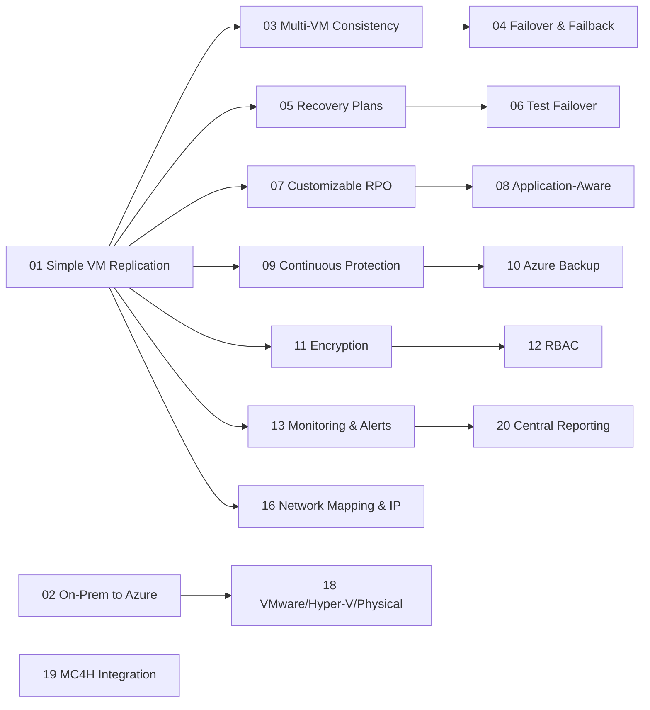

# Azure Site Recovery for Healthcare – Workshop Index

> [!IMPORTANT]  
> **HIPAA / HITRUST context:** Use **mock/test data only**. Treat all artifacts as ePHI for discipline. Enforce **least privilege RBAC**, **Private Endpoints**, **TLS 1.2+**, and **CMK** where indicated. Log access and changes for auditability. Never test with real PHI/PII.

This workshop is designed for **new computer engineers in healthcare** (providers, payors, ISVs) with **zero prior Azure experience**. You’ll progress from **basic VM replication** to **full DR orchestration**, automation, hybrid on‑prem integration, and **Microsoft Cloud for Healthcare** touchpoints. Every module includes **step‑by‑step labs**, **compliance callouts** (HIPAA, HITRUST, **FHIR**, **DICOM**), and **working Bash + Azure CLI scripts**.

---

## Quick Start

```bash
# 1) Configure environment
cp config/env.sample config/.env
code config/.env  # set SUBSCRIPTION_ID, RG_NAME, regions, VNet names, etc.

# 2) Prepare Azure prerequisites (providers, VNets, Log Analytics, demo VM, cache storage)
bash infra/00_prereqs.sh

# 3) (Optional) Generate synthetic mock ePHI (FHIR-like) for the demo PHP app
python3 scripts/mock_ephi_generator.py

# 4) Start with Module 1 (Simple VM Replication - A2A)
bash infra/m01_simple_vm_replication.sh
```

> [!TIP]  
> Work from **Windows + VS Code**. Use the **VS Code integrated terminal** or **Azure Cloud Shell (bash)**.  
> Recommended extensions are pre-configured in `.vscode/` (Azure CLI, Mermaid, Markdown).  

---

## Learning Path (Recommended Order)



> [!CAUTION]  
> Some modules can incur **extra cost** (e.g., **VPN Gateways**, **Log Analytics**, **Premium Cache Storage**). Use a **training** subscription and delete resources when finished:
> ```bash
> az group delete -n "$RG_NAME" --yes --no-wait
> ```

---

## Table of Modules

| # | Module | What you’ll learn | Core script(s) | Diagrams | Est. Time |
|---:|---|---|---|---|---|
| 1 | [Simple VM Replication](modules/Module01-Simple_VM_Replication.md) | Protect an Azure VM to a paired region with A2A; create policy & mapping | `infra/m01_simple_vm_replication.sh` | `assets/diagrams/module01_flow.mmd`, `assets/diagrams/module01_sequence.mmd` | ~60–90 min |
| 2 | [On-Premises to Azure Replication](modules/Module02-On-Premises_to_Azure_Replication.md) | Prep S2S VPN (VyOS) + vault context; appliance overview for Hyper‑V/VMware/physical | `infra/m02_onprem_to_azure_hyperv.sh` | `assets/diagrams/module02_flow.mmd`, `assets/diagrams/module02_sequence.mmd` | ~60–90 min |
| 3 | [Multi‑VM Consistency](modules/Module03-Multi-VM_Consistency.md) | Consistency groups; enable multi‑VM sync in policy | `infra/m03_multi_vm_consistency.sh` | `assets/diagrams/module03_flow.mmd`, `assets/diagrams/module03_sequence.mmd` | ~30–45 min |
| 4 | [Automated Failover & Failback](modules/Module04-Automated_Failover_&_Failback.md) | Planned/unplanned failover; commit; reprotect | `infra/m04_automated_failover_failback.sh` | `assets/diagrams/module04_flow.mmd`, `assets/diagrams/module04_sequence.mmd` | ~45–60 min |
| 5 | [Recovery Plans](modules/Module05-Recovery_Plans.md) | Orchestrate boot order & custom actions | `infra/m05_recovery_plans.sh` | `assets/diagrams/module05_flow.mmd`, `assets/diagrams/module05_sequence.mmd` | ~45–75 min |
| 6 | [Test Failover](modules/Module06-Test_Failover.md) | Non‑disruptive DR drills; evidence collection | `infra/m06_test_failover.sh` | `assets/diagrams/module06_flow.mmd`, `assets/diagrams/module06_sequence.mmd` | ~30–45 min |
| 7 | [Customizable Recovery Point Objectives (RPO)](modules/Module07-Customizable_Recovery_Point_Objectives_(RPO).md) | Tune app‑consistent snapshot frequency & retention | `infra/m07_custom_rpo.sh` | `assets/diagrams/module07_flow.mmd`, `assets/diagrams/module07_sequence.mmd` | ~30–45 min |
| 8 | [Application‑Aware Replication](modules/Module08-Application-Aware_Replication.md) | App‑consistent points; freeze/thaw hooks (e.g., PostgreSQL) | `infra/m08_application_aware_replication.sh` | `assets/diagrams/module08_flow.mmd`, `assets/diagrams/module08_sequence.mmd` | ~45–60 min |
| 9 | [Continuous Data Protection](modules/Module09-Continuous_Data_Protection.md) | High‑churn considerations; cache sizing | `infra/m09_continuous_data_protection.sh` | `assets/diagrams/module09_flow.mmd`, `assets/diagrams/module09_sequence.mmd` | ~30–45 min |
| 10 | [Integration with Azure Backup](modules/Module10-Integration_with_Azure_Backup.md) | Combine backup (long‑term) with ASR (DR) | `infra/m10_integration_azure_backup.sh` | `assets/diagrams/module10_flow.mmd`, `assets/diagrams/module10_sequence.mmd` | ~45–60 min |
| 11 | [Encryption at Rest and In Transit](modules/Module11-Encryption_at_Rest_and_In_Transit.md) | TLS 1.2+, disk/storage encryption, CMK/PE concepts | `infra/m11_encryption.sh` | `assets/diagrams/module11_flow.mmd`, `assets/diagrams/module11_sequence.mmd` | ~30–45 min |
| 12 | [Role‑Based Access Control (RBAC)](modules/Module12-Role-Based_Access_Control_(RBAC).md) | Assign Site Recovery roles; least privilege & SoD | `infra/m12_rbac.sh` | `assets/diagrams/module12_flow.mmd`, `assets/diagrams/module12_sequence.mmd` | ~30–45 min |
| 13 | [Automated Health Monitoring & Alerts](modules/Module13-Automated_Health_Monitoring_&_Alerts.md) | Action groups; activity log alerts for ASR jobs | `infra/m13_health_monitoring_alerts.sh` | `assets/diagrams/module13_flow.mmd`, `assets/diagrams/module13_sequence.mmd` | ~30–45 min |
| 14 | [Geo‑Redundant Storage Support](modules/Module14-Geo-Redundant_Storage_Support.md) | Clarify cache account redundancy vs A2A managed disks | `infra/m14_geo_redundant_storage.sh` | `assets/diagrams/module14_flow.mmd`, `assets/diagrams/module14_sequence.mmd` | ~20–30 min |
| 15 | [Integration with Azure Automation](modules/Module15-Integration_with_Azure_Automation.md) | Runbooks to orchestrate DR actions | `infra/m15_automation_integration.sh` | `assets/diagrams/module15_flow.mmd`, `assets/diagrams/module15_sequence.mmd` | ~45–60 min |
| 16 | [Network Mapping & IP Customization](modules/Module16-Network_Mapping_&_IP_Customization.md) | Map VNets; customize subnets/IPs; DNS tips | `infra/m16_network_mapping_ip_customization.sh` | `assets/diagrams/module16_flow.mmd`, `assets/diagrams/module16_sequence.mmd` | ~30–45 min |
| 17 | [Integration with Azure Policy & Compliance](modules/Module17-Integration_with_Azure_Policy_&_Compliance.md) | Enforce DR posture; HIPAA/HITRUST initiatives | `infra/m17_policy_compliance.sh` | `assets/diagrams/module17_flow.mmd`, `assets/diagrams/module17_sequence.mmd` | ~45–60 min |
| 18 | [Support for VMware, Hyper‑V, and Physical Servers](modules/Module18-Support_for_VMware,_Hyper-V,_and_Physical_Servers.md) | ASR appliance & fabric concepts | `infra/m18_platform_support.sh` | `assets/diagrams/module18_flow.mmd`, `assets/diagrams/module18_sequence.mmd` | ~45–60 min |
| 19 | [Integration with Microsoft Cloud for Healthcare](modules/Module19-Integration_with_Microsoft_Cloud_for_Healthcare.md) | AHDS (FHIR/DICOM) patterns + adjacent IaaS | `infra/m19_mc4h_integration.sh` | `assets/diagrams/module19_flow.mmd`, `assets/diagrams/module19_sequence.mmd` | ~60–90 min |
| 20 | [Centralized Management & Reporting](modules/Module20-Centralized_Management_&_Reporting.md) | Export jobs/events; build audit evidence | `infra/m20_centralized_management_reporting.sh` | `assets/diagrams/module20_flow.mmd`, `assets/diagrams/module20_sequence.mmd` | ~30–45 min |

> [!TIP]  
> Each module demonstrates at least **three core features**, includes **module‑specific architecture & sequence diagrams**, and ships with **CLI scripts** you can run as‑is.

---

## Repository Layout (for reference)

```
AzureSiteRecoveryHealthcareWorkshop/
├─ README.md                    # This file (index + quick start)
├─ modules/                     # 20 module markdown guides + lab notes
├─ infra/                       # Bash scripts (Azure CLI) per module
├─ assets/
│  ├─ diagrams/                 # Mermaid .mmd flow/sequence per module
│  ├─ docs/                     # Supplemental PDFs/refs (optional)
│  └─ images/                   # Images embedded in modules
├─ app/
│  ├─ web/                      # PHP FHIR viewer (training only)
│  └─ ai/                       # Python demo (training only)
├─ scripts/                     # Mock ePHI generator, VyOS helpers
├─ db/                          # Sample schema (if needed)
├─ config/                      # env.sample → .env for labs
└─ .vscode/                     # Editor settings + recommended extensions
```

---

## Compliance Focus by Module

- **Security & Access (M11–M12):** Encryption in transit & at rest, **CMK/PE concepts**, **RBAC** for Site Recovery vaults and DR operations.  
- **Observability (M13, M20):** Diagnostic signals & **Activity Log alerts**; export **jobs/events** for audit trails and HITRUST evidence.  
- **Hybrid & Migration (M02, M18):** **VyOS S2S VPN** + on‑prem **ASR appliance** for Hyper‑V/VMware/physical workloads.  
- **Automation & Orchestration (M04–M06, M15–M16):** Failover/failback sequences, **Recovery Plans**, **Azure Automation** runbooks, **Network Mapping & IP**.  
- **Healthcare Services (M19):** **AHDS / Azure API for FHIR** and **DICOM** considerations; integrate PaaS DR characteristics with IaaS gateways.

> [!IMPORTANT]  
> **FHIR/DICOM:** Use correct media types and RBAC. If exporting to ADLS, use **Private Endpoints** and maintain **audited pipelines**. Always validate with **synthetic data**.

---

## Common Tasks

- **Generate synthetic ePHI data:**  
  ```bash
  python3 scripts/mock_ephi_generator.py
  ```
- **Run a module script:**  
  ```bash
  bash infra/m01_simple_vm_replication.sh     # replace with the module you are working on
  ```
- **Clean up (delete lab resources):**  
  ```bash
  az group delete -n "$RG_NAME" --yes
  ```

> [!CAUTION]  
> Never upload real PHI/PII into training environments. Prefer **Managed Identities** and **RBAC** over long‑lived credentials. Limit public exposure and use **Private Endpoints** where available.

---

## Troubleshooting

- **`az` not found**: Install Azure CLI or use Azure Cloud Shell.  
- **Permission denied**: Ensure your user has sufficient rights on the subscription/resource group.  
- **DNS for Private Endpoints**: Configure **Private DNS Zone** and linking; verify name resolution from your VM.  
- **ASR job stuck**: Check cache storage capacity, policy settings (RPO/app‑consistent frequency), and **Activity Log** for failures.  

---

## Lab Notes

Record observations and screenshots in `modules/lab-notes.md` for audit readiness (e.g., **before/after** of RBAC assignments, **job exports**, **failover timings**).
