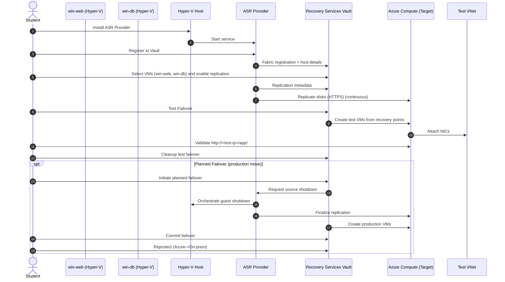

# Hyper‑V Windows → Azure (ASR) — Sequence

```mermaid
sequenceDiagram
    autonumber
    actor Student as Student
    participant WinWeb as win-web (Hyper‑V)
    participant WinDB as win-db (Hyper‑V)
    participant Host as Hyper‑V Host
    participant Provider as ASR Provider
    participant Vault as Recovery Services Vault
    participant Azure as Azure Compute (Target)
    participant TestVNet as Test VNet

    Student->>Host: Install ASR Provider
    Host->>Provider: Start service
    Student->>Provider: Register to Vault
    Provider->>Vault: Fabric registration + host details

    Student->>Vault: Select VMs (win-web, win-db) and enable replication
    Provider->>Vault: Replication metadata
    Provider->>Azure: Replicate disks (HTTPS) (continuous)

    Student->>Vault: Test Failover
    Vault->>Azure: Create test VMs from recovery points
    Azure->>TestVNet: Attach NICs
    Student->>Azure: Validate http://<test-ip>/app/
    Student->>Vault: Cleanup test failover

    opt Planned Failover (production move)
        Student->>Vault: Initiate planned failover
        Vault->>Provider: Request source shutdown
        Provider->>Host: Orchestrate guest shutdown
        Provider->>Azure: Finalize replication
        Vault->>Azure: Create production VMs
        Student->>Vault: Commit failover
        Student->>Vault: Reprotect (Azure->On‑prem)
    end
```
