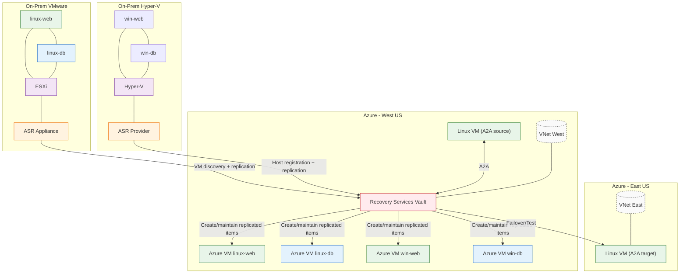

# Overall Architecture – ASR Workshop

```mermaid
flowchart TB
    %% On-prem fabrics
    subgraph VMware["On-Prem VMware"]
        LW["linux-web"]
        LD["linux-db"]
        ESXi["ESXi"]
        OVA["ASR Appliance"]
        LW --- LD
        LW --- ESXi
        LD --- ESXi
        ESXi --- OVA
    end

    subgraph HyperV["On-Prem Hyper-V"]
        WW["win-web"]
        WD["win-db"]
        HV["Hyper-V"]
        Prov["ASR Provider"]
        WW --- WD
        WW --- HV
        WD --- HV
        HV --- Prov
    end

    subgraph AzureWest["Azure - West US"]
        VNW[(VNet West)]
        RSV["Recovery Services Vault"]
        A2A_SRC["Linux VM (A2A source)"]
        AZ_W_LW["Azure VM linux-web"]
        AZ_W_LD["Azure VM linux-db"]
        AZ_W_WW["Azure VM win-web"]
        AZ_W_WD["Azure VM win-db"]
    end

    subgraph AzureEast["Azure - East US"]
        VNE[(VNet East)]
        A2A_TGT["Linux VM (A2A target)"]
    end

    %% Replication flows
    OVA -- "VM discovery + replication" --> RSV
    Prov -- "Host registration + replication" --> RSV
    RSV -- "Create/maintain replicated items" --> AZ_W_LW
    RSV -- "Create/maintain replicated items" --> AZ_W_LD
    RSV -- "Create/maintain replicated items" --> AZ_W_WW
    RSV -- "Create/maintain replicated items" --> AZ_W_WD
    A2A_SRC <-- "A2A" --> RSV
    RSV -- "Failover/Test" --> A2A_TGT

    %% Networks
    VNW --- RSV
    VNE --- A2A_TGT

    %% Styles
    classDef web fill:#e8f5e9,stroke:#2e7d32,stroke-width:1px;
    classDef db fill:#e3f2fd,stroke:#1565c0,stroke-width:1px;
    classDef hv fill:#f3e5f5,stroke:#6a1b9a,stroke-width:1px;
    classDef agent fill:#fff3e0,stroke:#ef6c00,stroke-width:1px;
    classDef vault fill:#ffebee,stroke:#c62828,stroke-width:1px;
    classDef net fill:#fafafa,stroke:#424242,stroke-width:1px,stroke-dasharray:3 3;

    %% Apply classes
    class LW,AZ_W_LW,A2A_SRC,A2A_TGT,AZ_W_WW web;
    class LD,AZ_W_LD,AZ_W_WD db;
    class ESXi,HV hv;
    class OVA,Prov agent;
    class RSV vault;
    class VNW,VNE net;
```
