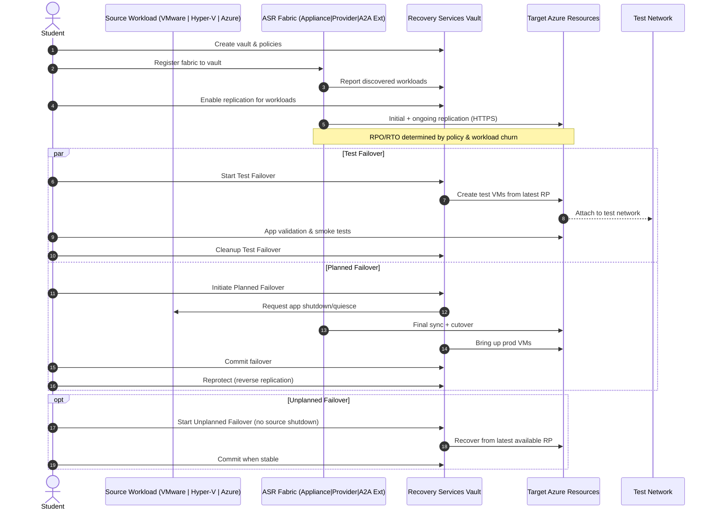

# Overall Failover Lifecycle (All Workloads) — Sequence

```mermaid
sequenceDiagram
    autonumber
    actor Student as Student
    participant Source as Source Workload (VMware | Hyper‑V | Azure)
    participant Fabric as ASR Fabric (Appliance|Provider|A2A Ext)
    participant Vault as Recovery Services Vault
    participant Target as Target Azure Resources
    participant TestNet as Test Network

    Student->>Vault: Create vault & policies
    Student->>Fabric: Register fabric to vault
    Fabric->>Vault: Report discovered workloads
    Student->>Vault: Enable replication for workloads
    Fabric->>Target: Initial + ongoing replication (HTTPS)
    Note over Fabric,Target: RPO/RTO determined by policy & workload churn

    par Test Failover
        Student->>Vault: Start Test Failover
        Vault->>Target: Create test VMs from latest RP
        Target-->>TestNet: Attach to test network
        Student->>Target: App validation & smoke tests
        Student->>Vault: Cleanup Test Failover
    and Planned Failover
        Student->>Vault: Initiate Planned Failover
        Vault->>Source: Request app shutdown/quiesce
        Fabric->>Target: Final sync + cutover
        Vault->>Target: Bring up prod VMs
        Student->>Vault: Commit failover
        Student->>Vault: Reprotect (reverse replication)
    end

    opt Unplanned Failover
        Student->>Vault: Start Unplanned Failover (no source shutdown)
        Vault->>Target: Recover from latest available RP
        Student->>Vault: Commit when stable
    end
```
