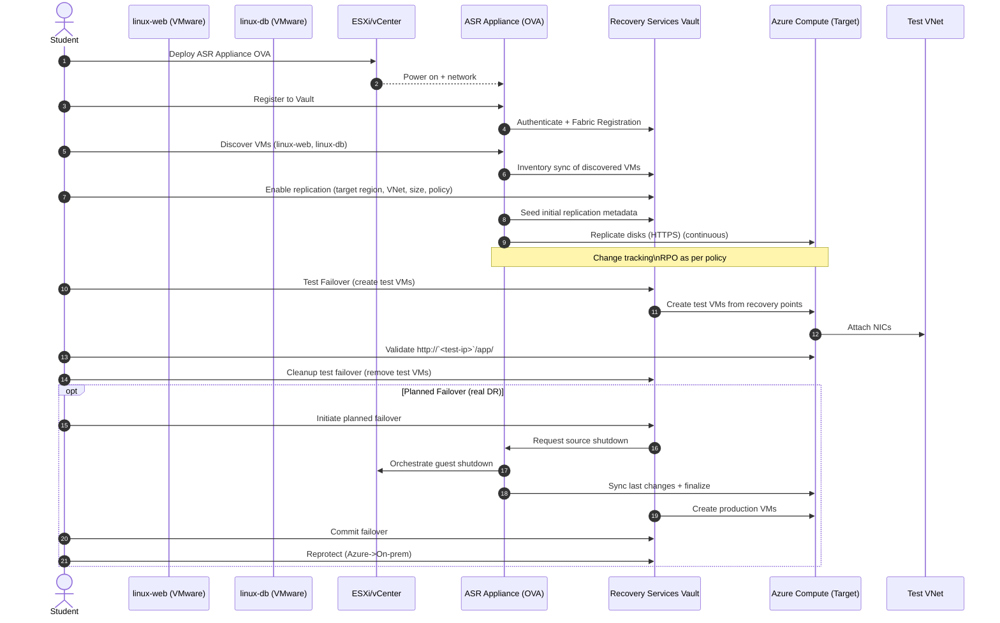

# VMware Linux → Azure (ASR) — Sequence

```mermaid
sequenceDiagram
    autonumber
    actor Student as Student
    participant Web as linux-web (VMware)
    participant DB as linux-db (VMware)
    participant ESXi as ESXi/vCenter
    participant Appliance as ASR Appliance (OVA)
    participant Vault as Recovery Services Vault
    participant Azure as Azure Compute (Target)
    participant TestVNet as Test VNet

    Student->>ESXi: Deploy ASR Appliance OVA
    ESXi-->>Appliance: Power on + network
    Student->>Appliance: Register to Vault
    Appliance->>Vault: Authenticate + Fabric Registration
    Student->>Appliance: Discover VMs (linux-web, linux-db)
    Appliance->>Vault: Inventory sync of discovered VMs

    Student->>Vault: Enable replication (target region, VNet, size, policy)
    Appliance->>Vault: Seed initial replication metadata
    Appliance->>Azure: Replicate disks (HTTPS) (continuous)
    Note over Appliance,Azure: Change tracking\nRPO as per policy

    Student->>Vault: Test Failover (create test VMs)
    Vault->>Azure: Create test VMs from recovery points
    Azure->>TestVNet: Attach NICs
    Student->>Azure: Validate http://`<test-ip>`/app/

    Student->>Vault: Cleanup test failover (remove test VMs)

    opt Planned Failover (real DR)
        Student->>Vault: Initiate planned failover
        Vault->>Appliance: Request source shutdown
        Appliance->>ESXi: Orchestrate guest shutdown
        Appliance->>Azure: Sync last changes + finalize
        Vault->>Azure: Create production VMs
        Student->>Vault: Commit failover
        Student->>Vault: Reprotect (Azure->On-prem)
    end

```
