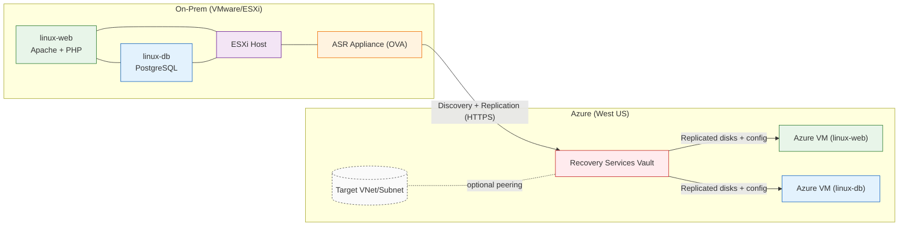

# VMware Linux → Azure (ASR)

```mermaid
flowchart LR
    subgraph OnPrem_VMware["On-Prem (VMware/ESXi)"]
        LW["linux-web\nApache + PHP"]
        LD["linux-db\nPostgreSQL"]
        ESXi["ESXi Host"]
        ASRApp["ASR Appliance (OVA)"]
        LW --- LD
        LW --- ESXi
        LD --- ESXi
        ESXi --- ASRApp
    end

    subgraph Azure_West["Azure (West US)"]
        RSV["Recovery Services Vault"]
        TVNet[(Target VNet/Subnet)]
        AWebVM["Azure VM (linux-web)"]
        ADbVM["Azure VM (linux-db)"]
    end

    ASRApp -- "Discovery + Replication (HTTPS)" --> RSV
    RSV -- "Replicated disks + config" --> AWebVM
    RSV -- "Replicated disks + config" --> ADbVM
    TVNet -. optional peering .- RSV

    %% Styles
    classDef web fill:#e8f5e9,stroke:#2e7d32,stroke-width:1px;
    classDef db fill:#e3f2fd,stroke:#1565c0,stroke-width:1px;
    classDef hv fill:#f3e5f5,stroke:#6a1b9a,stroke-width:1px;
    classDef agent fill:#fff3e0,stroke:#ef6c00,stroke-width:1px;
    classDef vault fill:#ffebee,stroke:#c62828,stroke-width:1px;
    classDef net fill:#fafafa,stroke:#424242,stroke-width:1px,stroke-dasharray:3 3;

    %% Apply classes
    class LW,AWebVM web;
    class LD,ADbVM db;
    class ESXi hv;
    class ASRApp agent;
    class RSV vault;
    class TVNet net;
```
