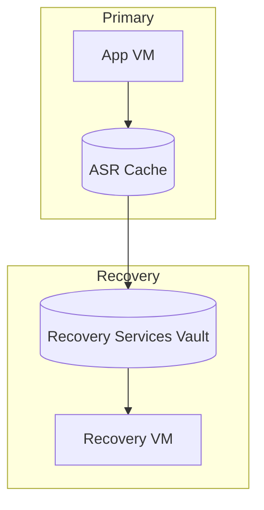
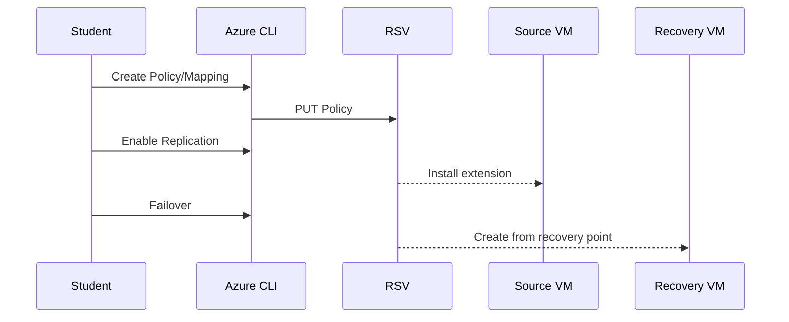

# Module 1: Simple VM Replication

> [!IMPORTANT]
> Use mock ePHI only. Follow least privilege and TLS 1.2+.

**Start:**  
```bash
cp config/env.sample config/.env && code config/.env
bash infra/m01_simple_vm_replication.sh
```

**Diagrams**  



**Pros**: Cloud-native DR orchestration.  
**Cons**: Some features require on-prem appliance or portal flows.
