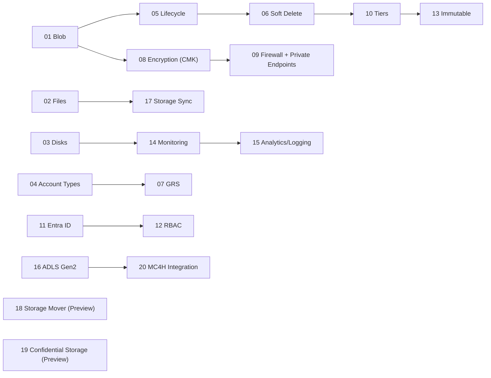

# Azure Storage for Healthcare Workshop – Module Index

> [!IMPORTANT]
> **HIPAA / HITRUST Context:** Treat all lab data as ePHI. Use test data only. Enforce least‑privilege RBAC, Private Endpoints, and CMK where indicated. Follow minimum‑necessary access.

## Quick Start
```bash
cp config/env.sample config/.env
code config/.env      # fill in your values

# One-time prerequisites
bash infra/00_prereqs.sh
bash infra/01_rg_vnet.sh
```

## Recommended Progression


## Table of Modules

| # | Module | What you’ll learn | Core script(s) | Diagrams | Est. Time |
|---:|---|---|---|---|---|
| 1 | [Azure Blob Storage](modules/Module01-Azure_Blob_Storage.md) | Object storage for ePHI; SAS; containers. | `infra/m01_blob_basics.sh` | assets/diagrams/module01_flow.mmd, module01_sequence.mmd | ~40–60 min |
| 2 | [Azure File Storage](modules/Module02-Azure_File_Storage.md) | SMB/NFS shares for EHR apps/users. | `infra/m02_files_basics.sh` | assets/diagrams/module02_flow.mmd, module02_sequence.mmd | ~40–60 min |
| 3 | [Azure Disk Storage](modules/Module03-Azure_Disk_Storage.md) | Persistent disks for Linux VMs. | `infra/m03_disks_vm.sh` | assets/diagrams/module03_flow.mmd, module03_sequence.mmd | ~40–60 min |
| 4 | [Storage Account Types](modules/Module04-Storage_Account_Types.md) | Standard vs Premium trade-offs. | `infra/m04_account_types.sh` | assets/diagrams/module04_flow.mmd, module04_sequence.mmd | ~30–45 min |
| 5 | [Lifecycle Policies](modules/Module05-Lifecycle_Management_Policies.md) | Tiering & retention automation. | `infra/m05_lifecycle_policies.sh` | assets/diagrams/module05_flow.mmd, module05_sequence.mmd | ~45–60 min |
| 6 | [Soft Delete & Recovery](modules/Module06-Soft_Delete_and_Recovery.md) | Undelete; point-in-time for training data. | `infra/m06_soft_delete.sh` | assets/diagrams/module06_flow.mmd, module06_sequence.mmd | ~30–45 min |
| 7 | [Geo-Redundant Storage](modules/Module07-Geo_Redundant_Storage.md) | Regional DR patterns. | `infra/m07_grs.sh` | assets/diagrams/module07_flow.mmd, module07_sequence.mmd | ~30–45 min |
| 8 | [Encryption (CMK)](modules/Module08-Encryption_CMK.md) | Key Vault CMK; key rotation habits. | `infra/m08_encryption_cmk.sh` | assets/diagrams/module08_flow.mmd, module08_sequence.mmd | ~45–60 min |
| 9 | [Firewall & Private Endpoints](modules/Module09-Firewall_and_Private_Endpoints.md) | Remove public access; PE + Private DNS. | `infra/m09_firewall_private_endpoints.sh` | assets/diagrams/module09_flow.mmd, module09_sequence.mmd | ~45–75 min |
| 10 | [Access Tiers](modules/Module10-Access_Tiers.md) | Hot/Cool/Archive cost control. | `infra/m10_access_tiers.sh` | assets/diagrams/module10_flow.mmd, module10_sequence.mmd | ~30–45 min |
| 11 | [Entra ID Integration](modules/Module11-Entra_ID_Integration.md) | Token-based access; MSI. | `infra/m11_entra_integration.sh` | assets/diagrams/module11_flow.mmd, module11_sequence.mmd | ~45–60 min |
| 12 | [Role-Based Access Control](modules/Module12-Role_Based_Access_Control.md) | Fine-grained roles & scopes. | `infra/m12_rbac_granular.sh` | assets/diagrams/module12_flow.mmd, module12_sequence.mmd | ~30–45 min |
| 13 | [Immutable Blob (WORM)](modules/Module13-Immutable_Blob_WORM.md) | HIPAA/HITRUST evidence retention. | `infra/m13_immutable_worm.sh` | assets/diagrams/module13_flow.mmd, module13_sequence.mmd | ~45–60 min |
| 14 | [Monitoring & Metrics](modules/Module14-Monitoring_and_Metrics.md) | LA + diagnostic settings. | `infra/m14_monitoring_metrics.sh` | assets/diagrams/module14_flow.mmd, module14_sequence.mmd | ~40–60 min |
| 15 | [Analytics & Logging](modules/Module15-Analytics_and_Logging.md) | Versioning, change feed, inventory. | `infra/m15_analytics_logging.sh` | assets/diagrams/module15_flow.mmd, module15_sequence.mmd | ~40–60 min |
| 16 | [Data Lake Storage Gen2](modules/Module16-Data_Lake_Storage_Gen2.md) | HNS, ACLs, research datasets. | `infra/m16_adls_gen2.sh` | assets/diagrams/module16_flow.mmd, module16_sequence.mmd | ~45–75 min |
| 17 | [Azure Storage Sync](modules/Module17-Azure_Storage_Sync.md) | Hybrid sync of file servers. | `infra/m17_storage_sync.sh` | assets/diagrams/module17_flow.mmd, module17_sequence.mmd | ~45–75 min |
| 18 | [Azure Storage Mover (Preview)](modules/Module18-Azure_Storage_Mover_Preview.md) | Scalable migrations to Blob. | `infra/m18_storage_mover_preview.sh` | assets/diagrams/module18_flow.mmd, module18_sequence.mmd | ~45–75 min |
| 19 | [Confidential Storage (Preview)](modules/Module19-Confidential_Storage_Preview.md) | Encryption-in-use; client-side enc. | `infra/m19_confidential_storage_preview.sh` | assets/diagrams/module19_flow.mmd, module19_sequence.mmd | ~45–75 min |
| 20 | [Integration with Microsoft Cloud for Healthcare](modules/Module20-Microsoft_Cloud_for_Healthcare.md) | AHDS FHIR/DICOM + Storage. | `infra/m20_microsoft_cloud_for_healthcare.sh` | assets/diagrams/module20_flow.mmd, module20_sequence.mmd | ~60–90 min |

> [!TIP]
> After each module, record notes in `modules/lab-notes.md` and capture screenshots for audit readiness.
