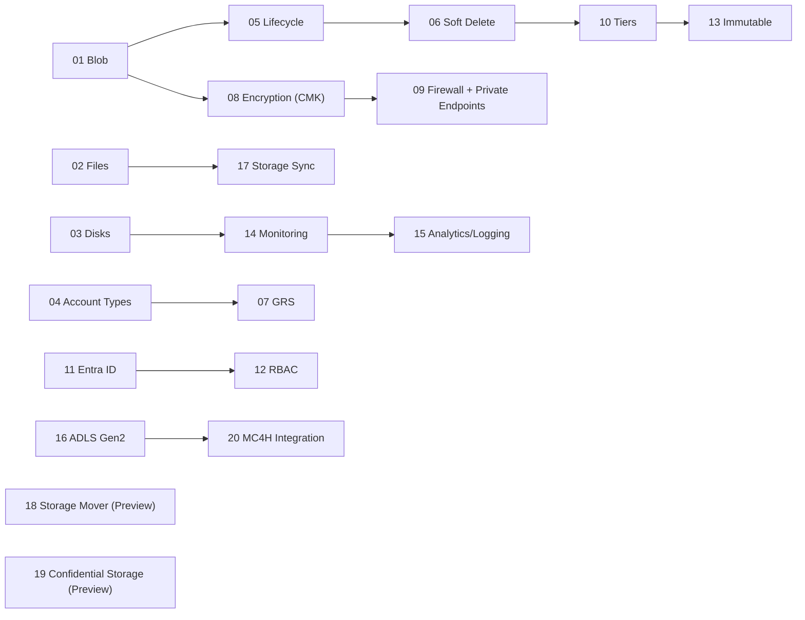

# Azure Storage for Healthcare – Workshop Index

> [!IMPORTANT]  
> **HIPAA / HITRUST context:** Use **mock/test data only**. Treat all artifacts as ePHI for discipline. Enforce **least‑privilege RBAC**, **Private Endpoints**, **TLS 1.2+**, and **CMK** where indicated. Log access and changes for auditability.

This workshop is designed for **new computer engineers in healthcare** (providers and payors) with **zero prior Azure experience**. You’ll progress from core storage fundamentals to hybrid and healthcare‑specific integrations. Every module includes step‑by‑step labs, compliance callouts (HIPAA, HITRUST, **FHIR**, **DICOM**), and working scripts.

---

## Quick Start

```bash
# 1) Configure environment
cp config/env.sample config/.env
code config/.env  # set SUBSCRIPTION_ID, RG_NAME, LOCATION, etc.

# 2) Prepare Azure prerequisites (providers, VNet, Log Analytics)
bash infra/00_prereqs.sh
```

> [!TIP]  
> Work from **Windows + VS Code**. Use the **VS Code integrated terminal** or **Azure Cloud Shell (bash)**.  
> Recommended extensions are pre-configured in `.vscode/` (Azure CLI, Mermaid, Markdown).  

---

## Learning Path (Recommended Order)



> [!CAUTION]  
> Some modules can incur extra cost (e.g., **Premium SKUs**, **RA‑GRS**, **Log Analytics**). Use a **training** subscription and delete resources when finished:
> ```bash
> az group delete -n "$RG_NAME" --yes --no-wait
> ```

---

## Table of Modules

| # | Module | What you’ll learn | Core script(s) | Diagrams | Est. Time |
|---:|---|---|---|---|---|
| 1 | [Azure Blob Storage](modules/Module01-Azure_Blob_Storage.md) | Object storage for ePHI; SAS patterns; containers | `infra/m01_blob.sh` | `assets/diagrams/module01_flow.mmd`, `module01_sequence.mmd` | ~40–60 min |
| 2 | [Azure File Storage](modules/Module02-Azure_File_Storage.md) | SMB/NFS shares for apps & users; snapshots | `infra/m02_files.sh` | `assets/diagrams/module02_flow.mmd`, `module02_sequence.mmd` | ~40–60 min |
| 3 | [Azure Disk Storage](modules/Module03-Azure_Disk_Storage.md) | Disks for VMs; attach/expand; DB volumes | `infra/m03_disks.sh` | `assets/diagrams/module03_flow.mmd`, `module03_sequence.mmd` | ~40–60 min |
| 4 | [Storage Account Types (Standard/Premium)](modules/Module04-Storage_Account_Types_%28Standard_Premium%29.md) | GPv2 vs Premium (BlockBlobStorage/FileStorage) | `infra/m04_types.sh` | `assets/diagrams/module04_flow.mmd`, `module04_sequence.mmd` | ~30–45 min |
| 5 | [Lifecycle Management Policies](modules/Module05-Lifecycle_Management_Policies.md) | Policy JSON; tiering; deletion | `infra/m05_lifecycle.sh` | `assets/diagrams/module05_flow.mmd`, `module05_sequence.mmd` | ~45–60 min |
| 6 | [Soft Delete & Data Recovery](modules/Module06-Soft_Delete_%26_Data_Recovery.md) | Undelete; container/point‑in‑time restore | `infra/m06_softdelete.sh` | `assets/diagrams/module06_flow.mmd`, `module06_sequence.mmd` | ~30–45 min |
| 7 | [Geo‑Redundant Storage (GRS)](modules/Module07-Geo-Redundant_Storage_%28GRS%29.md) | RA‑GRS/GRS; durability & DR | `infra/m07_grs.sh` | `assets/diagrams/module07_flow.mmd`, `module07_sequence.mmd` | ~30–45 min |
| 8 | [Azure Storage Encryption (CMK)](modules/Module08-Azure_Storage_Encryption_%28CMK%29.md) | Key Vault CMK; wrap/unwrap; rotation | `infra/m08_encryption_cmk.sh` | `assets/diagrams/module08_flow.mmd`, `module08_sequence.mmd` | ~45–60 min |
| 9 | [Firewall & Private Endpoints](modules/Module09-Firewall_%26_Private_Endpoints.md) | DefaultAction=Deny; PE; Private DNS | `infra/m09_firewall_pe.sh` | `assets/diagrams/module09_flow.mmd`, `module09_sequence.mmd` | ~45–75 min |
| 10 | [Access Tiers (Hot/Cool/Archive)](modules/Module10-Access_Tiers_%28Hot_Cool_Archive%29.md) | Per‑blob tiering; archive/rehydration | `infra/m10_tiers.sh` | `assets/diagrams/module10_flow.mmd`, `module10_sequence.mmd` | ~30–45 min |
| 11 | [Entra ID Integration](modules/Module11-Entra_ID_Integration.md) | Tokens via Managed Identity; no keys | `infra/m11_entra.sh` | `assets/diagrams/module11_flow.mmd`, `module11_sequence.mmd` | ~45–60 min |
| 12 | [Role‑Based Access Control (RBAC)](modules/Module12-Role-Based_Access_Control_%28RBAC%29.md) | Built‑in roles; scoped assignments | `infra/m12_rbac.sh` | `assets/diagrams/module12_flow.mmd`, `module12_sequence.mmd` | ~30–45 min |
| 13 | [Immutable Blob Storage (WORM)](modules/Module13-Immutable_Blob_Storage_%28WORM%29.md) | Time‑based retention; protected append | `infra/m13_worm.sh` | `assets/diagrams/module13_flow.mmd`, `module13_sequence.mmd` | ~45–60 min |
| 14 | [Monitoring & Metrics](modules/Module14-Monitoring_%26_Metrics.md) | Diagnostic settings; LA queries; alerts | `infra/m14_monitoring.sh` | `assets/diagrams/module14_flow.mmd`, `module14_sequence.mmd` | ~40–60 min |
| 15 | [Analytics & Logging](modules/Module15-Analytics_%26_Logging.md) | Versioning; change feed; inventory | `infra/m15_analytics.sh` | `assets/diagrams/module15_flow.mmd`, `module15_sequence.mmd` | ~40–60 min |
| 16 | [Data Lake Storage Gen2](modules/Module16-Data_Lake_Storage_Gen2.md) | HNS; POSIX ACLs; ABFS | `infra/m16_adls.sh` | `assets/diagrams/module16_flow.mmd`, `module16_sequence.mmd` | ~45–75 min |
| 17 | [Azure Storage Sync (Linux‑friendly Lab)](modules/Module17-Azure_Storage_Sync_%28Linux-friendly_Lab%29.md) | Hybrid sync patterns (note Windows requirement) | `infra/m17_sync_linux_alt.sh` | `assets/diagrams/module17_flow.mmd`, `module17_sequence.mmd` | ~45–75 min |
| 18 | [Azure Storage Mover (Preview)](modules/Module18-Azure_Storage_Mover_%28Preview%29.md) | Agent‑based migration; jobs | `infra/m18_mover.sh` | `assets/diagrams/module18_flow.mmd`, `module18_sequence.mmd` | ~45–75 min |
| 19 | [Confidential Storage (Preview)](modules/Module19-Confidential_Storage_%28Preview%29.md) | Encryption‑in‑use via CVM; client‑side enc | `infra/m19_confidential.sh` | `assets/diagrams/module19_flow.mmd`, `module19_sequence.mmd` | ~45–75 min |
| 20 | [Integration with Microsoft Cloud for Healthcare](modules/Module20-Integration_with_Microsoft_Cloud_for_Healthcare.md) | AHDS FHIR/DICOM + Storage; export to ADLS | `infra/m20_mc4h.sh` | `assets/diagrams/module20_flow.mmd`, `module20_sequence.mmd` | ~60–90 min |

> [!TIP]  
> Each module lists at least three **core features**, shows **module‑specific architecture and sequence diagrams**, and provides **CLI scripts** you can run as‑is.  

---

## Repository Layout (for reference)

```
AzureStorageHealthcareWorkshop/
├─ README.md                    # This file (index + quick start)
├─ modules/                     # 20 module markdown guides + lab notes
├─ infra/                       # Bash scripts (Azure CLI) per module
├─ assets/
│  ├─ diagrams/                 # Mermaid .mmd flow/sequence per module
│  ├─ docs/                     # Supplemental PDFs/refs (optional)
│  └─ images/                   # Images embedded in modules
├─ app/
│  ├─ web/                      # PHP uploader + FHIR demo (training only)
│  └─ ai/                       # Client-side enc. demo (Python)
├─ scripts/                     # Mock ePHI generator, on‑prem helpers
├─ db/                          # Sample schema (FHIR‑adjacent)
├─ config/                      # env.sample → .env for labs
└─ .vscode/                     # Editor settings + recommended extensions
```

---

## Compliance Focus by Module

- **Data Security & Access (M08–M13):** CMK encryption (Key Vault), Private Endpoints + firewall, access tiers, Entra ID tokens, RBAC, and **WORM** retention.  
- **Observability (M14–M15):** Diagnostic settings, metrics, **versioning**, **change feed**, **inventory** for lineage and auditability.  
- **Analytics & Research (M16):** **ADLS Gen2** with HNS and **POSIX ACLs** for cohort datasets; use de‑identification.  
- **Hybrid & Migration (M17–M18):** On‑prem to cloud patterns (note **Azure File Sync requires Windows Server agent**).  
- **Confidential & Healthcare Services (M19–M20):** Encryption‑in‑use patterns and **AHDS (FHIR/DICOM)** integration.

> [!IMPORTANT]  
> **FHIR/DICOM:** Use correct media types and RBAC. Export to ADLS with **Private Endpoints** and **audited pipelines**.  

---

## Common Tasks

- **Generate mock ePHI data:**  
  ```bash
  python3 scripts/mock_ephi_generator.py
  ```
- **Run a module script:**  
  ```bash
  bash infra/m01_blob.sh     # replace with the module you are working on
  ```
- **Clean up (delete lab resources):**  
  ```bash
  az group delete -n "$RG_NAME" --yes
  ```

> [!CAUTION]  
> Never upload real PHI/PII into training environments. Keep SAS tokens **short‑lived** and **least‑privileged**. Prefer **Managed Identities** and **RBAC** over account keys.

---

## Troubleshooting

- **`az` not found**: Install Azure CLI or use Azure Cloud Shell.  
- **Permission denied**: Ensure your user has **Owner** or sufficient rights on the subscription/resource group.  
- **Private Endpoint DNS**: Configure **Private DNS Zone** and linking; verify name resolution from your VM.  
- **Policy delays**: Lifecycle and rehydration are **asynchronous**; monitor status with `az` commands.

---

## Lab Notes

Record observations and screenshots in `modules/lab-notes.md` for audit readiness (e.g., **before/after** of RBAC assignments, **KQL** queries, **change feed** samples).

---

*End of README*
