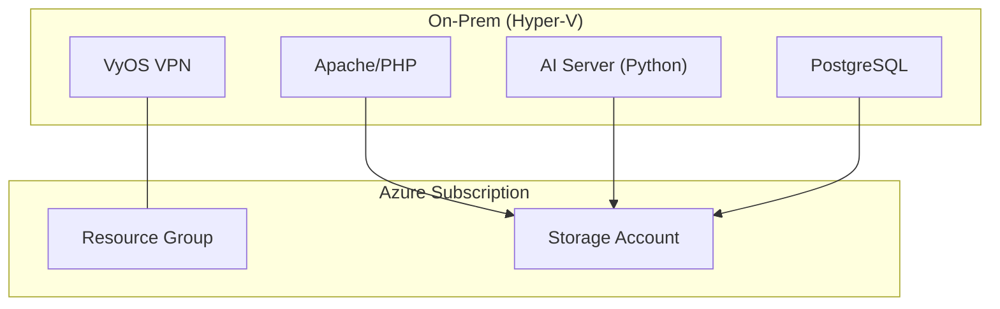
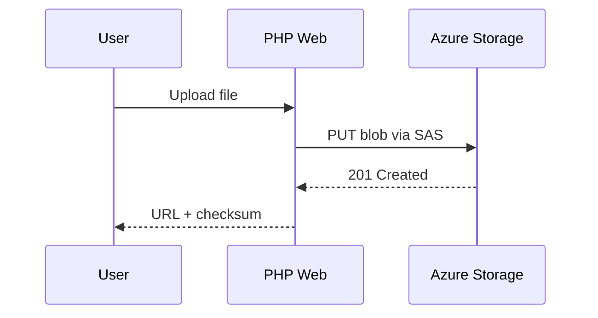

# Module 03: Azure Disk Storage
**Intent & Learning Objectives:** Persistent disks for VMs running healthcare workloads.

**Top 2 problems this solves / features provided:**
- High IOPS for databases
- Data durability for stateful services

**Key Features Demonstrated:**
- - Managed Disks: Premium/Standard/Ultra
- - Disk attach/detach; expand online
- - Data integrity & performance for DBs

**Architecture Diagram**

*See also:* `assets/diagrams/module03_flow.mmd`

**Sequence Overview**

*See also:* `assets/diagrams/module03_sequence.mmd`

## Step-by-Step Instructions
> [!IMPORTANT]
> Use only generated mock data. Treat all artifacts as ePHI for discipline.
> [!TIP]
> Open a VS Code terminal. All scripts are idempotent where possible.

1. **Prepare environment**
   ```bash
   cp config/env.sample config/.env
   code config/.env  # set RG_NAME, LOCATION, etc.
   bash infra/00_prereqs.sh
   ```
2. **Run the module script**
   ```bash
   bash infra/m03_disks_vm.sh
   ```
3. **Validate outcome**
   - SSH to VM, `lsblk`, format and mount new disk, and confirm persistence after reboot.

## Compliance Notes
> [!IMPORTANT]
> **HIPAA/HITRUST:** Enforce least-privilege. Log access (Module 14), keep audit trails (Module 15), and restrict network exposure (Module 9).

## Pros, Cons & Warnings
**Pros**
- Elastic scale and durability for clinical content.
- Native encryption at rest and TLS in transit.
- Broad ecosystem integration (SDK/CLI/REST).

**Cons**
- Misconfigured public access can expose data—prefer Private Endpoints.
- SAS mismanagement (over-broad scope/long expiry) increases risk.
- Some enterprise features require additional Azure services (cost).

> [!CAUTION]
> Test in non-production subscriptions. Some modules (GRS, Premium) incur higher costs.
> [!TIP]
> Use tags (e.g., `env=training`, `app=hcws`) for cost reporting and governance.

## Files & Scripts
- Module script: `infra/m03_disks_vm.sh`
- Diagrams: `assets/diagrams/module03_flow.mmd`, `assets/diagrams/module03_sequence.mmd`
- App demo: `app/web/index.php` (SAS uploader), `app/ai/cse_upload.py` (client-side encryption demo)
