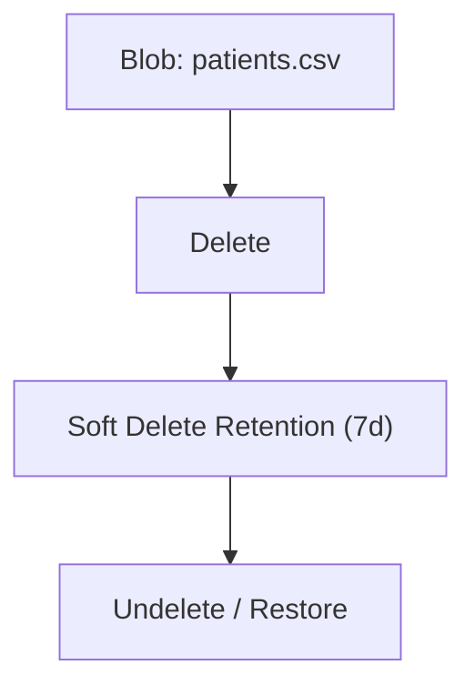
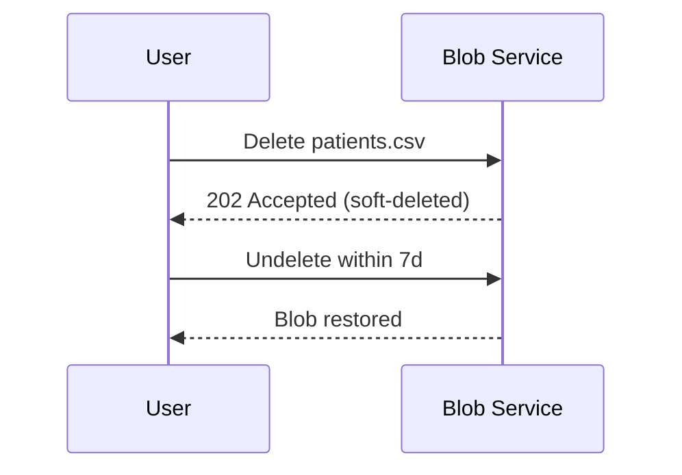

# Module 06: Soft Delete & Data Recovery
**Intent & Learning Objectives:** Protect against accidental deletions and support PITR for training datasets.

**Top 2 problems this solves / features provided:**
- Recover accidentally deleted blobs
- Short-term rollback safety

**Key Features Demonstrated:**
- Blob soft delete; container soft delete; point-in-time restore

**Architecture Diagram (module-specific)**


**Sequence Diagram (module-specific)**


## Step-by-Step Instructions (from zero)
> [!IMPORTANT]
> Use **mock/test data** only. Treat all artifacts as ePHI for discipline.
1. **Environment prep**
   ```bash
   cp config/env.sample config/.env
   code config/.env
   bash infra/00_prereqs.sh
   ```
2. **Deploy & configure**
   ```bash
   bash infra/m06_softdelete.sh
   ```
   - Delete a test blob; undelete it within retention.
   - List deleted versions to confirm.

## Compliance Notes
- **Least privilege:** Keep delete rights restricted.
- **Retention:** Align 7–90 days with policy.

## Pros, Cons & Warnings
**Pros**
- Built-in security controls (TLS, SSE, RBAC).
- Azure-native automation and scalability.
- Scriptable with Azure CLI for repeatability/audits.

**Cons**
- Misconfiguration of SAS, public network access, or RBAC can expose data.
- Some features (e.g., RA-GRS, Premium SKUs) have cost trade-offs.
- Lifecycle policy evaluation is periodic, not immediate.

> [!CAUTION]
> Validate access via Entra ID tokens (Modules 11–12) and restrict public access (Module 9).
> [!TIP]
> Tag resources (e.g., `env=training`, `data=ephi`) to drive cost/compliance reports.

## Files & Scripts
- Script: `infra/m06_softdelete.sh`
