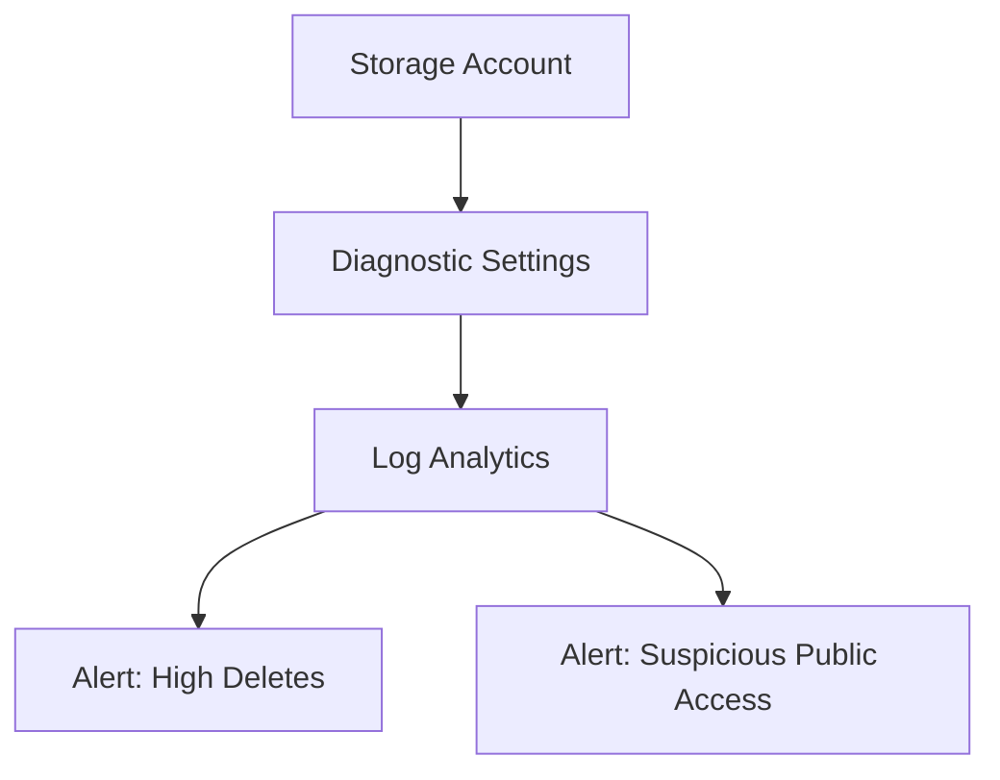
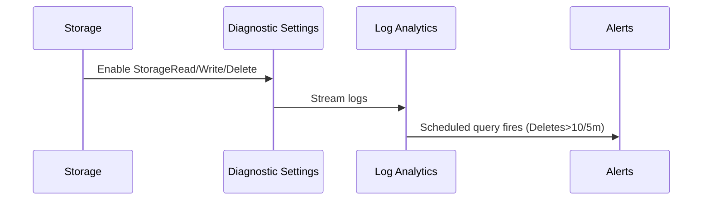

# Module 14: Monitoring & Metrics (Enhanced)
**Intent & Learning Objectives:** Stream diagnostics to Log Analytics and create actionable alerts with KQL for healthcare storage observability.

**Key Features Demonstrated:**
- Diagnostic settings → Log Analytics (StorageRead/Write/Delete, Transaction, AllMetrics)
- Scheduled query alert on high delete rate
- Metric alert on UsedCapacity

**Architecture Diagram (module-specific)**


**Sequence Diagram (module-specific)**


## Step-by-Step Instructions
> [!IMPORTANT]
> Use **mock/test data** only. Treat all artifacts as ePHI for discipline.
1. **Environment prep**
   ```bash
   cp config/env.sample config/.env
   code config/.env
   bash infra/00_prereqs.sh
   ```
2. **Deploy & configure**
   ```bash
   bash infra/m14_monitoring_metrics.sh
   ```
3. **Create Action Group (email)**
   ```bash
   bash infra/m14_action_group.sh you@contoso.com
   ```
4. **Create alert rules (KQL + metric)**
   ```bash
   bash infra/m14_alert_rules.sh
   ```
5. **Explore KQL samples**
   ```kusto
   // High delete rate
   StorageBlobLogs
| where OperationName in ("DeleteBlob","DeleteContainer")
| summarize Deletes=count() by bin(TimeGenerated, 5m)
| where Deletes > 10
| order by TimeGenerated desc
   ```
   ```kusto
   // Suspicious public access (if public enabled)
   StorageBlobLogs
| where not(IsPrivateLink) and (IPAddress !startswith "10." and IPAddress !startswith "172." and IPAddress !startswith "192.168.")
| summarize Count=count() by IPAddress, bin(TimeGenerated, 15m)
| where Count > 0
| top 50 by Count desc
   ```

## Compliance Notes
- **HIPAA/HITRUST:** Log access and changes; retain logs per records schedule.
- **Least Privilege:** Prefer MSI + RBAC where possible; avoid static keys.
- **Audit:** Export KQL, policy JSON, and screenshots to your evidence repo.
