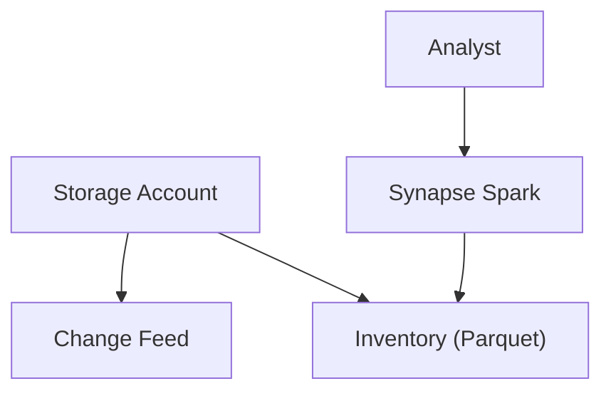
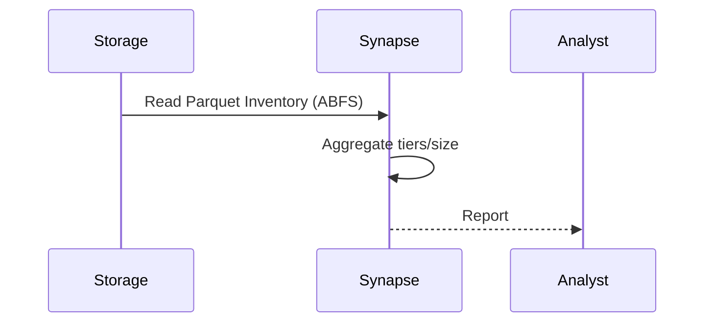

# Module 15: Analytics & Logging (Enhanced)
**Intent & Learning Objectives:** Use blob versioning, change feed, and inventory for data lineage and governance; analyze with Synapse.

**Key Features Demonstrated:**
- Blob versioning for rollback/forensics
- Change feed for append-only audit trail
- Inventory Parquet for estate visibility

**Architecture Diagram (module-specific)**


**Sequence Diagram (module-specific)**


## Step-by-Step Instructions
> [!IMPORTANT]
> Use **mock/test data** only. Treat all artifacts as ePHI for discipline.
1. **Environment prep**
   ```bash
   cp config/env.sample config/.env
   code config/.env
   bash infra/00_prereqs.sh
   ```
2. **Deploy & configure**
   ```bash
   bash infra/m15_analytics.sh
   ```
3. **Enable versioning, change feed, inventory**
   ```bash
   az storage account blob-service-properties update --account-name <sa> --enable-versioning true --enable-change-feed true
   ```
   Create inventory policy as shown by the script in Module 15 or via Portal.
4. **Analyze Inventory in Synapse (PySpark)**
   - Upload notebook: `assets/docs/synapse_notebooks/m15_inventory_analysis.py`
   - Set widgets or edit placeholders for `account` and `container` (inventory destination).
   - Run cell to get **counts by AccessTier** and total bytes.
5. **KQL for change feed activity**
   ```kusto
   StorageBlobLogs
| where OperationName in ("PutBlob","PutBlockList","AppendBlock","SetBlobTier","DeleteBlob")
| project TimeGenerated, OperationName, Uri, AccountName, UserAgentHeader, Identity, CallerIpAddress=IPAddress
| order by TimeGenerated desc
   ```

## Compliance Notes
- **HIPAA/HITRUST:** Log access and changes; retain logs per records schedule.
- **Least Privilege:** Prefer MSI + RBAC where possible; avoid static keys.
- **Audit:** Export KQL, policy JSON, and screenshots to your evidence repo.
