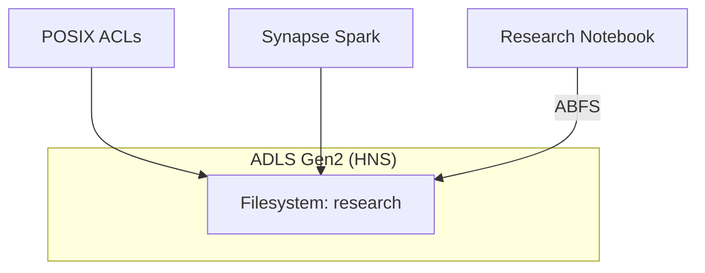
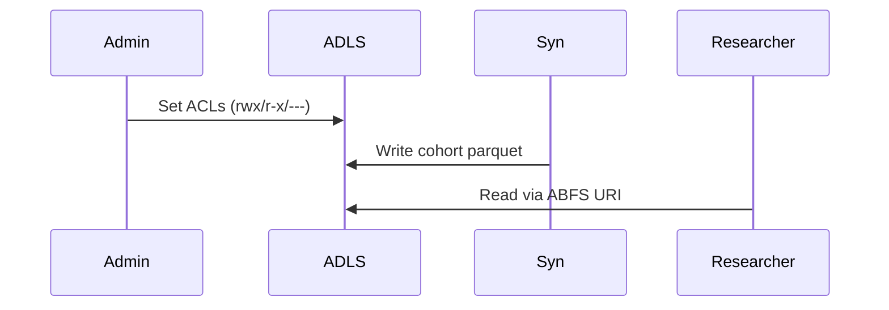

# Module 16: Data Lake Storage Gen2 (Enhanced)
**Intent & Learning Objectives:** Configure HNS + POSIX ACLs and analyze cohort data using Synapse Spark on ABFS paths.

**Key Features Demonstrated:**
- ADLS Gen2 with hierarchical namespace
- POSIX ACLs for least privilege
- ABFS access from Synapse Spark

**Architecture Diagram (module-specific)**


**Sequence Diagram (module-specific)**


## Step-by-Step Instructions
> [!IMPORTANT]
> Use **mock/test data** only. Treat all artifacts as ePHI for discipline.
1. **Environment prep**
   ```bash
   cp config/env.sample config/.env
   code config/.env
   bash infra/00_prereqs.sh
   ```
2. **Deploy & configure**
   ```bash
   bash infra/m16_adls.sh
   ```
3. **Deploy ADLS Gen2 (HNS)**
   ```bash
   bash infra/m16_adls.sh
   ```
4. **Set ACLs for research cohort folders**
   ```bash
   az storage fs access set --account-name <sa> -n research --acl 'user::rwx,group::r-x,other::---'
   ```
5. **Run Synapse notebook**
   - Upload `assets/docs/synapse_notebooks/m16_adls_acl_demo.py`
   - Replace `<account>` and `fs` widget values as needed.
   - Validate read/write via ABFS URIs.

## Compliance Notes
- **HIPAA/HITRUST:** Log access and changes; retain logs per records schedule.
- **Least Privilege:** Prefer MSI + RBAC where possible; avoid static keys.
- **Audit:** Export KQL, policy JSON, and screenshots to your evidence repo.
