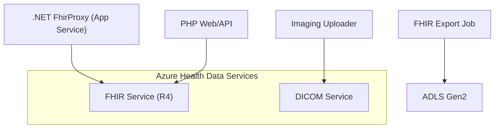
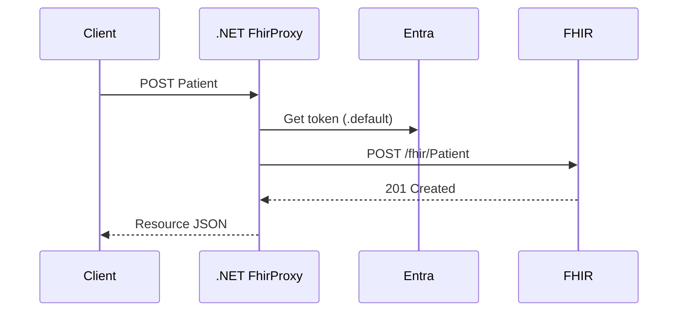

# Module 20: Integration with Microsoft Cloud for Healthcare (Enhanced)
**Intent & Learning Objectives:** Deploy AHDS FHIR/DICOM and a .NET 8 FhirProxy microservice on App Service that authenticates with Entra ID and forwards FHIR requests.

**Key Features Demonstrated:**
- AHDS workspace with FHIR & DICOM services
- .NET 8 minimal API (FhirProxy) using DefaultAzureCredential
- RBAC: FHIR Data Contributor for App Service MI
- Export pipelines to ADLS Gen2 (extend in Module 16)

**Architecture Diagram (module-specific)**


**Sequence Diagram (module-specific)**


## Step-by-Step Instructions
> [!IMPORTANT]
> Use **mock/test data** only. Treat all artifacts as ePHI for discipline.
1. **Environment prep**
   ```bash
   cp config/env.sample config/.env
   code config/.env
   bash infra/00_prereqs.sh
   ```
2. **Deploy & configure**
   ```bash
   bash infra/m20_mc4h.sh
   ```
3. **Provision AHDS (FHIR/DICOM)**
   ```bash
   bash infra/m20_mc4h.sh
   ```
4. **Deploy .NET FhirProxy to App Service (managed identity)**
   ```bash
   bash infra/m20_appservice_dotnet.sh
   ```
5. **Test Patient ingest via FhirProxy**
   ```bash
   curl -X POST https://<your-app>.azurewebsites.net/ingest/patient \
     -H 'Content-Type: application/fhir+json' \
     -d '{"resourceType":"Patient","name":[{"family":"Doe","given":["Jane"]}],"gender":"female","birthDate":"1980-02-01"}'
   ```
6. **PHP FHIR POST (training-only)**
   - Set env `FHIR_ENDPOINT` and optional `FHIR_BEARER_TOKEN` for `app/web/api/fhir_submit.php`.
7. **RBAC**
   - The App Service identity is granted **FHIR Data Contributor** at the FHIR service scope by the deploy script.

## Compliance Notes
- **HIPAA/HITRUST:** Log access and changes; retain logs per records schedule.
- **Least Privilege:** Prefer MSI + RBAC where possible; avoid static keys.
- **Audit:** Export KQL, policy JSON, and screenshots to your evidence repo.
