# Azure Defender for Linux in Healthcare (Hybrid, On‑Prem)

> **Audience:** IT Engineers in a healthcare provider  
> **Goal:** Secure on‑prem Linux workloads with Microsoft Defender for Cloud (Defender for Servers) & MDE, mapped to healthcare controls and standards.

---

## Slide 1 — Why this matters to providers
<details>
<summary>Click to expand</summary>

> 💡 **TIP**  
> Healthcare systems (EHR, FHIR servers, PACS/DICOM archives, LIS, pharmacy) increasingly run on Linux. Threats (ransomware, lateral movement to medical devices) often start on servers that host or are adjacent to **ePHI**. Defender for Cloud + Defender for Endpoint (MDE) brings EDR, hardening, vulnerability insights, and regulatory posture into one plane while you keep workloads **on-prem** via **Azure Arc**.
> 
>[!TIP]  
>Healthcare systems (EHR, FHIR servers, PACS/DICOM archives, LIS, pharmacy) increasingly run on Linux. Threats (ransomware, lateral movement to medical devices) often start on servers that host or are adjacent to **ePHI**. Defender for Cloud + Defender for Endpoint (MDE) brings EDR, hardening, vulnerability insights, and regulatory posture into one plane while you keep workloads **on‑prem** via **Azure Arc**.
>[!TIP]
>**Pro:** Unified visibility across EHR (Epic/Cerner) app servers, interface engines (HL7/FHIR), and imaging (PACS).  
>**Con:** We must be deliberate to avoid sending **PHI** in logs; strict **DCR** filters and data minimization are non‑negotiable.
</details>
---

## Slide 2 — Terminology & scope

- **Defender for Cloud → Defender for Servers (P1 / P2)**: server protection suite (EDR via MDE, recommendations, vulnerability management, optional FIM).  
- **Microsoft Defender for Endpoint (MDE) for Linux**: EDR/AV on supported Linux distros (now includes Arm64). **Not Unix (AIX/Solaris/HP‑UX)**.  
- **Azure Arc‑enabled servers**: manage/onboard **on‑prem** Linux to Azure for policy, extensions (MDE, AMA), and Defender.

---

## Slide 3 — Compliance lens (HIPAA, HITRUST; applicable to FHIR/DICOM systems)

- Azure offers a **HIPAA BAA** and in‑scope services; you assess, configure, and operate securely.  
- **Azure Policy Regulatory Compliance – HIPAA/HITRUST** initiative maps policy controls to the framework and shows a compliance dashboard (initiative GUID shown later).

>[!TIP]  
>We use the HIPAA/HITRUST initiative to **continuously audit** that Arc servers and connected services meet guardrails. This is evidence we share with internal audit and security committees (no replacement for full HIPAA/HITRUST program).

---

## Slide 4 — Reference architecture (on‑prem → Azure security plane)


**Notes:**  
- **Arc** is the bridge for on‑prem Linux to receive Defender plan features and policies.  
- **Unix** is not directly supported by MDE; we ingest **syslog/CEF** via a Linux forwarder running AMA into Sentinel.

---

## Slide 5 — Supported Linux (and what’s not)

- MDE for Linux supports RHEL 7+/8/9, Ubuntu 16.04–24.04 LTS, Debian 9–12, SLES 12/15, CentOS 7/8; Arm64 support available. (Note: Rocky/Alma may have limitations for Defender Vulnerability Management.)  
- **Not supported:** AIX, HP‑UX, Solaris (use Unix strategy on Slide 13).

>[!TIP]  
>We run mixed RHEL and Ubuntu in our FHIR APIs and image routers. For Unix legacy (radiology gateways, lab middleware), we plan **log forwarding + 3rd‑party vuln feeds** into Sentinel.

---

## Slide 6 — Plans at a glance (choose P1 vs P2)

- **Plan 1 (P1):** EDR via MDE, basic hardening recommendations.  
- **Plan 2 (P2):** Everything in P1 **plus** advanced capabilities like File Integrity Monitoring (FIM) and premium Defender Vulnerability Management features.

>[!TIP]  
>For **clinical production**, we standardize on **P2** to get **FIM** on `/etc`, PACS mounts, and middleware directories—useful for change control & incident forensics.

---

## Slide 7 — Data & privacy considerations for PHI/ePHI

- **MDE for Linux**: use **static or transparent proxies** and exclude SSL inspection for MDE endpoints. Avoid PAC/WPAD and SSL interception to keep telemetry intact and reduce risk of PHI leakage.  
- **AMA + DCR**: filter Syslog facilities/severities to minimize accidental PHI.

---

## Slide 8 — Demo 1: Onboard an on‑prem Linux server to Azure Arc

> Run in **Azure Portal → Cloud Shell (Bash)** and on the **Linux server**.

**On the Linux server (root/sudo):**
```bash
# Download and install the Azure Connected Machine (Arc) agent
curl -fsSL https://aka.ms/Install_linux_azcmagent.sh | bash

# Connect to Azure (replace placeholders)
azcmagent connect \
  --resource-group <RG_NAME> \
  --tenant-id <TENANT_ID> \
  --subscription-id <SUBSCRIPTION_ID> \
  --location <AZURE_REGION> \
  --tags "Env=Prod" "System=PACS" "ContainsPHI=true"
```

**Why:** Arc creates a metadata resource for your on‑prem machine and enables extensions (MDE, AMA) and policy.

---

## Slide 9 — Demo 2: Enable Defender for Servers (subscription scope)

> **Cloud Shell (Bash)**

```bash
# Show current Defender plan settings
az security pricing list

# Enable Defender for Servers Plan 2 for all servers
az security pricing create \
  --name VirtualMachines \
  --tier Standard \
  --subplan P2
```

**(Optional) Bicep snippet for IaC**
```bicep
resource defenderForServers 'Microsoft.Security/pricings@2024-01-01' = {
  name: 'VirtualMachines'
  properties: {
    pricingTier: 'Standard'
    subPlan: 'P2'
  }
}
```

---

## Slide 10 — Demo 3: Deploy AMA to Arc servers + strict Syslog filtering (HIPAA‑friendly)

> Install **Azure Monitor Agent** and attach a **Data Collection Rule (DCR)** that only ingests what you need.

**Install AMA on an Arc server**
```bash
az connectedmachine extension create \
  --resource-group <RG> \
  --machine-name <ARC_MACHINE_NAME> \
  --location <REGION> \
  --publisher Microsoft.Azure.Monitor \
  --type AzureMonitorLinuxAgent \
  --name AzureMonitorLinuxAgent
```

**Create a Syslog‑focused DCR (save as `syslog-dcr.json`)** – example filters only **auth, authpriv, daemon** at **warning+**:
```json
{
  "properties": {
    "dataSources": {
      "syslog": [
        {
          "streams": ["Syslog"],
          "facilityNames": ["auth", "authpriv", "daemon"],
          "logLevels": ["Warning", "Error", "Critical", "Alert", "Emergency"]
        }
      ]
    },
    "destinations": {
      "logAnalytics": [
        {
          "name": "la",
          "workspaceResourceId": "/subscriptions/<sub>/resourceGroups/<rg>/providers/Microsoft.OperationalInsights/workspaces/<workspace>"
        }
      ]
    },
    "dataFlows": [
      {
        "streams": ["Syslog"],
        "destinations": ["la"]
      }
    ]
  },
  "location": "<REGION>"
}
```

**Deploy & associate the DCR**
```bash
# Create DCR
az monitor data-collection rule create \
  --resource-group <RG> \
  --name dcr-syslog-warning \
  --location <REGION> \
  --rule-file syslog-dcr.json

# Associate the Arc machine to the DCR
az monitor data-collection rule association create \
  --name dcr-assoc-syslog \
  --rule-id $(az monitor data-collection rule show -g <RG> -n dcr-syslog-warning --query id -o tsv) \
  --resource "/subscriptions/<sub>/resourceGroups/<rg>/providers/Microsoft.HybridCompute/machines/<ARC_MACHINE_NAME>"
```

- AMA+DCR is the supported way to collect syslog with **fine‑grained control**.

---

## Slide 11 — Demo 4: Deploy **MDE for Linux** via Arc extension & verify

```bash
# Install MDE sensor via Arc extension (MDE.Linux)
az connectedmachine extension create \
  --resource-group <RG> \
  --machine-name <ARC_MACHINE_NAME> \
  --location <REGION> \
  --publisher Microsoft.Azure.AzureDefenderForServers \
  --type MDE.Linux \
  --name MDE.Linux

# On the Linux server, confirm MDE health:
mdatp health
# Expect: healthy : true ; licensed : true
```

- After enabling Defender‑for‑Servers integration, Arc machines show **MDE.Linux** extension in the Portal.

---

## Slide 12 — Demo 5: File Integrity Monitoring (FIM) and hunting

**Enable FIM (P2)** in Defender for Cloud → Servers → File integrity monitoring (choose workspace and paths). Then hunt in Sentinel:

**KQL – critical file changes (`/etc`, SSH config, PACS mounts)**
```kusto
DeviceFileEvents
| where TimeGenerated > ago(24h)
| where ActionType in ("FileModified","FileCreated","FileDeleted")
| where FolderPath startswith "/etc" or FilePath has "/etc/ssh" or FolderPath has "/opt/pacs"
| project TimeGenerated, DeviceName, ActionType, FilePath, InitiatingProcessFileName, InitiatingProcessCommandLine
| order by TimeGenerated desc
```
**KQL – suspicious netshells often used in data exfil**
```kusto
DeviceProcessEvents
| where TimeGenerated > ago(24h)
| where ProcessCommandLine has_any ("nc -e", "/dev/tcp", "bash -i >& /dev/tcp")
| summarize cnt=count() by DeviceName, InitiatingProcessFileName, bin(TimeGenerated, 1h)
| order by cnt desc
```
**KQL – DICOM ports watch (104/11112) from endpoints**
```kusto
DeviceNetworkEvents
| where TimeGenerated > ago(24h)
| where DestinationPort in ("104","11112")
| summarize cnt=count() by DeviceName, RemoteIP, DestinationPort, bin(TimeGenerated, 1h)
```

- FIM is part of **Defender for Servers P2** and emits data you can query alongside MDE tables (`DeviceFileEvents`, `DeviceProcessEvents`, `DeviceNetworkEvents`).

---

## Slide 13 — Unix (AIX/Solaris/HP‑UX): practical protection pattern

> Goal: Bring **signals** from Unix into the same SecOps plane even though **MDE isn’t supported**.

```mermaid
flowchart LR
  U1[AIX / HP‑UX / Solaris]:::unix -->|syslog/CEF| LFWD[Linux log forwarder<br/>rsyslog / syslog-ng + AMA]:::linux
  LFWD --> LAW[(Log Analytics)]:::az --> SNTL[Microsoft Sentinel]:::az
  subgraph Optional Vuln
    TNB[Tenable/Qualys scans]:::az --> SNTL
  end
  classDef unix fill:#ffe6d6,stroke:#b55;
  classDef linux fill:#eef8e8,stroke:#096;
  classDef az fill:#eef3ff,stroke:#2a5bd7;
```



**Steps:**
1. Forward Unix syslog/CEF to a hardened **Linux forwarder** (no PHI in messages).  
2. Install **AMA** on the forwarder and use Sentinel **Syslog/CEF via AMA** connectors.  
3. Integrate **Tenable/Qualys** vulnerability findings into Sentinel to cover Unix exposure.

>[!TIP]  
>**Pro:** Centralizes alerts and asset risk across Linux & Unix without deploying agents we can’t support.  
>**Con:** It’s telemetry only; no EDR containment on Unix. Compensate with **network controls**, bastionized admin, and change windows coordinated with clinical engineering.

---

## Slide 14 — Regulatory alignment in practice (assign HIPAA/HITRUST)

> **Cloud Shell (Bash)** – assign the **built‑in initiative** subscription‑wide.

```bash
SUB="<SUBSCRIPTION_ID>"
SCOPE="/subscriptions/$SUB"
GUID="a169a624-5599-4385-a696-c8d643089fab"   # HIPAA HITRUST initiative

az policy assignment create \
  --name hipaa-hitrust \
  --display-name "HIPAA/HITRUST baseline" \
  --policy $GUID \
  --scope $SCOPE
```

- Use the **Regulatory compliance** dashboard to evidence control adherence across Arc machines and Azure services.

---

## Slide 15 — Network & connectivity (clinical networks, proxies)

- **Azure Arc network requirements**: outbound TLS to Azure endpoints; can use Arc Gateway to simplify allow lists.  
- **MDE Linux**: do **not** use PAC/WPAD or SSL interception; configure static proxy and bypass.

>[!TIP]  
>We place Arc & MDE egress on **dedicated proxy policy** and document endpoints with security. It avoids surprises during Joint Commission audits.

---

## Slide 16 — Incident flow across SecOps & Clinical Ops

```mermaid
sequenceDiagram
  participant Attacker
  participant Linux as Linux Server (FHIR/PACS)
  participant MDE as MDE for Linux
  participant DfC as Defender for Cloud
  participant Sent as Microsoft Sentinel (SIEM/SOAR)
  participant ClinOps as Clinical Ops (PACS/EHR Change Board)

  Attacker->>Linux: Exploit service (e.g., outdated library)
  Linux-->>MDE: Telemetry & EDR signals
  MDE-->>DfC: Alerts & vulnerability context
  DfC-->>Sent: SecurityAlert + entity context
  Sent-->>ClinOps: PagerDuty/Teams – maintenance window check
  Sent->>Linux: SOAR playbook -> quarantine/kill process (when safe)
  ClinOps->>Sent: Approve remediation window (no procedure impact)
```



---

## Slide 17 — Costing & plan choice

- Typical pricing reference: **P1** lower cost; **P2** higher (adds FIM, premium TVM). Use **tags**/policy to scope where P2 is required (e.g., prod clusters hosting ePHI).

>[!TIP]  
>We run **P2** for systems touching **ePHI** (FHIR/DICOM/data marts) and **P1** for dev/test to control spend while preserving EDR.

---

## Slide 18 — Operational runbook (daily/weekly)

- **Daily:** Triage **SecurityAlert** feed in Sentinel; confirm MDE health (`mdatp health`), watch **DeviceFileEvents** for sensitive paths.  
- **Weekly:** Review HIPAA/HITRUST posture drift; validate Arc‑policy compliance, agent health.  
- **Monthly:** Patch cadence; verify AMA DCR filters remain PHI‑safe; confirm FIM coverage and retention.

---

## Slide 19 — Demo snippets you can run **today**

**Verify Arc connection**
```bash
azcmagent show
az connectedmachine list -g <RG> -o table
```
**List installed extensions (expect MDE.Linux, AzureMonitorLinuxAgent)**
```bash
az connectedmachine extension list --machine-name <ARC_MACHINE_NAME> -g <RG> -o table
```
**Check MDE**
```bash
mdatp health
mdatp log level list
mdatp threat summary
```
**Connect MDE alerts into Sentinel** (enable the **Microsoft Defender for Endpoint** connector in Sentinel workspace – built‑in connector).

---

## Slide 20 — PACS & DICOM awareness

- Monitor network events on **TCP 104 / 11112** for anomalous flows from non‑PACS apps; add analytics on **DeviceNetworkEvents** for unusual data volumes or new peers.  
- Ensure FIM covers directories where DICOM stores/repositories write metadata (not the images themselves).

---

## Slide 21 — FHIR server posture

- Secure FHIR servers (often on **RHEL/Ubuntu**) with MDE and FIM. Use Arc Policy to enforce **TLS, local firewall, SSH hardening**, and monitored `/etc` files.  
- Use the HIPAA/HITRUST initiative to validate broader platform configuration.

>[!TIP]  
>We treat FHIR APIs as **clinical interfaces**—outage windows coordinated with the interface team. FIM provides change evidence for CAB.

---

## Slide 22 — What if the server is **Unix**?

- Ingest **syslog/CEF** from Unix into Sentinel via a **Linux forwarder + AMA**.  
- Add **Tenable/Qualys** connectors to bring Unix vulnerability data alongside alerts.  
- Compensate with **network segmentation**, MFA for admins, and **jump hosts** with MDE.

---

## Slide 23 — Governance: tagging & scoping

- Use tags like `ContainsPHI=true`, `System=PACS/EHR`, `Env=Prod` to drive:  
  - P2 enablement,  
  - stricter DCRs,  
  - FIM paths,  
  - change/maintenance workflows.

---

## Slide 24 — Quick wins checklist (hospital ready)

- ✅ Arc onboard all Linux in **Clinical** VLANs  
- ✅ Enable Defender for Servers **P2** on prod subscriptions  
- ✅ Deploy **MDE.Linux** extension  
- ✅ Install **AMA** and attach **tight DCR** (no PHI)  
- ✅ Turn on Sentinel connector for **MDE** and **Syslog/CEF**  
- ✅ Assign **HIPAA/HITRUST** initiative

---

## Slide 25 — Pitfalls to avoid

- PAC/WPAD or SSL inspection on MDE egress (breaks telemetry).  
- Over‑ingesting verbose logs (cost & PHI risk) → use **DCR filters**.  
- Assuming Unix has EDR parity—design compensating controls.

---

## Slide 26 — Appendix: Portal‑friendly policy enablement (HIPAA/HITRUST)

> **Azure Policy** → **Definitions** → assign **HIPAA/HITRUST** initiative. Shows control mappings and compliance states.

---

## Slide 27 — Appendix: Health Data Services in Azure (context)

If/when you modernize imaging or FHIR to Azure, **Azure Health Data Services** offers managed **FHIR/DICOM** with built‑in compliance features. Current project focuses on on‑prem, but this is your runway.

---

## Slide 28 — Appendix: Network requirements (Arc/MDE)

- Review endpoints/ports, prefer **outbound only**. If egress is tight, consider **Arc Gateway**.

---

## Slide 29 — Q&A / Discussion prompts

- Where do we keep **Unix** in the fold?  
- Which clinical systems must be **P2** vs **P1**?  
- What FIM paths are **change‑managed** in CAB?  
- How do we verify **no PHI** in logs continuously?

---

## Slide 30 — Takeaways

- **On‑prem Linux** can be fully integrated into Defender via **Azure Arc** + **MDE** + **AMA**.  
- **HIPAA/HITRUST** posture is measurable with built‑in initiatives.  
- **Unix** remains covered via **log forwarding + vuln connectors**, with compensating controls.

---

### Footnotes & Key References (high level)

- Microsoft Defender for Endpoint for Linux – product documentation and supported distros  
- Microsoft Defender for Cloud (Defender for Servers) – plans and pricing (P1 vs P2)  
- Azure Arc‑enabled servers – onboarding and extensions  
- Azure Monitor Agent (AMA) and Data Collection Rules (DCR) – syslog filtering  
- Microsoft Sentinel connectors – MDE and Syslog/CEF  
- Azure Policy regulatory compliance initiatives – HIPAA/HITRUST mappings  
- Azure Health Data Services – FHIR and DICOM services

---

## Bonus: One‑liner “day‑zero” setup (test subscription)

```bash
# 0) Variables
SUB=<SUBSCRIPTION_ID>; RG=<RG>; REGION=<REGION>; WS=<LOGANALYTICS_NAME>

# 1) Enable Defender for Servers P2
az security pricing create -n VirtualMachines --tier Standard --subplan P2

# 2) Create a Log Analytics workspace
az monitor log-analytics workspace create -g $RG -n $WS -l $REGION

# 3) Arc → Install MDE + AMA on one server (replace machine)
az connectedmachine extension create -g $RG --machine-name <ARC_MACHINE> -l $REGION \
  --publisher Microsoft.Azure.AzureDefenderForServers --type MDE.Linux --name MDE.Linux
az connectedmachine extension create -g $RG --machine-name <ARC_MACHINE> -l $REGION \
  --publisher Microsoft.Azure.Monitor --type AzureMonitorLinuxAgent --name AzureMonitorLinuxAgent

# 4) Assign HIPAA/HITRUST initiative at subscription
az policy assignment create --name hipaa-hitrust --policy a169a624-5599-4385-a696-c8d643089fab --scope /subscriptions/$SUB
```

---

## What you’ll demo live (suggested flow)
1. Show **Arc‑connected** Linux in Portal → confirm **MDE.Linux** and **AMA** extensions.  
2. Open **Defender for Cloud** → confirm **Plan 2** enabled → open **FIM** blade.  
3. In **Sentinel**, run the **KQL** hunts on `DeviceFileEvents` and `DeviceNetworkEvents`.  
4. Browse **Policy → Regulatory compliance** → **HIPAA/HITRUST** posture view.

---