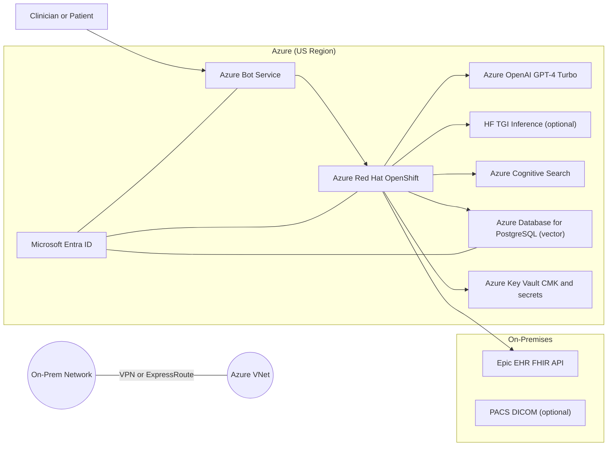
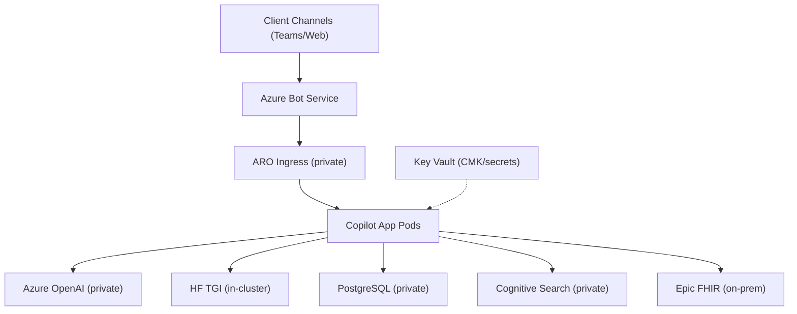
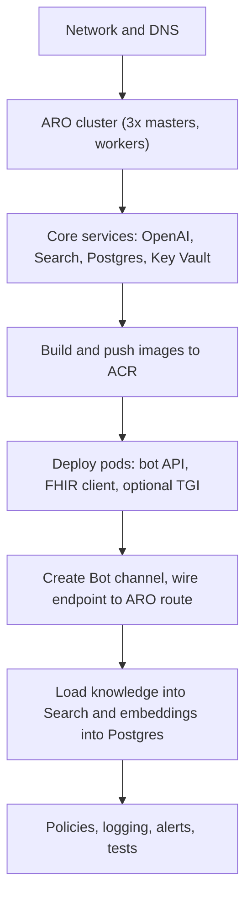
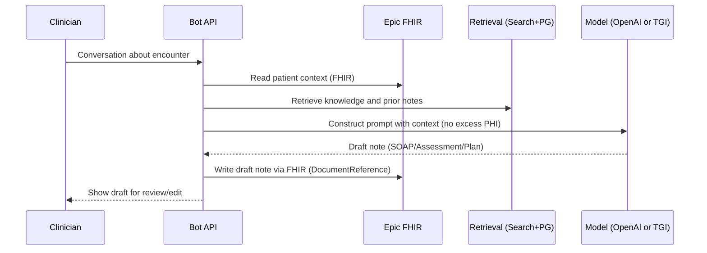

# Azure Virtual Health Assistant (Copilot) — Deployment Guide (45 min)

> Audience: Healthcare IT Engineers (Intermediate–Expert)  
> Scope: AI-powered **patient triage**, **Q&A**, and **clinical documentation assistance** on **Azure** + **ARO (OpenShift)** with **Epic FHIR**, **Entra ID**, **Azure OpenAI (GPT‑4 Turbo)**, optional **Hugging Face TGI**, **Azure Cognitive Search**, and **Azure Database for PostgreSQL** (vector). US regions only. HIPAA/HITRUST-aligned.

---

## 0. Agenda
1. Why this matters, outcomes, and risks (5)
2. Architecture and trust boundaries (8)
3. Security and compliance for ePHI (8)
4. Deployment (CLI + Bicep) pre-demo build (12)
5. Operations, BCDR, and Landing Zone fit (8)
6. Objections, performance notes, Q&A (4)

---

## 1) Why this matters to providers

- Reduce clinician burnout with ambient documentation and summarized notes.
- Accelerate triage with consistent AI-driven questioning and risk flags.
- Elevate self-service Q&A using governed knowledge (policies, education).
- Keep data governed under HIPAA/HITRUST with auditable controls.

**Trade-offs:** data governance discipline, bias testing, model validation, connectivity.

---

## 2) Reference architecture (high-level)



**Notes:** All Azure services are private (no public DB/search). ARO apps call Epic via private connectivity. KV holds CMKs/secrets. Entra provides SSO and workload identity.

---

## 3) Trust boundaries and network isolation



- Private Endpoints for OpenAI, Search, Postgres, Key Vault where available.
- ARO namespace isolation; NetworkPolicies restrict egress to allowlist.
- Epic FHIR reachable only from Copilot subnets via VPN/ER.

---

## 4) Security controls (ePHI)

**Identity & Access**
- Entra ID SSO for users; ARO OAuth with Entra; PIM/JIT for admins.
- App-to-Azure via Managed Identity where supported; secrets in KV.

**Network**
- No public DB/search endpoints; Private Link + Private DNS.
- ARO routes protected; optional WAF in front; NSGs/K8s NetworkPolicies.

**Encryption**
- At rest: CMK-backed where supported (Postgres TDE, KV for keys).
- In transit: TLS 1.2+ everywhere; mutual TLS for internal hops if needed.

**Data Handling**
- PHI minimization; structured prompt construction; no PHI in logs.
- Audit trails: App logs, DB audit, KV access logs, API calls to FHIR.

---

## 5) Deployment flow (pre-demo)



---

## 6) CLI quickstart (extracts)

See `iac/` and `scripts/` folders.

**Resource group and VNet**  
```bash
az group create -n HealthCopilotRG -l eastus
az network vnet create -g HealthCopilotRG -n aro-vnet -l eastus --address-prefixes 10.10.0.0/16
az network vnet subnet create -g HealthCopilotRG --vnet-name aro-vnet -n aro-master-subnet --address-prefixes 10.10.0.0/24
az network vnet subnet create -g HealthCopilotRG --vnet-name aro-vnet -n aro-worker-subnet --address-prefixes 10.10.1.0/23
```

**ARO (OpenShift)**
```bash
az provider register -n Microsoft.RedHatOpenShift --wait
az aro create -g HealthCopilotRG -n health-copilot-cluster \
  --vnet aro-vnet --master-subnet aro-master-subnet --worker-subnet aro-worker-subnet \
  --location eastus --pull-secret @pull-secret.txt
```

**Core services (Bicep)**
```bash
az deployment group create -g HealthCopilotRG \
  -f iac/deploy_services.bicep \
  -p location=eastus oaiName=HealthCopilotOAI searchName=health-search \
     pgServerName=health-copilot-db kvName=HealthCopilotKV
```

---

## 7) App deployment on ARO

- Push images to ACR; link pull secret to project.
- `oc apply -f k8s/bot-api.yaml`, `k8s/fhir-client.yaml`, `k8s/hf-tgi.yaml`.
- `oc expose service bot-api-svc --name=bot-api-route --hostname=<bot-host>`.
- In Azure Bot Service, set messaging endpoint to `https://<bot-host>/api/messages`.

---

## 8) Clinical documentation assistance (flow)



---

## 9) BCDR

- ARO: multi-AZ; optional secondary region ARO cluster.
- Postgres: zone-redundant HA or read replica; PITR backups.
- OpenAI: secondary region endpoint configured; local TGI fallback.
- IaC for re-deploy; runbooks for DNS and failover; DR drills.

---

## 10) Landing Zone alignment

- Hub-spoke networking; central logging; policy at MG/sub scope.
- Tags (Owner, DataSensitivity=PHI, App=HealthCopilot).
- Cost governance and budgets; Key Vault soft-delete + purge protect.

---

## 11) Objections and responses

- **Security/PHI risk:** Private endpoints, CMK, audit, US-only; BAA-backed.
- **Accuracy:** Human-in-the-loop; pilot first; measure against baselines.
- **Latency:** In-region services, streaming responses, optional local model.
- **Complexity:** Managed ARO, Azure PaaS, IaC; skills uplift plan provided.
- **Cost:** Scale-to-zero patterns; open-source model for certain paths.

---

## 12) Live demo script (10 min)

1) Portal: show ARO project, pods, and route.  
2) Run chat; triage follow-ups; produce draft note.  
3) Show FHIR GET/POST traces (no sensitive data).  
4) Show Search hit and vector DB call.  
5) Show Azure Policy HIPAA/HITRUST compliance view.  

---

### Appendix — References
- Epic FHIR (R4), Azure OpenAI, Cognitive Search, ARO docs, Azure Policy HIPAA/HITRUST.
