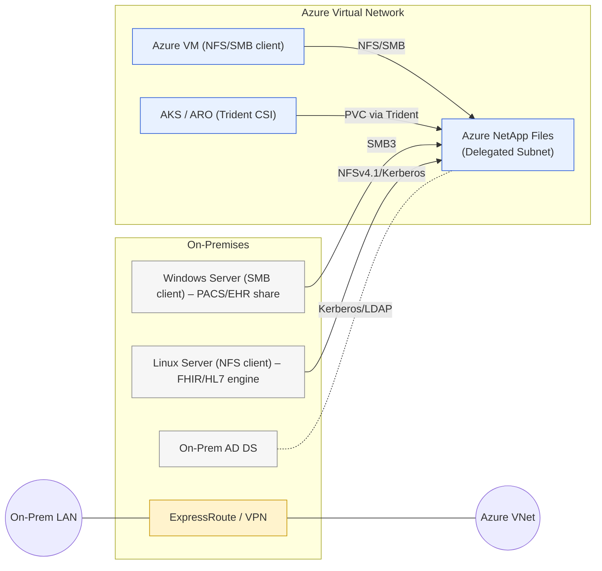
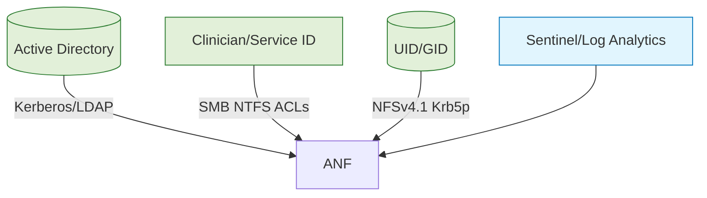
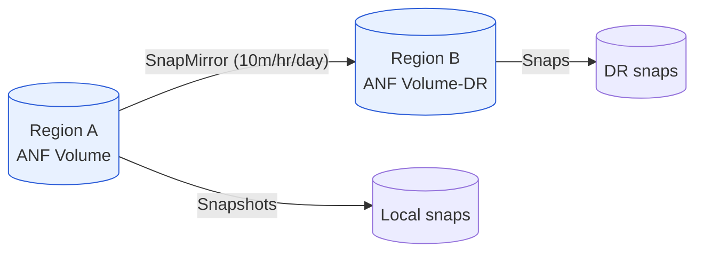
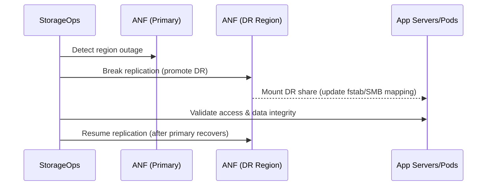

# Azure NetApp Files for Hybrid Healthcare Storage (On‑Prem to Azure)

> **Audience:** IT Engineers in a healthcare provider  
> **Goal:** Deploy Azure NetApp Files (ANF) to extend on‑prem Windows/Linux storage into Azure (VMs, AKS, OpenShift) with high performance and regulatory compliance for ePHI.

---

## Slide 1 — Why this matters to providers

>[!TIP]  
>Healthcare datasets (EHR, FHIR/HL7 interfaces, **PACS/DICOM**, genomics, pathology images) are growing rapidly and must be retained for long periods. Legacy NAS/SAN often bottlenecks analytics and cross‑site collaboration. **Azure NetApp Files (ANF)** delivers cloud‑scale, all‑flash file storage (NFS/SMB) with healthcare‑grade security and DR, letting you extend on‑premises capabilities into Azure with minimal app changes.

>[!TIP]  
>**Pro:** Unified storage for **Windows (SMB)** and **Linux (NFS)** workloads; hybrid access from on‑prem and Azure.  
>**Con:** Hybrid success depends on reliable **ExpressRoute/VPN** and disciplined governance for PHI.

---

## Slide 2 — Terminology & scope

- **ANF:** Azure‑native enterprise NAS (powered by NetApp ONTAP). Protocols: **NFSv3, NFSv4.1, SMB 3.x**, dual‑protocol.  
- **Hybrid connectivity:** Private **ExpressRoute or VPN** from on‑prem to Azure VNets.  
- **AKS/ARO:** Azure Kubernetes Service & Azure Red Hat OpenShift – use ANF via CSI (Trident).  
- **Compliance:** **HIPAA/BAA, HITRUST, FHIR, DICOM**, protection of **ePHI**.  
- **Scope:** File storage for VMs & containers; Linux/Windows clients on‑prem and in Azure.

---

## Slide 3 — Compliance lens (HIPAA, HITRUST; for PHI/FHIR/DICOM systems)

- **HIPAA eligibility & BAA:** Use ANF under your organization’s Microsoft **BAA**; configure controls to satisfy HIPAA Security Rule.  
- **HITRUST alignment:** Inherit Azure platform controls; implement customer controls (identity, network, logging, backup).  
- **Azure Policy – HIPAA/HITRUST:** Assign built‑in initiative to continuously audit controls for ANF resource groups.  
- **Shared responsibility:** Azure secures the service; you secure **identity, access, network, data handling**.

>[!TIP]  
>Use **Azure Policy Regulatory Compliance – HIPAA/HITRUST** to evidence guardrails during audits (CAB, risk committee). fileciteturn4file0

---

## Slide 4 — Reference architecture (Hybrid on‑prem ↔ Azure)


**Notes:** ANF uses a **delegated subnet** in the VNet and is reachable only via private networking. On‑prem clients reach ANF through ExpressRoute/VPN.

---

## Slide 5 — Protocols & features (and caveats)

- **Multi‑protocol:** **NFSv3, NFSv4.1, SMB 3.1.1**, **dual‑protocol** volumes.  
- **AD integration:** SMB requires AD join; optional LDAP/Kerberos for NFSv4.1 for user mapping/auth.  
- **Dynamic scaling:** Resize volumes/pools non‑disruptively to change throughput (per‑TB MB/s scaling).  
- **Limits/considerations:** No public endpoints; plan **IP space** for delegated subnet. For NFSv3, rely on network isolation; prefer **NFSv4.1 + Kerberos** where PHI is involved.

---

## Slide 6 — Performance & capacity planning

- **Service levels:** Standard / Premium / Ultra. Throughput scales with allocated TiB; increase quota to boost MB/s/IOPS.  
- **Latency:** Typically low single‑digit ms within Azure; on‑prem latency depends on **ER/VPN** path.  
- **Burst tactics:** Temporarily upsize volumes for migrations or batch jobs, then scale down.  
- **Design tip:** Place latency‑sensitive compute **in the same Azure region** as ANF; use ER for on‑prem consumers.

---

## Slide 7 — Protecting ePHI: security at rest & in flight

- **At rest:** Encryption by default; enable **customer‑managed keys** (CMK) if policy requires.  
- **In flight:**  
  - **SMB:** Require SMB3 encryption/signing via GPO/share settings.  
  - **NFS:** Use **NFSv4.1 with Kerberos (sec=krb5p)** for auth + encryption.  
  - **Transport:** Private connectivity (ER/VPN); NSGs/Firewalls to restrict subnets/ports.  
- **Access control:** SMB **NTFS ACLs** with AD groups; NFS export policies restrict client subnets and root‑squash non‑admin access.  
- **Monitoring:** Azure Monitor metrics; diagnostics to Log Analytics/SIEM. Avoid PHI in filenames/logs.

---

## Slide 8 — Compliance mapping quick reference

| Regulation | Control Theme | ANF / Azure Feature | Implementation Notes |
|---|---|---|---|
| HIPAA 164.312(a) Access Control | Unique user ID | AD‑based auth (SMB/NFSv4.1/Krb) | Enforce least privilege groups; audit access via OS/SIEM |
| HIPAA 164.312(c) Integrity | Data integrity | Snapshots; WORM (via governance) | Snapshots for rapid rollback; evaluate legal hold/WORM needs |
| HIPAA 164.312(e) Transmission Security | In‑transit protection | SMB3 encryption; NFSv4.1 Kerberos; ER/IPsec | Require encrypted channels end‑to‑end |
| HITRUST 09.* | Logging/monitoring | Azure Monitor, Activity Logs, Sentinel | Alert on anomalous access/replication |
| FHIR (security) | Data protection | CMK, access boundaries | Keep clinical namespaces separate; audit data flows |
| DICOM | Large object workflows | High throughput, snapshots, tiering | Tier cold studies; snapshot before maintenance |
| BAA | Contractual | Microsoft BAA | Ensure BAA executed; document shared responsibility |

>[!TIP]  
>Assign the **HIPAA/HITRUST policy** initiative to ANF resource groups and VNets to continuously evidence controls (encryption, network isolation, tagging). fileciteturn4file0

---

## Slide 9 — Demo 1: Provision ANF (Azure CLI)

> Run in **Azure Cloud Shell (Bash)**

```bash
# Register provider
az provider register --namespace Microsoft.NetApp --wait

# Resource group & VNet
az group create -n <RG> -l <REGION>
az network vnet create -g <RG> -n <VNET> -l <REGION> --address-prefixes 10.20.0.0/16
az network vnet subnet create -g <RG> --vnet-name <VNET> -n <ANF_SUBNET> \
  --address-prefixes 10.20.1.0/24 --delegations Microsoft.NetApp/volumes

# ANF account & capacity pool (Premium 4 TiB)
az netappfiles account create -g <RG> -n <ANF_ACCOUNT> -l <REGION>
az netappfiles pool create -g <RG> -a <ANF_ACCOUNT> -n <POOL> -l <REGION> \
  --size 4 --service-level Premium

# NFSv4.1 volume (100 GiB) with export rule
az netappfiles volume create -g <RG> -a <ANF_ACCOUNT> -p <POOL> -n <VOL> \
  --file-path <VOL> --usage-threshold 100 --vnet <VNET> --subnet <ANF_SUBNET> \
  --protocol-types NFSv4.1 --allowed-clients <ONPREM_CIDR> --rule-index 1
```

---

## Slide 10 — Demo 2: SMB (AD join) and volume (CLI)

```bash
# Join ANF account to AD for SMB volumes
az netappfiles account ad add -g <RG> -a <ANF_ACCOUNT> \
  --username "<AD_USER>" --password "<AD_PASS>" \
  --domain "<AD_DOMAIN_FQDN>" --dns "<AD_DNS_IP1> <AD_DNS_IP2>" \
  --smb-server-name "<ANF_SMB_NAME>" --organizational-unit "OU=Servers,DC=contoso,DC=local" \
  --aes-encryption true

# Create SMB volume
az netappfiles volume create -g <RG> -a <ANF_ACCOUNT> -p <POOL> -n <SMB_VOL> \
  --file-path <SMB_VOL> --usage-threshold 500 --vnet <VNET> --subnet <ANF_SUBNET> \
  --protocol-types SMB
```

> **Mount (Windows):**
```powershell
net use Z: \\<ANF_SMB_NAME>\<SMB_VOL> /USER:<DOMAIN>\<User> ********
```

---

## Slide 11 — Demo 3: Mount from Linux (NFS) & Windows (SMB)

**Linux (on‑prem or Azure VM):**
```bash
sudo mkdir -p /mnt/anf
ANF_IP=$(az netappfiles volume show -g <RG> -a <ANF_ACCOUNT> -p <POOL> -n <VOL> --query "mountTargets[0].ipAddress" -o tsv)
sudo mount -t nfs -o vers=4.1 ${ANF_IP}:/<VOL> /mnt/anf
df -h | grep /mnt/anf
```

**Windows:**
```powershell
net use Z: \\<ANF_SMB_NAME>\<SMB_VOL> /persistent:yes
```

---

## Slide 12 — Demo 4: Snapshot policy & instant restore

```bash
# Create snapshot policy: hourly x24, daily x30, weekly x12
az netappfiles snapshot policy create -g <RG> -a <ANF_ACCOUNT> -n snapPolicy1 \
  --hourly-schedule enabled true snapshots-to-keep 24 minute 0 \
  --daily-schedule enabled true snapshots-to-keep 30 \
  --weekly-schedule enabled true snapshots-to-keep 12 day Sunday

# Assign policy to volume
az netappfiles volume update -g <RG> -a <ANF_ACCOUNT> -p <POOL> -n <VOL> \
  --snapshot-policy-id $(az netappfiles snapshot policy show -g <RG> -a <ANF_ACCOUNT> -n snapPolicy1 --query id -o tsv)

# Restore: create a new volume from snapshot (portable recovery test)
SNAP_ID=$(az netappfiles snapshot list -g <RG> -a <ANF_ACCOUNT> -p <POOL> -v <VOL> --query "[0].id" -o tsv)
az netappfiles volume create -g <RG> -a <ANF_ACCOUNT> -p <POOL> -n <VOL>-restored \
  --file-path <VOL>-restored --usage-threshold 100 --vnet <VNET> --subnet <ANF_SUBNET> \
  --protocol-types NFSv4.1 --snapshot-id ${SNAP_ID}
```

---

## Slide 13 — Demo 5: Cross‑Region Replication (CRR) & failover

```bash
# Prereqs: DR account/pool/volume created in secondary region with identical size/protocol
# Establish replication relationship
az netappfiles volume replication create \
  --resource-group <RG> --account-name <ANF_ACCOUNT> --pool-name <POOL> --volume-name <VOL> \
  --remote-volume-resource-id "/subscriptions/<SUB>/resourceGroups/<RG_DR>/providers/Microsoft.NetApp/netAppAccounts/<ANF_ACCOUNT_DR>/capacityPools/<POOL_DR>/volumes/<VOL_DR>" \
  --replication-schedule "10minutes"

# Planned failover (test): break and mount DR
az netappfiles volume replication approve --resource-group <RG_DR> --account-name <ANF_ACCOUNT_DR> --pool-name <POOL_DR> --volume-name <VOL_DR>
az netappfiles volume replication break --resource-group <RG_DR> --account-name <ANF_ACCOUNT_DR> --pool-name <POOL_DR> --volume-name <VOL_DR>

# Resync post‑test
az netappfiles volume replication resync --resource-group <RG_DR> --account-name <ANF_ACCOUNT_DR> --pool-name <POOL_DR> --volume-name <VOL_DR>
```

---

## Slide 14 — AKS/ARO: Trident CSI (dynamic provisioning)

```yaml
# Trident backend (CR) example for ANF (apply via kubectl/oc after installing Trident)
apiVersion: trident.netapp.io/v1
kind: TridentBackendConfig
metadata:
  name: anf-backend
spec:
  version: 1
  storageDriverName: azure-netapp-files
  subscriptionID: "<SUB>"
  tenantID: "<TENANT>"
  clientID: "<APP_ID>"
  clientSecret: "<APP_SECRET>"
  location: "<AZURE_REGION>"
  resourceGroups:
    - "<RG>"
  netAppAccounts:
    - "<ANF_ACCOUNT>"
  capacityPools:
    - "<POOL>"
  virtualNetwork: "<VNET>"
  subnet: "<ANF_SUBNET>"
  nfsMountOptions: "nfsvers=4.1"
```

```yaml
# StorageClass for Premium NFS
apiVersion: storage.k8s.io/v1
kind: StorageClass
metadata:
  name: anf-premium-nfs
provisioner: csi.trident.netapp.io
parameters:
  backendType: "azure-netapp-files"
  serviceLevel: "Premium"
  protocol: "nfs"
mountOptions:
  - nfsvers=4.1
allowVolumeExpansion: true
reclaimPolicy: Retain
volumeBindingMode: Immediate
```

```yaml
# PVC
apiVersion: v1
kind: PersistentVolumeClaim
metadata:
  name: pvc-anf-nfs
spec:
  accessModes: ["ReadWriteMany"]
  resources:
    requests:
      storage: 500Gi
  storageClassName: anf-premium-nfs
```

>[!TIP]  
>For SMB volumes in AKS/ARO, ensure Windows nodes and AD integration; mount via Trident with SMB credentials Secret.

---

## Slide 15 — OpenShift specifics (ARO)

- Install Trident via OperatorHub (Red Hat Certified Operator) or Helm.  
- Ensure **machineConfig** for worker nodes allows required NFS/SMB client packages.  
- Use **SecurityContextConstraints** appropriately for pods needing privileged mount helpers.  
- For dual‑protocol (NFS+SMB) datasets, pre‑create the ANF volume and **use static PV** mapping.

---

## Slide 16 — Security design: identity & auth


- Enforce **RBAC** in Azure for ANF admin ops; use least privilege.  
- Use **AD groups** mapped to SMB shares; for NFSv4.1, use AD for ID mapping/Kerberos.  
- Centralize logs/events to SIEM; trigger alerts on anomalous access patterns.

---

## Slide 17 — Network security & segmentation

- Dedicated **delegated subnet** for ANF; restrict routing/peering to trusted VNets.  
- NSGs or NVAs to allow only required client subnets (on‑prem & Azure).  
- For multi‑tenant hospital networks, segregate research vs clinical volumes at **VNet/subnet** level.  
- Optionally publish access via **private DNS** zones for predictable names.

---

## Slide 18 — Data lifecycle & tiering

- **Snapshots:** frequent, low‑overhead, near‑instant recovery.  
- **Backup vault:** off‑platform copies for long retention and delete protection.  
- **Tiering:** enable **cool/auto tiering** for cold blocks to reduce cost.  
- **Retention alignment:** map snapshot/backup retention to policy (e.g., DICOM retention years).

---

## Slide 19 — BCDR strategy & targets (healthcare‑centric)

- **Typical targets:**  
  - **EHR interfaces / FHIR:** RPO ≤ 15 min, RTO ≤ 60 min.  
  - **PACS archive:** RPO ≤ 60 min, RTO ≤ 4 hrs (viewers often tolerate read‑only DR sooner).  
  - **Research pipelines:** RPO ≤ 24 hrs, RTO ≤ 8 hrs (depends on grant/operational needs).  
- **Mechanisms:** Snapshots (local recovery), **CRR** for regional outage, Backup vault for long‑term & ransomware defense.  
- **Process:** Quarterly DR drills; documented **failover runbooks**; DNS and access re‑pointing steps tested.

---

## Slide 20 — Replication topology (CRR & CZR)


- **CRR:** async, schedule‑based; manual break/restore; test without prod impact.  
- **CZR:** zone‑level replication for intra‑region HA.

---

## Slide 21 — Failover playbook (sequence)



---

## Slide 22 — Migration approaches

- **Cutover via rsync/robocopy:** Seed data to ANF; plan delta sync and short downtime.  
- **NetApp SnapMirror:** From on‑prem ONTAP to ANF (near‑zero‑downtime cutover).  
- **Data Box / offline seed:** For 100+ TB initial loads; then incremental over network.  
- **Dual‑protocol volumes:** Ease heterogeneous client transitions.

---

## Slide 23 — Cost management

- Choose **right service level** per workload; mix pools.  
- Scale volumes temporarily for performance bursts.  
- Enable **tiering** for cold data; consider **reservations** where available.  
- Tagging for **chargeback/showback** (Dept=Radiology, DataType=PHI).

---

## Slide 24 — Pros & cons vs. traditional storage

**Pros:** Cloud agility, performance headroom, integrated DR, OpEx model, security posture tooling, multi‑protocol in one platform.  
**Cons:** Network dependency for on‑prem users, ongoing cloud OpEx, new operational model (Azure/IaC skills), feature parity differences vs specific on‑prem arrays.

---

## Slide 25 — Competitor perspectives (typical objections)

- **EMC/PowerScale (Isilon):** Strong scale‑out NAS on‑prem; cloud extension requires extra components. ANF offers native Azure integration & managed ops.  
- **Pure (FlashBlade/File):** High performance; cloud usage often via managed offerings or partner solutions; ANF provides native Azure file service with DR features.  
- **NetApp FAS/AFF on‑prem:** Excellent; ANF provides **cloud‑managed ONTAP** experience with instant capacity/perf changes and native CRR in Azure.

>[!TIP]  
>Position ANF as **hybrid complement** first (DR, cloud analytics), then consider production cutovers where latency or scale favors cloud.

---

## Slide 26 — Governance & operations

- **IaC (Bicep/Terraform)** for consistent deployments.  
- **RBAC & PIM:** Just‑in‑time admin for ANF ops.  
- **Policy:** Enforce tagging, region allow‑list, encryption, subnet rules.  
- **SOPs:** Snapshot/backup standards; approval flow for share/export changes.

---

## Slide 27 — Azure Policy (HIPAA/HITRUST) assignment (CLI)

```bash
SUB="<SUBSCRIPTION_ID>"
SCOPE="/subscriptions/$SUB"
GUID="a169a624-5599-4385-a696-c8d643089fab"   # HIPAA/HITRUST initiative
az policy assignment create \
  --name hipaa-hitrust \
  --display-name "HIPAA/HITRUST baseline" \
  --policy $GUID \
  --scope $SCOPE
```
>[!TIP]  
>Use initiative compliance dashboard as audit evidence for storage/network guardrails. fileciteturn4file0

---

## Slide 28 — Bicep: End‑to‑end ANF (account, pool, volume)

```bicep
param location string
param rgName string
param anfAccountName string
param capacityPoolName string
param poolSizeTiB int = 4
param serviceLevel string = 'Premium'
param vnetName string
param subnetName string
param volumeName string
param volumeQuotaGiB int = 100

resource anfAccount 'Microsoft.NetApp/netAppAccounts@2022-05-01' = {
  name: anfAccountName
  location: location
}

resource capacityPool 'Microsoft.NetApp/netAppAccounts/capacityPools@2022-05-01' = {
  name: '${anfAccount.name}/${capacityPoolName}'
  location: location
  properties: {
    size: poolSizeTiB * 1024 * 1024 * 1024 * 1024
    serviceLevel: serviceLevel
  }
}

resource vnet 'Microsoft.Network/virtualNetworks@2022-07-01' existing = {
  name: vnetName
}

resource subnet 'Microsoft.Network/virtualNetworks/subnets@2022-07-01' existing = {
  parent: vnet
  name: subnetName
}

resource volume 'Microsoft.NetApp/netAppAccounts/capacityPools/volumes@2022-05-01' = {
  name: '${anfAccount.name}/${capacityPool.name}/${volumeName}'
  location: location
  properties: {
    usageThreshold: volumeQuotaGiB * 1024 * 1024 * 1024
    creationToken: volumeName
    subnetId: subnet.id
    protocolTypes: [ 'NFSv4.1' ]
    exportPolicy: {
      rules: [
        {
          ruleIndex: 1
          allowedClients: '10.0.0.0/8'
          nfsv41: true
          unixReadOnly: false
          unixReadWrite: true
          rootAccess: 'no'
        }
      ]
    }
  }
}
```

---

## Slide 29 — Kerberos for NFSv4.1 (outline)

- Join ANF to AD; configure LDAP for ID mapping.  
- On Linux clients: obtain Kerberos ticket (`kinit`) and mount with `sec=krb5p`.  
- Validate **name mapping** (idmapd/sssd) and enforce **root‑squash** through export rules.

```bash
# Example mount with Kerberos privacy
sudo mount -t nfs -o vers=4.1,sec=krb5p <ANF_IP>:/<VOL> /mnt/secure
```

---

## Slide 30 — Monitoring & alerting

- **Metrics:** Capacity %, throughput, latency, replication health.  
- **Logs:** Activity Logs to Log Analytics; correlate with SIEM alerts.  
- **Dashboards:** Azure Monitor workbooks for storage posture.  
- **Anomaly detection:** Alert on unusual read/write bursts or replication failures.

---

## Slide 31 — PACS/DICOM patterns

- Separate volumes for **ingest** vs **archive**; snapshot at hand‑off points.  
- Use **tiering** for old studies; retain Snapshots pre‑upgrade/patch.  
- Watch ports **104/11112** in SIEM; baseline typical transfer rates.  
- Ensure viewer apps handle minor latency variances; cache if needed.

---

## Slide 32 — FHIR/HL7 workload patterns

- FHIR servers (Linux) mount NFSv4.1 with Kerberos; enforce least privilege service IDs.  
- Interface engines (e.g., Mirth) use SMB for drop‑folders; restrict via AD groups.  
- Use snapshots before interface **change windows**; quick rollback if needed.  
- Keep **audit trails** for file I/O that affects clinical workflows.

---

## Slide 33 — Validation & readiness checks

- **Connectivity:** NFS/SMB ports reachable end‑to‑end; DNS resolves ANF endpoints.  
- **Security:** Kerberos/SMB encryption enforced; export/share lists minimal.  
- **Performance:** Baseline throughput from on‑prem & Azure VMs; document expectations.  
- **DR:** Test CRR failover quarterly; verify RPO/RTO actuals vs targets.

---

## Slide 34 — Quick wins checklist (hospital ready)

- ✅ Delegated subnet & ANF account/pool/volume created via IaC  
- ✅ AD join completed; SMB shares with proper NTFS ACLs  
- ✅ NFSv4.1 + Kerberos for PHI datasets  
- ✅ Snapshot + Backup/CRR configured to meet RPO/RTO  
- ✅ Azure Policy HIPAA/HITRUST assigned; tagging in place  
- ✅ Monitor & alerts configured (capacity/perf/replication)

---

## Slide 35 — Pitfalls to avoid

- ❌ Opening NFS to broad subnets (“0.0.0.0/0”) in production.  
- ❌ Skipping AD/DNS prep → SMB auth failures.  
- ❌ Relying only on snapshots without **off‑platform backups**.  
- ❌ Not testing DR mount paths/DNS changes ahead of time.  
- ❌ Ignoring client‑side tuning (rsize/wsize, SMB credits) for performance.

---

## Slide 36 — Takeaways

- **Hybrid file services for healthcare:** ANF enables on‑prem + cloud workflows with minimal app changes.  
- **Enterprise DR built‑in:** Snapshots, replication, backups → meet clinical **RPO/RTO** goals.  
- **Compliance‑first:** Encryption, identity, private networking; use Policy & SIEM to evidence HIPAA/HITRUST.  
- **Next steps:** Pilot with a **non‑critical dataset**, validate performance, then expand to PACS/archive and FHIR integrations.

---

### Appendix A — Azure Policy (HIPAA/HITRUST) (CLI)

```bash
SUB="<SUBSCRIPTION_ID>"
SCOPE="/subscriptions/$SUB"
GUID="a169a624-5599-4385-a696-c8d643089fab"
az policy assignment create --name hipaa-hitrust --display-name "HIPAA/HITRUST baseline" --policy $GUID --scope $SCOPE
```
> Uses Azure Policy to continuously measure posture against HIPAA/HITRUST. fileciteturn4file0

---

### Appendix B — Example ExpressRoute/VPN checks

- Validate MTU and throughput end‑to‑end; avoid fragmentation for NFS.  
- Ensure symmetric routing; allow TCP 445 (SMB) and 2049 (NFS).  
- For VPN, verify **IPsec** SA lifetimes and rekey windows during clinical off‑hours.

---

### Appendix C — Operations runbook snippets

```bash
# Show ANF volumes and mount targets
az netappfiles volume list -g <RG> -a <ANF_ACCOUNT> -o table
az netappfiles volume show -g <RG> -a <ANF_ACCOUNT> -p <POOL> -n <VOL> --query mountTargets

# Check replication status
az netappfiles volume replication status --resource-group <RG> --account-name <ANF_ACCOUNT> --pool-name <POOL> --volume-name <VOL>

# Resize a volume to increase throughput
az netappfiles volume update -g <RG> -a <ANF_ACCOUNT> -p <POOL> -n <VOL> --usage-threshold 2048
```

---

### Appendix D — OpenShift (oc) quick notes

```bash
# After installing Trident Operator
oc get tridentversions
oc apply -f anf-backend.yaml
oc apply -f sc-anf-premium-nfs.yaml
oc apply -f pvc-anf-nfs.yaml
```

---

## What you’ll demo live (suggested flow)
1. Show ANF account/pool/volume in **Azure Portal** → point out delegated subnet, service level, quota.  
2. Mount from a **Linux VM** (NFS) and a **Windows VM** (SMB). Create/read files both ways.  
3. Take a **snapshot** and demonstrate file recovery (clone from snapshot).  
4. Review **Policy → Regulatory compliance** dashboard (HIPAA/HITRUST) for assigned scope. fileciteturn4file0

---
