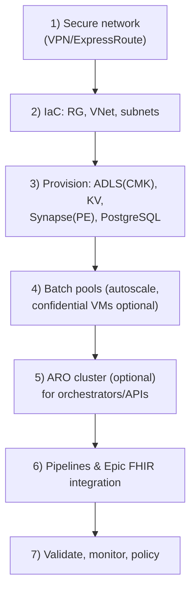

# Secure, Scalable Genomics Data Processing on Azure (WGS, RNA-Seq, Exome & Panels)

> **Audience:** Healthcare IT Engineers (Intermediate-to-Expert)  
> **Goal:** Build and deploy a **secure, compliant** genomics data processing platform on Azure using **Azure Batch**, **Azure Data Lake Storage Gen2**, **Azure Synapse Analytics**, **Azure Red Hat OpenShift (ARO)**, **Confidential Compute**, and **PostgreSQL (pgvector)**. Support Whole Genome Sequencing (WGS), RNA-Seq, exome, and gene panel pipelines. Ensure **HIPAA/HITRUST** compliance and integrate with Epic EHR via **FHIR**, with all data and compute in US regions.

---

## Slide 1 — Why this matters to providers

>[!TIP]  
>Genomic medicine is moving from research labs to the clinic. **Genome data volumes are exploding** – on the order of _exabytes_ of sequencing data and trillions of CPU core-hours needed in the next five years. Traditional hospital HPC clusters and appliances cannot easily scale to meet this demand or deliver fast insights for patient care. A cloud-based solution is needed for agility, **easier management**, and on-demand capacity.

>[!TIP]  
>**Pros:** Virtually **unlimited compute** to process whole genomes in hours, enabling faster diagnoses. Ability to **parallelize** hundreds of samples, integrate results with EHR data, and leverage advanced analytics/AI.  
>**Cons:** Requires robust **network connectivity** (large FASTQ files to cloud), strict **governance** of PHI in a new environment, and cloud cost management to avoid surprises.

---

## Slide 2 — Terminology & scope

- **Azure Batch:** Cloud HPC job scheduler for running large-scale genomics workloads (e.g. alignment, variant calling).
- **Azure Data Lake Storage Gen2 (ADLS Gen2):** Scalable object storage with hierarchical filesystem for FASTQ, BAM/VCF, and results.
- **Azure Synapse Analytics:** Spark + SQL analytics over ADLS for annotation, cohort queries, and reporting.
- **Azure Red Hat OpenShift (ARO):** Managed OpenShift in Azure to run Cromwell/Nextflow and integration services.
- **Confidential Compute:** Hardware TEEs (e.g., Intel SGX / AMD SEV) to encrypt data **in use**.
- **PostgreSQL (pgvector):** Vector similarity search for embeddings (gene expression, clinical NLP); alternatives include Azure Cognitive Search or specialized vector DBs.
- **Entra ID & Key Vault:** Identity/RBAC and CMKs/secrets.

---

## Slide 3 — Compliance lens (HIPAA, HITRUST, FHIR, DICOM)

- Use HIPAA-eligible services under a signed BAA; configure per Security Rule (access, audit, encryption).
- Assign HIPAA/HITRUST **Azure Policy** initiative for continuous posture checks.
- FHIR/DICOM: secure storage/transport; retention & access control; document shared responsibility.

---

## Slide 4 — Reference architecture (Cloud genomics pipeline)

```mermaid
flowchart LR
  subgraph OnPrem["On-Premises (Hospital Lab & EHR)"]
    Seq["NGS Sequencers\n(Lab instruments)"]:::onprem
    Epic["Epic EHR\n(FHIR API)"]:::onprem
  end
  subgraph Azure["Azure (US Region)"]
    ADLS["Data Lake Storage\n(ADLS Gen2)"]:::az
    Batch["Azure Batch\n(HPC Pools)"]:::az
    ARO["OpenShift (ARO)\nWorkflow Orchestrator"]:::az
    Synapse["Azure Synapse\nAnalytics Workspace"]:::az
    PG["PostgreSQL (Vector DB)"]:::az
    KV["Key Vault\n(CMKs, Secrets)"]:::az
  end

  Seq -- "Raw FASTQ uploads (AzCopy/SFTP)" --> ADLS
  Epic -- "FHIR patient data" --> ARO
  ARO -- "Push results via FHIR" --> Epic
  ARO -- "Submit jobs" --> Batch
  Batch -- "Read/write genomic data" --> ADLS
  Batch -- "Output VCFs, reports" --> ADLS
  Synapse -- "Query & analyze via Spark/SQL" --> ADLS
  Synapse -- "Store aggregated results" --> PG
  Epic --- "VPN/ExpressRoute" --- OnPremNet((On-Prem Network)):::net
  OnPremNet --- "VPN/ExpressRoute" --- AzureNet((Azure VNet)):::net
  KV --> ADLS
  KV --> Synapse
  classDef onprem fill:#f6f6f6,stroke:#888;
  classDef az fill:#e8f1ff,stroke:#006fcf;
  classDef net fill:#fff3cd,stroke:#c69500;
```

---

## Slide 5 — Deployment approach & flow



---

## Slide 6 — Security controls (checklist)

- **Identity:** Entra ID-only where possible; least-privilege RBAC; PIM for admins.
- **Network:** Private Endpoints; deny public; NSGs/Azure Firewall; VPN/ER only.
- **Encryption:** At rest (CMK) + in transit (TLS1.2+); **Confidential Compute** for in-use.
- **Data handling:** No PHI in logs; managed identity + Key Vault; full audit to Log Analytics.
- **Lifecycle:** Retention policies; soft delete/versioning; backup & long-term retention.

---

## Slide 7 — Performance vs legacy

- Scale-out to hundreds of VMs per pipeline; no queues, burst on demand.
- Optimized VM families per stage; newer CPU gens improve cost/perf.
- ADLS high-throughput parallel IO; compute/data co-located in-region.

---

## Slide 8 — BCDR

- ADLS **RA-GRS**; planned failover; immutable/WORM as needed.
- Secondary region readiness: Batch pools/ARO templates for redeploy.
- Synapse & PostgreSQL backups/geo-restore; Key Vault recovery.
- DR drills; on-prem buffering if link down.

---

## Slide 9 — Hybrid & ARO

- ER/VPN for FASTQ uploads; AzCopy/Data Box for bulk.
- Epic FHIR integration via private network; OAuth2.
- ARO hosts Cromwell/Nextflow, FHIR connectors; AAD SSO; NetworkPolicies.

---

## Slide 10 — Analytics & Vector DB

- Synapse Spark + SQL over ADLS for annotation/cohorts.
- AI/ML training/inference (optionally confidential VMs).
- **pgvector** for embeddings (gene expression, NLP) similarity search.

---

## Slide 11 — Compliance mapping (quick ref)

| Domain | Control | Implementation |
|---|---|---|
| Access control | Unique IDs, least privilege | AAD-only, RBAC, PIM, ADLS ACLs |
| Transmission | Encrypt in-flight | TLS1.2+, VPN/ER, private endpoints |
| Integrity | Prevent alteration | Delta/ACID, versioning, audits |
| Audit | Track access/activity | LA/Sentinel, diagnostics, alerts |
| At rest | Encrypt | CMK (Key Vault), disk/DB encryption |
| Lifecycle | Retain/Purge | Blob lifecycle, backups, LTR |

---

## Demos — CLI snippets

### Network & Storage
```bash
az group create -n GenomicsRG -l eastus
az network vnet create -g GenomicsRG -n GenomicsVNet --address-prefixes 10.100.0.0/16
az network vnet subnet create -g GenomicsRG --vnet-name GenomicsVNet -n BatchSubnet --address-prefixes 10.100.1.0/24
az keyvault create -g GenomicsRG -n GenomicsKeyVault -l eastus --sku standard --enable-soft-delete true --enable-purge-protection true
az keyvault key create --vault-name GenomicsKeyVault -n adls-cmk -p software
az storage account create -g GenomicsRG -n genomicsdatalake123 -l eastus \
  --sku Standard_RAGRS --kind StorageV2 --enable-hierarchical-namespace true \
  --encryption-key-source Microsoft.Keyvault \
  --encryption-key-name adls-cmk \
  --encryption-key-vault-key-uri $(az keyvault key show --vault-name GenomicsKeyVault -n adls-cmk --query key.kid -o tsv) \
  --default-action Deny
```

### Batch & ARO
```bash
az batch account create -g GenomicsRG -n GenomicsBatchAcct -l eastus --storage-account genomicsdatalake123
az batch account login -g GenomicsRG -n GenomicsBatchAcct --shared-key-auth
az batch pool create --id genomicsPool1 --vm-size Standard_D8_v3 --target-dedicated-nodes 0 \
  --auto-scale-enabled true --auto-scale-formula "$$TargetDedicatedNodes=0" \
  --image canonical:0001-com-ubuntu-server-focal:20_04-lts --node-agent-sku-id "batch.node.ubuntu 20.04"
# ARO (requires prereqs)
# az aro create -g GenomicsRG -n GenomicsARO -l eastus --vnet GenomicsVNet --master-subnet AROSubnet --worker-subnet AROSubnet \
#   --worker-count 3 --worker-vm-size Standard_D8s_v3 --pull-secret @/path/to/pull_secret.json
```

### Synapse & PostgreSQL
```bash
az synapse workspace create -g GenomicsRG -n GenomicsSynapse -l eastus \
  --storage-account genomicsdatalake123 --file-system "genomics" \
  --sql-admin-login-user sqladminuser --sql-admin-login-password "Str0ng!Passw0rd" \
  --enable-managed-vnet true --key-name "adls-cmk" --key-vault-url https://GenomicsKeyVault.vault.azure.net/
az postgres flexible-server create -g GenomicsRG -n genomicsdb -l eastus \
  --vnet GenomicsVNet --subnet BatchSubnet --administrator-login pgadmin --administrator-login-password "AnotherStr0ngP@ss1" --storage-size 128 --yes
```

### Policy & Diagnostics
```bash
az monitor diagnostic-settings create -n StorageDiag \
  --resource $(az storage account show -n genomicsdatalake123 -g GenomicsRG --query id -o tsv) \
  --workspace $(az monitor log-analytics workspace list -g GenomicsRG --query "[0].id" -o tsv) \
  --logs '[{"category":"StorageRead","enabled":true},{"category":"StorageWrite","enabled":true},{"category":"StorageDelete","enabled":true}]'

az policy assignment create --policy-set-definition /providers/Microsoft.Authorization/policySetDefinitions/a169a624-5599-4385-a696-c8d643089fab \
  --name HIPAA-HITRUST --scope /subscriptions/<YourSubID>/resourceGroups/GenomicsRG
```

---

## Appendix — Bicep (Storage + Key Vault + Synapse skeleton)

```bicep
param location string = 'eastus'
param storageAccountName string
param keyVaultName string
param synapseName string
param cmkName string = 'adls-cmk'
param fileSystem string = 'genomics'

resource kv 'Microsoft.KeyVault/vaults@2023-02-01' = {
  name: keyVaultName
  location: location
  properties: {
    tenantId: subscription().tenantId
    sku: { family: 'A', name: 'standard' }
    enablePurgeProtection: true
    enableSoftDelete: true
  }
}

resource key 'Microsoft.KeyVault/vaults/keys@2023-02-01' = {
  name: '${keyVaultName}/${cmkName}'
  properties: { kty: 'RSA' }
}

resource stg 'Microsoft.Storage/storageAccounts@2023-01-01' = {
  name: storageAccountName
  location: location
  kind: 'StorageV2'
  sku: { name: 'Standard_RAGRS' }
  properties: {
    minimumTlsVersion: 'TLS1_2'
    encryption: {
      keySource: 'Microsoft.Keyvault'
      keyVaultProperties: {
        keyName: cmkName
        keyVaultUri: kv.properties.vaultUri
      }
      services: { blob: { enabled: true } }
    }
    isHnsEnabled: true
    networkAcls: { defaultAction: 'Deny', bypass: 'AzureServices' }
  }
}

resource syn 'Microsoft.Synapse/workspaces@2021-06-01' = {
  name: synapseName
  location: location
  properties: {
    defaultDataLakeStorage: {
      accountUrl: 'https://${storageAccountName}.dfs.core.windows.net'
      filesystem: fileSystem
    }
    managedVirtualNetwork: 'default'
    encryption: {
      cmk: {
        key: {
          name: cmkName
          keyVaultUrl: kv.properties.vaultUri
        }
      }
    }
  }
}
```
