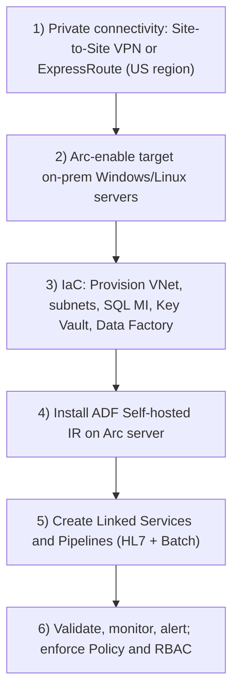
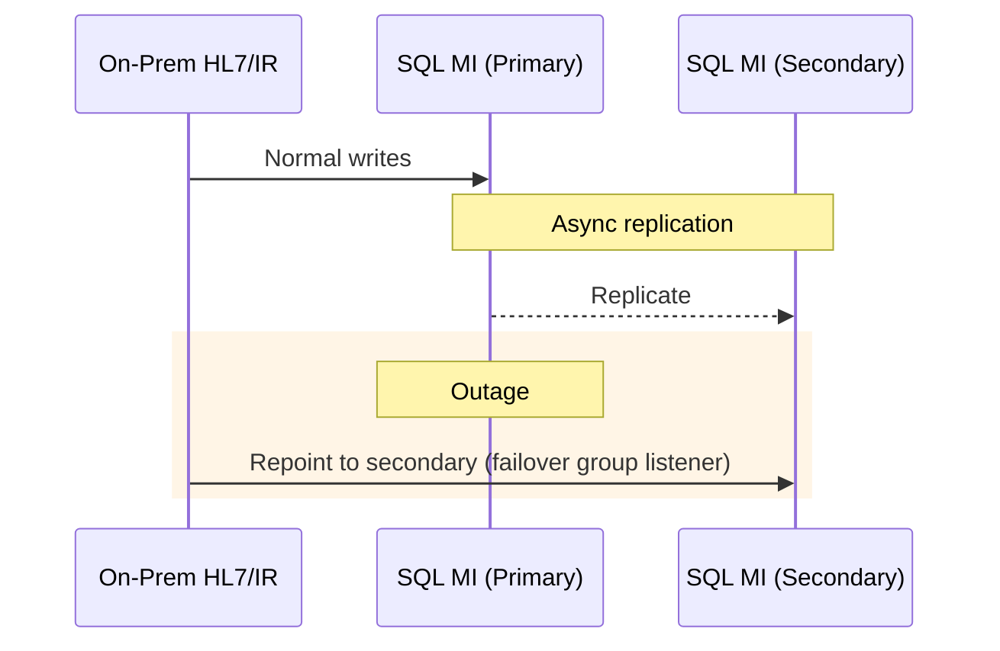

# Azure Arc Hybrid Clinical Data Integration (Epic/Cerner → Azure)

> **Audience:** IT Engineers in a healthcare provider  
> **Goal:** Deploy a hybrid clinical data integration solution using **Azure Arc**, **Azure Data Factory (ADF)**, **Azure SQL Managed Instance (MI)**, and **Microsoft Fabric**. Integrate real-time **HL7/FHIR** feeds and batch data loads from Epic & Cerner EHRs. Use **Entra ID** for auth, **U.S.-only** Azure regions, and a mix of **Windows/Linux** hybrid deployments (OpenShift optional for future).

---

## Slide 1 — Why this matters to providers

>[!TIP]  
>Legacy point-to-point interfaces and nightly ETL delay insights. A hybrid Azure approach unifies **real-time HL7** and **batch** data into a **secure, compliant** analytics plane without ripping-and-replacing your EHR.

**Pros:** timely insights, cloud scale, AI readiness.  
**Cons:** network dependency and need for cloud governance.

---

## Slide 2 — Terminology & scope

- **Azure Arc:** Bring on‑prem **Windows/Linux** servers into Azure for inventory, policy, monitoring.  
- **ADF:** Orchestrates pipelines (copy, mapping data flows) for **batch** and **near real‑time** integration.  
- **SQL MI:** PaaS SQL Server in a private VNet for integrated clinical data.  
- **Microsoft Fabric:** Unified analytics (Lakehouse, Warehouses, Notebooks, Power BI).  
- **HL7 v2 & FHIR:** HL7 via **MLLP/TCP**; **FHIR R4** via REST/JSON.  
- **Entra ID:** Central identity for users & workloads.  
- **Scope:** U.S. regions only; OpenShift is **future** (not deployed now).

---

## Slide 3 — Compliance lens (HIPAA/HITRUST, FHIR, DICOM)

- **HIPAA eligible services & BAA**; configure per Security Rule.  
- **HITRUST alignment:** Inherit Azure controls, implement customer controls (identity, network, logging, backups).  
- **Azure Policy initiatives:** Assign **HIPAA/HITRUST** to RG/subscription for continuous audit.  
- **Shared responsibility:** You secure identity, endpoints, data handling, and local systems.

---

## Slide 4 — Reference architecture (Hybrid on‑prem ↔ Azure)

```mermaid
flowchart LR
  subgraph On-Premises
    EHR1["Epic EHR<br/>(DB &amp; Extracts)"]:::onprem
    EHR2["Cerner EHR<br/>(DB &amp; Extracts)"]:::onprem
    HL7["HL7 Interface Engine<br/>(Mirth &amp; Rhapsody)"]:::onprem
    OPS["Windows &amp; Linux Servers<br/>(Azure Arc)"]:::onprem
  end

  subgraph Azure (US Region)
    ADF["Azure Data Factory<br/>(Orchestration)"]:::az
    IR["Self-hosted Integration Runtime<br/>(on-prem, Arc-managed)"]:::onprem
    SQLMI["Azure SQL Managed Instance<br/>(Clinical DB, Private)"]:::az
    KV["Azure Key Vault<br/>(CMK, secrets)"]:::az
    ENTRA["Entra ID (Azure AD)"]:::az
  end

  EHR1 -- "Nightly / Hourly Extracts" --> ADF
  EHR2 -- "Nightly / Hourly Extracts" --> ADF
  HL7 -- "Real-time HL7 v2" --> ADF
  ADF -- "via IR" --> SQLMI
  ADF --> KV
  ENTRA --- ADF
  ENTRA --- SQLMI

  OnPremNet((On-Prem Network)):::net ---|"VPN / ExpressRoute"|--- AzureNet((Azure VNet)):::net

  classDef onprem fill:#f6f6f6,stroke:#888;
  classDef az fill:#e8f1ff,stroke:#2a5bd7;
  classDef net fill:#fff3cd,stroke:#c69500;
```

**Notes:** ADF uses **Self-hosted IR** on an Arc-managed on‑prem server to pull from Epic/Cerner and push to SQL MI over private connectivity. All cloud endpoints are **private** and **AAD-protected**.

---

## Slide 5 — Deployment approach & flow



---

## Slide 6 — Security controls for ePHI (settings checklist)

**Identity & Access**  
- Entra ID-only auth where supported (SQL MI AAD admin; disable SQL logins where possible).  
- RBAC least privilege: ADF (Data Factory Contributor), SQL roles mapped to AAD groups.  
- Privileged access: PIM/JIT for admin roles; MFA enforced.

**Network**  
- No public endpoints; **Private Link**/**private DNS**.  
- VPN/ExpressRoute for all on‑prem ↔ Azure traffic.  
- NSGs/NVAs to restrict subnets; deny-all egress except required.

**Encryption**  
- **At rest:** SQL MI **TDE** with **CMK** (Key Vault) if policy requires. Encrypt any staging storage.  
- **In transit:** TLS 1.2+ everywhere. HL7 over VPN/ER; optionally MLLP-in-TLS (stunnel).

**Data Handling**  
- Minimize/avoid PHI in logs; hash/pseudonymize where possible.  
- ADF Managed Identity retrieves secrets from Key Vault; no secrets in code.  
- Enable auditing: SQL MI audit to Log Analytics/Storage; ADF diagnostics to Log Analytics.

---

## Slide 7 — Performance vs. traditional

- **Throughput & scale-out:** Parallel copy activities; multi-node Self-hosted IR; schedule micro-batches instead of one huge nightly.  
- **Latency:** ER/VPN yields low-ms hops; we’re not in the clinician’s transactional path.  
- **Ops efficiency:** Serverless orchestration vs. patching on-prem ETL servers.  
- **Tip:** Co-locate SQL MI and any Azure compute in the same region; size IR nodes for peak extract windows.

---

## Slide 8 — BC/DR strategy (healthcare-focused)

- **SQL MI:** Zone redundancy; **Auto-Failover Groups** to secondary US region for RPO≈seconds, RTO≈minutes.  
- **ADF:** Pipelines as code; redeploy to DR region; IR nodes deployed in pairs.  
- **Network:** Dual tunnels/dual ER circuits; failover VPN.  
- **On-prem:** HL7 engine HA; queue messages locally during outage; catch-up replay.  
- **Backups:** SQL MI PITR (7–35 days) + Long-Term Retention (years). Quarterly DR drills.



---

## Slide 9 — Demo 1: Azure Arc onboarding (Linux/Windows)

**Linux:**  
```bash
wget https://aka.ms/azcmagent -O Install_AzureArc.sh
sudo bash Install_AzureArc.sh
azcmagent connect --resource-group <RG> --tenant-id <TENANT_ID> \
  --location <REGION> --subscription-id <SUB_ID>
```

**Windows (Admin PowerShell):**  
```powershell
Install-Module Az.ConnectedMachine -Force
Connect-AzConnectedMachine -ResourceGroup <RG> -TenantId <TENANT_ID> `
  -Location <REGION> -SubscriptionId <SUB_ID>
```

---

## Slide 10 — Demo 2: Network + SQL MI (CLI + Bicep)

**Create RG & VNet/Subnet (CLI):**  
```bash
az group create -n ClinDataIntegrationRG -l eastus
az network vnet create -g ClinDataIntegrationRG -n ClinicalVNet -l eastus \
  --address-prefixes 10.20.0.0/16
az network vnet subnet create -g ClinDataIntegrationRG --vnet-name ClinicalVNet \
  -n SqlMISubnet --address-prefixes 10.20.1.0/24 \
  --delegations Microsoft.Sql/managedInstances
```

**Deploy SQL MI (Bicep excerpt):** See `iac/deploy_sqlmi.bicep` in this package.  
Deploy:  
```bash
az deployment group create -g ClinDataIntegrationRG -f iac/deploy_sqlmi.bicep \
  -p administratorLoginPassword=<SecurePW>
```

---

## Slide 11 — Demo 3: Data Factory (CLI + SHIR)

**Create ADF (CLI):**  
```bash
az datafactory create -n ClinicalDataFactory -g ClinDataIntegrationRG -l eastus \
  --identity-type SystemAssigned
```

**Self-hosted IR:** From ADF Studio → Manage → Integration Runtimes → **New (Self-hosted)** → Download & install on Arc server → Register with provided key.  
**Linked Services & Pipelines:** Create LS for on‑prem sources (ODBC/REST), SQL MI sink; implement HL7-to-staging and batch ETL pipelines.

---

## Slide 12 — Demo 4: Azure Policy (HIPAA/HITRUST)

```bash
SUB="<SUB_ID>"
SCOPE="/subscriptions/$SUB/resourceGroups/ClinDataIntegrationRG"
GUID="a169a624-5599-4385-a696-c8d643089fab"   # HIPAA/HITRUST initiative
az policy assignment create --name hipaa-hitrust \
  --display-name "HIPAA/HITRUST baseline" --policy $GUID --scope $SCOPE
```

---

## Slide 13 — Compliance mapping quick reference

| Domain | Control | Implementation |
|---|---|---|
| Access control | Unique IDs, least privilege | Entra ID-only access to SQL MI; ADF RBAC; PIM/MFA |
| Transmission security | Encrypt in-flight | TLS1.2+, VPN/ER; optional HL7 over TLS |
| Integrity | Prevent alteration | SQL MI ACID; audits; PITR/LTR |
| Audit | Track access/activity | SQL MI audit to Log Analytics; ADF diagnostics; Sentinel |
| Data at rest | Encrypt | TDE on SQL MI (CMK optional); encrypted staging |
| Data lifecycle | Retention | SQL LTR (years); HL7 replay; purge/archive policies |

---

## Slide 14 — Anticipated objections & responses

- **“Cloud PHI risk.”** HIPAA-eligible services + BAA; private endpoints; encryption; full audit.  
- **“Network dependency.”** Redundant tunnels/ER; local HL7 queue; catch-up.  
- **“Latency.”** We’re out of the clinician path; near‑real‑time is sufficient for analytics.  
- **“Skills & complexity.”** IaC + ADF low-code; Arc centralizes ops; start with pilot.  
- **“Cost.”** Pay‑as‑you‑go; right-size IR and MI; show ROI via analytics value.

---

## Slide 15 — Future extensibility with Microsoft Fabric & AI

- Land curated data in a **Fabric Lakehouse** (Delta) for cross‑domain analytics.  
- Use **Fabric Data Factory**/Pipelines (same skillset) and **Notebooks/ML** for models (e.g., readmission risk).  
- Power BI for governed clinical dashboards.  
- Optional **ARO/OpenShift** later for microservices (FHIR APIs, event processors).

---

## Slide 16 — What you’ll demo live

1) Show Arc-connected on‑prem server(s) in Azure Portal.  
2) Show SQL MI & VNet (private endpoint, no public access).  
3) Show ADF, Self-hosted IR online. Trigger a pipeline run.  
4) Verify rows land in SQL MI; view audit logs.  
5) Open Policy compliance dashboard (HIPAA/HITRUST) and show passed/failed controls.

---

### Appendix A — SQL MI security hardening (CLI)

```bash
# Set AAD admin (after creating an AAD group/user)
az sql mi ad-admin create -g ClinDataIntegrationRG -n clin-sqlmi-prod \
  --display-name "SQLMI Admins" --object-id <AAD_GROUP_OBJECT_ID>

# (Recommended) Enforce minimal TLS version & disable public network access
az sql mi update -g ClinDataIntegrationRG -n clin-sqlmi-prod \
  --minimal-tls-version 1.2 --public-data-endpoint-enabled false
```

### Appendix B — ADF diagnostics & Key Vault

```bash
# Enable ADF diagnostics to Log Analytics (replace with your workspace IDs)
az monitor diagnostic-settings create --name "adf-logs" \
  --resource $(az datafactory show -n ClinicalDataFactory -g ClinDataIntegrationRG --query id -o tsv) \
  --workspace <LOG_ANALYTICS_RESOURCE_ID> \
  --logs '[{"category": "PipelineRuns","enabled": true},{"category": "ActivityRuns","enabled": true}]'

# Grant ADF MI access to Key Vault
ADF_MI_PRINCIPAL_ID=$(az datafactory show -n ClinicalDataFactory -g ClinDataIntegrationRG --query identity.principalId -o tsv)
az keyvault set-policy -n <KV_NAME> --object-id $ADF_MI_PRINCIPAL_ID --secret-permissions get list
```

### Appendix C — Operations runbook snippets

```bash
# List Arc machines
az connectedmachine list -g ClinDataIntegrationRG -o table

# Trigger pipeline run
az datafactory pipeline create-run --factory-name ClinicalDataFactory \
  -g ClinDataIntegrationRG --name "HL7_Ingest_Pipeline"

# Query pipeline run status last 24h
az datafactory pipeline-run query-by-factory --factory-name ClinicalDataFactory \
  -g ClinDataIntegrationRG --last-updated-after "$(date -u -d '1 day ago' +%Y-%m-%dT%H:%M:%SZ)" \
  --last-updated-before "$(date -u +%Y-%m-%dT%H:%M:%SZ)" -o table
```
