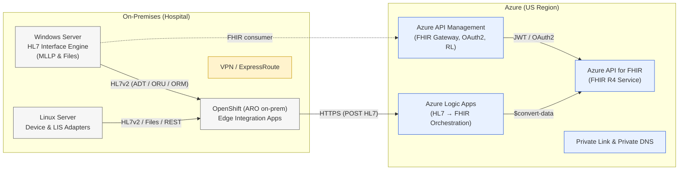

# Hybrid HL7/FHIR Interoperability Platform on Azure
> **Audience:** Healthcare IT Engineers (Intermediate–Advanced)  
> **Goal:** Deploy a hybrid interoperability platform—**Azure API for FHIR + Azure Logic Apps + Azure API Management (APIM)**—that ingests **HL7 v2** from on‑prem EHR/LIS/devices, converts to **FHIR R4**, and exposes secure **FHIR APIs**. Includes Windows/Linux servers and **OpenShift (ARO)** for edge/hybrid, with compliance controls for **HIPAA, HITRUST, FHIR, DICOM**, and protection of **ePHI**. US regions assumed.

---

## Slide 1 — Why this matters now
- Hospitals juggle HL7 v2 feeds, bespoke interfaces, and growing clinical datasets (EHR, LIS, PACS/DICOM, devices).  
- FHIR APIs enable real‑time care coordination, patient access, and analytics while reducing brittle point‑to‑point links.  
- Azure provides a managed, compliant foundation with **FHIR Service**, **Logic Apps**, and **APIM**—deployable as **hybrid** (on‑prem + cloud).
- **Outcome:** faster integration, better reliability, and lower ops toil—*without throwing away* HL7 investments.

---

## Slide 2 — What we’ll build (45‑minute session plan)
1. **Architecture** (hybrid: on‑prem Windows/Linux + OpenShift + Azure)  
2. **Data flow**: HL7 v2 → `$convert-data` → FHIR Resources  
3. **Security & Compliance**: HIPAA/HITRUST, ePHI protection, auditing  
4. **Deploy** (CLI + Bicep): FHIR, Logic App, APIM + Private Link ready  
5. **Demo**: Post an ADT^A01 → see Patient/Encounter in FHIR → call via APIM  
6. **BCDR**: Regions, backups, DR drills, RPO/RTO targets  
7. **Performance**: Scale‑out, throttling, caching, parallelism  
8. **Objections** & migration strategies; **future AI** hooks (Health Bot, AI Search)

---

## Slide 3 — Reference architecture (hybrid)

**Notes:** On‑prem adapters can run on Windows/Linux or **OpenShift (ARO)**. All PHI flows over **private** channels (VPN/ER), with **APIM** enforcing auth, quotas, and schema/size checks. `$convert-data` uses Microsoft‑supplied Liquid templates for HL7→FHIR mapping.

---

## Slide 4 — HL7 v2 → FHIR workflow (sequence)

```mermaid
sequenceDiagram
  autonumber
  participant EHR as On-Prem EHR/LIS
  participant Edge as Edge Adapter (OpenShift)
  participant LA as Logic App
  participant FHIR as Azure FHIR Service
  participant APIM as API Management

  EHR->>Edge: HL7v2 ADT\^A01 (MLLP, File, HTTP)
  Edge->>LA: HTTP POST (HL7 payload)
  LA->>FHIR: POST $convert-data (templates=hl7v2 default, root=ADT_A01)
  FHIR-->>LA: FHIR Bundle (Patient, Encounter, etc.)
  LA->>FHIR: POST or PUT resources (transaction)

  Note over FHIR,APIM
    Data at rest encrypted; RBAC via Entra ID (AAD)
  end note

  APIM->>FHIR: Client FHIR queries (JWT validated, rate-limited)

```

---

## Slide 5 — Standards & scope
- **Messaging:** HL7 v2.x (ADT, ORU, ORM, VXU), files (CSV/XML), device telemetry  
- **API/Data model:** **FHIR R4** resources and search parameters  
- **Imaging:** **DICOM** (optional, via DICOM service) with FHIR links (ImagingStudy)  
- **Security:** OAuth2/OIDC (Entra ID), TLS 1.2+, Private Link, CMK optional  
- **Ops:** IaC (Bicep), Azure CLI, GitHub Actions/DevOps ready

---

## Slide 6 — Compliance guardrails (HIPAA/HITRUST & ePHI)
- **Shared responsibility:** Azure certs & platform controls; you configure identity, networking, data handling, and logging.
- **Entra ID (AAD):** JWT scopes; app roles: *FHIR Data Contributor/Reader/Converter*.  
- **Network isolation:** **Public network access = Disabled**; **Private Link** to FHIR/APIM; traffic only via VPN/ER.  
- **Encryption:** AES‑256 at rest (CMK optional via Key Vault); TLS in transit; no PHI in logs/filenames.  
- **Auditability:** APIM & FHIR audit logs to **Log Analytics/Sentinel**, retain per policy.  
- **Azure Policy:** Assign HIPAA/HITRUST initiatives; deny public endpoints; enforce diagnostic settings.

---

## Slide 7 — Security deep dive (defense‑in‑depth)
- **Identity:** Managed Identity for Logic App → least‑privilege RBAC on FHIR.  
- **APIM policies:** `validate-jwt`, `rate-limit`, `check-header`, body size caps; block wildcard searches.  
- **Data minimization:** Transform only required fields; redact or map Z‑segments to FHIR extensions carefully.  
- **Key Vault:** Store client secrets/keys; periodic rotation; MSI preferred over secrets.  
- **Dev/Test:** Use de‑identified data; segregate subscriptions; access via PIM/JIT.

---

## Slide 8 — Performance architecture
- **Parallelism:** Logic Apps fan‑out over bundle entries; Service Bus decouples bursts.  
- **Scale‑out:** FHIR service scales with workload; APIM autoscale tiers; LA concurrency controls.  
- **Caching:** APIM response caching for read‑heavy GETs (non‑PHI or short TTL).  
- **Backpressure:** APIM throttling + 429 handling; LA retry with exponential backoff.  
- **Latency:** Place compute in same region; use ER not Internet; gzip JSON; prefer search includes over N+1 GETs.

---

## Slide 9 — BCDR targets & approach
- **Targets:** EHR/ADT feeds RPO ≤ 15 min, RTO ≤ 60 min; Labs ORU RPO ≤ 15 min; Portals RTO ≤ 30–60 min.  
- **Mechanisms:** FHIR backups/exports; template‑driven redeploy (Bicep); APIM multi‑region (Premium for prod); DR Logic App clone.  
- **Drills:** Quarterly; failover runbooks; DNS/APIM route switchover scripts; replay last‑mile HL7 from edge queue.  
- **Store‑and‑forward:** Edge adapter buffers HL7 during outages; eventual delivery when link restored.

---

## Slide 10 — Demo prep (what you’ll see)
1. Post sample **ADT^A01** to Logic App → `$convert-data` → FHIR Patient+Encounter created.  
2. Query **/Patient?identifier=** via **APIM** with bearer token.  
3. Show logs & audit trail in **Log Analytics**; show **Azure Policy** compliance view.

---

## Slide 11 — Deploy (CLI): providers, RG, VNet (optional)
```bash
# Log in & set subscription
az login
az account set --subscription "<SUB_ID>"

# Register providers & add extensions
az provider register --namespace Microsoft.HealthcareApis --wait
az provider register --namespace Microsoft.ApiManagement --wait
az provider register --namespace Microsoft.Logic --wait
az extension add --name healthcareapis || true
az extension add --name logic || true

# Resource group (US region)
az group create -n rg-fhir-demo -l eastus

# (Optional) VNet/Subnet for Private Endpoints
az network vnet create -g rg-fhir-demo -n vnet-fhir --address-prefixes 10.40.0.0/16
az network vnet subnet create -g rg-fhir-demo --vnet-name vnet-fhir -n snet-private   --address-prefixes 10.40.1.0/24
```

---

## Slide 12 — Deploy (Bicep): FHIR + APIM + PrivateLink‑ready
> Template: `bicep/main.bicep` (see bundle). Parameters let you toggle **publicNetworkAccess**, private endpoints, and APIM SKU.

```bash
az deployment group create -g rg-fhir-demo   --template-file ./bicep/main.bicep   --parameters location=eastus fhirServiceName=fhir-demo-001                apimName=apim-fhir-demo skuName=Developer                createPrivateEndpoint=true vnetName=vnet-fhir subnetName=snet-private
```

---

## Slide 13 — Deploy (CLI): Logic App (HL7→FHIR)
```bash
# Create Logic App (Consumption) from definition
az logic workflow create -g rg-fhir-demo -n HL7toFHIR   --location eastus --definition @./logicapp/hl7_to_fhir_logicapp.json

# Grant Logic App identity rights on FHIR (replace with its principalId)
LA_PRINCIPAL_ID=$(az logic workflow show -g rg-fhir-demo -n HL7toFHIR --query identity.principalId -o tsv || echo "")
FHIR_ID=$(az resource show -g rg-fhir-demo -n fhir-demo-001 --resource-type Microsoft.HealthcareApis/services --query id -o tsv)
az role assignment create --assignee $LA_PRINCIPAL_ID --role "FHIR Data Contributor" --scope $FHIR_ID
az role assignment create --assignee $LA_PRINCIPAL_ID --role "FHIR Data Converter" --scope $FHIR_ID
```

---

## Slide 14 — APIM: publish FHIR API & policies
- Import FHIR endpoints (OpenAPI or manual).  
- **Inbound policies:** `validate-jwt` (issuer=aad, audience=fhir URL/client), `rate-limit`, `limit-concurrency`, `set-backend-service`.  
- Optional **response caching** for read queries (short TTL). See `apim/policies/fhir-inbound-policy.xml` in bundle.

---

## Slide 15 — HL7 sample (for demo)
```hl7
MSH|^~\&|EHR|HOSP|FHIR|AZURE|202501011230||ADT^A01|MSG00001|P|2.5
PID|1||123456^^^HOSP^MR||DOE^JOHN^^^^^L||19800101|M|||123 MAIN ST^^CITY^ST^12345||555-1234
PV1|1|I|3N^301^1^HOSP||||1234^ATTEND^DOC^^^^^L
```
**How to test:** `curl -X POST -H "Content-Type: text/plain" --data-binary @adt.txt "<LogicAppTriggerUrl>"`

---

## Slide 16 — Logic App definition (key excerpt)
```json
{
  "$schema":"https://schema.management.azure.com/providers/Microsoft.Logic/schemas/2016-06-01/workflowdefinition.json#",
  "contentVersion":"1.0.0.0",
  "parameters":{},
  "triggers":{
    "receive_hl7":{
      "type":"Request","kind":"Http","inputs":{"schema":{}}
    }
  },
  "actions":{
    "convert_to_fhir":{
      "type":"Http",
      "inputs":{
        "method":"POST",
        "uri":"https://{fhirName}.azurehealthcareapis.com/$convert-data",
        "headers":{"Content-Type":"application/json"},
        "body":{
          "resourceType":"Parameters",
          "parameter":[
            {"name":"inputData","value":"@{base64(triggerBody())}"},
            {"name":"inputDataType","value":"Hl7v2"},
            {"name":"templateCollectionReference","value":"microsofthealth/hl7v2templates:default"},
            {"name":"rootTemplate","value":"ADT_A01"}
          ]
        },
        "authentication":{"type":"ManagedServiceIdentity"}
      }
    },
    "post_bundle":{
      "foreach":"@body('convert_to_fhir').entry",
      "type":"Foreach",
      "actions":{
        "post_resource":{
          "type":"Http",
          "inputs":{
            "method":"POST",
            "uri":"@{items('post_bundle').resource.resourceType}",
            "baseUrl":"https://{fhirName}.azurehealthcareapis.com",
            "headers":{"Content-Type":"application/fhir+json"},
            "body":"@{items('post_bundle').resource}",
            "authentication":{"type":"ManagedServiceIdentity"}
          }
        }
      }
    }
  }
}
```

---

## Slide 17 — OpenShift (ARO/on‑prem) HL7 edge bridge
```yaml
apiVersion: apps/v1
kind: Deployment
metadata: { name: hl7-mllp-bridge, namespace: interop }
spec:
  replicas: 2
  selector: { matchLabels: { app: hl7-mllp-bridge } }
  template:
    metadata: { labels: { app: hl7-mllp-bridge } }
    spec:
      containers:
      - name: bridge
        image: ghcr.io/example/hl7-mllp-http-bridge:latest  # replace with your image
        env:
        - { name: LISTEN_PORT, value: "2575" }
        - { name: TARGET_URL, valueFrom: { secretKeyRef: { name: la-secret, key: url } } }
        ports: [{ containerPort: 2575 }]
---
apiVersion: v1
kind: Service
metadata: { name: hl7-mllp-bridge, namespace: interop }
spec:
  selector: { app: hl7-mllp-bridge }
  ports: [{ port: 2575, targetPort: 2575, protocol: TCP }]
```
> Bridge converts **MLLP** inbound to **HTTP POST** toward the Logic App trigger URL; buffers on transient errors.

---

## Slide 18 — ePHI protection checklist
- Disable public endpoints; use **Private Link** + private DNS.  
- Enforce **TLS 1.2+**; disallow weak ciphers; custom domain for APIM with managed certs.  
- **JWT validation** in APIM; **RBAC** on FHIR; **PIM/JIT** for operators.  
- **Diagnostics**: FHIR/LA/APIM to Log Analytics; retain per policy; alert on anomalies.  
- **Key management**: enable CMK if policy dictates; auto‑rotate secrets; prefer MSI.

---

## Slide 19 — Azure Policy (quick)
```bash
# Assign built-in HIPAA/HITRUST initiative at subscription or RG scope
GUID="a169a624-5599-4385-a696-c8d643089fab"
az policy assignment create --name hipaa-hitrust --policy $GUID   --scope "/subscriptions/<SUB_ID>/resourceGroups/rg-fhir-demo"
```

---

## Slide 20 — APIM inbound policy (snippet)
```xml
<inbound>
  <base />
  <validate-jwt header-name="Authorization" require-scheme="Bearer">
    <openid-config url="https://login.microsoftonline.com/<TENANT_ID>/v2.0/.well-known/openid-configuration" />
    <audiences>
      <audience>https://{fhirName}.azurehealthcareapis.com</audience>
      <!-- or api://{client-id} if using application audience -->
    </audiences>
  </validate-jwt>
  <rate-limit calls="100" renewal-period="60" />
  <set-header name="x-correlation-id" exists-action="override">
    <value>@(context.RequestId)</value>
  </set-header>
</inbound>
```

---

## Slide 21 — Monitoring & audit
- **APIM**: request logs, policy outcomes, 4xx/5xx rates, latency, per‑consumer analytics.  
- **FHIR**: audit events, throttling metrics, search performance; diagnostics to LA.  
- **Logic Apps**: run history, failed actions; alerts with action groups.  
- **SIEM**: Azure Sentinel rules for anomalous spikes, unauthorized sources, data exfil indicators.

---

## Slide 22 — Cost & performance tips
- Right‑size APIM SKU; dev/test → Developer, prod → Premium (multi‑region/VNET).  
- Logic Apps **consumption** for sporadic loads; **standard** for high‑throughput/Arc.  
- Minimize `$include`/`_revinclude` breadth; paginate; prefer transaction bundles.  
- Use **Service Bus** between edge and cloud for smoothing bursts.

---

## Slide 23 — Migration patterns
- **Side‑by‑side**: keep HL7 v2 feeds; mirror into FHIR; validate parity; gradually move consumers to FHIR.  
- **Adapter first**: deploy edge bridge → cloud LA/FHIR; retire brittle point‑to‑point later.  
- **Blue/green**: APIM routes small % to new FHIR backend; increase as confidence grows.

---

## Slide 24 — Typical objections & responses
- *Security*: Azure Health/Entra, Private Link, CMK, full audit—meets HIPAA/HITRUST when configured.  
- *Latency*: Edge processing + ER; APIM caching; parallel ingestion.  
- *Skills*: Visual workflows; incremental adoption; reuse HL7 expertise to tune templates.  
- *Lock‑in*: Open standards (HL7/FHIR); IaC exportable; APIs documented.

---

## Slide 25 — Future: AI & patient engagement
- **Azure Health Bot**: guided triage, pulls FHIR via APIM using OAuth2; audit all interactions.  
- **Azure AI Search (Healthcare skills)**: index de‑identified FHIR + clinical docs for semantic search; isolate PHI; bring‑your‑own‑key.

---

## Slide 26 — Live demo script (10 minutes)
1. Show **FHIR service** blade; copy **/metadata** URL.  
2. Open **Logic App** run history → trigger with sample ADT; show `$convert-data` output.  
3. In **APIM Test** console, GET `/Patient?identifier=123456`.  
4. Open **Log Analytics** query: failed runs, 4xx spikes; show Policy compliance view.

---

## Slide 27 — Cleanup
```bash
az group delete -n rg-fhir-demo --yes --no-wait
```

---

## Appendix A — Bicep deploy notes
- Template accepts: `fhirServiceName`, `apimName`, `skuName`, `createPrivateEndpoint`, `vnetName`, `subnetName`, `publicNetworkAccess`.  
- For **production**, use APIM **Premium** + VNET/Private Link; enable **Private Endpoint** for FHIR.  
- Add RBAC assignments for app registrations (FHIR Data Reader/Contributor/Converter).

## Appendix B — OpenShift security
- Use **NetworkPolicies** to restrict bridge egress to Logic App URL.  
- Store secrets in **OpenShift Secrets**; mount read‑only; rotate regularly.  
- Use SCC/PSP equivalents minimally—no privileged unless required.

## Appendix C — Sample test curl
```bash
curl -X POST -H "Content-Type: text/plain"   --data-binary @adt.txt "https://<logic-app-trigger-url>"
```

---

### End — Q&A
