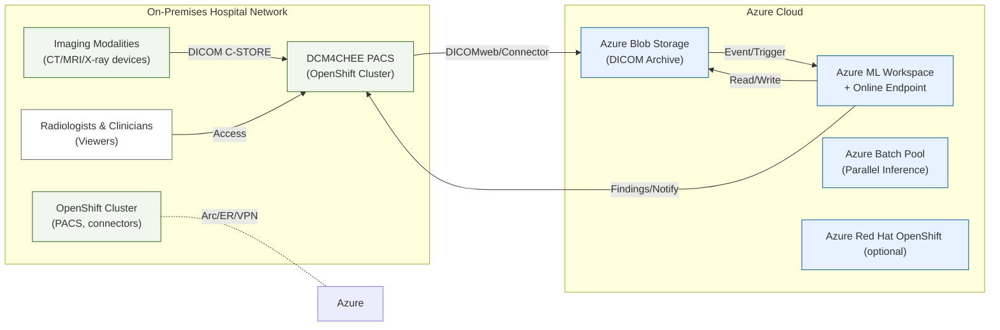
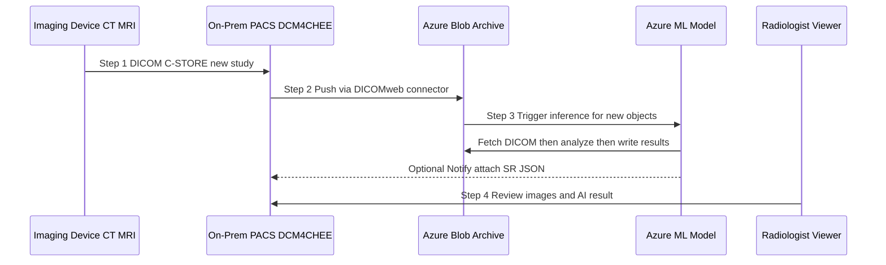

# Hybrid Imaging Archive & AI Diagnostics (Azure + OpenShift)

> **Audience:** Healthcare IT Engineers & Architects (Intermediate–Advanced)  
> **Duration:** ~45 minutes  
> **Focus:** Azure Blob Storage, Azure Machine Learning, Azure Batch, OpenShift (on‑prem & ARO), DICOM/PACS integration, HIPAA/HITRUST/FHIR compliance

---

## Slide 1 — Why Hybrid Cloud for Medical Imaging?
- **Data explosion**: Multi‑petabyte DICOM archives; 10–15+ year retention.
- **Legacy constraints**: On‑prem PACS/NAS bottlenecks; costly scale‑up; limited DR.
- **Hybrid opportunity**: Cloud‑scale archive + on‑demand AI while preserving on‑prem control and viewer performance.

---

## Slide 2 — Solution Overview
- **Storage**: Azure Blob as vendor‑neutral archive (Hot/Cool/Archive tiers; optional immutability/WORM).
- **AI**: Azure ML for anomaly detection endpoints; Azure Batch for high‑volume inference.
- **Orchestration**: OpenShift on‑prem for PACS & connectors; ARO optional for cloud microservices.
- **Connectivity**: ExpressRoute/VPN; Private Endpoints; no public exposure of ePHI.
- **Compliance**: HIPAA, HITRUST, DICOM, with end‑to‑end encryption and audit.

---

## Slide 3 — Key Components & Standards
- **PACS**: DCM4CHEE (example) on on‑prem OpenShift.
- **DICOM**: C‑STORE, DICOMweb (STOW/QIDO/WADO).
- **Azure**: Blob Storage, ML workspace + online endpoint, Batch pools/jobs.
- **Security**: RBAC/MFA, CMK optional, private networking, audit logs.
- **FHIR**: Optional linkage to EHR; scope here is imaging pipeline.

---

## Slide 4 — Reference Architecture (Hybrid)

**Notes:** Keep recent studies on‑prem; archive + AI in Azure.

---

## Slide 5 — Data Flow (Scan → Archive → AI → Clinician)


---

## Slide 6 — Blob as DICOM Archive
- Hot/Cool/Archive tiers optimize cost; RA‑GRS for DR.
- Container immutability (WORM) & legal hold for integrity.
- Private Endpoints; default network **Deny**; TLS 1.2+ only.
- Lifecycle rules tier old studies; prefetch priors for clinics.

---

## Slide 7 — Azure ML for Anomaly Detection
- Register model (e.g., chest X‑ray CNN in ONNX).
- Deploy **online endpoint** (private) for real‑time assist.
- Use **Batch** for large reprocessing (research, retrospectives).
- Log inference; version models; human‑in‑the‑loop review.

---

## Slide 8 — Azure Batch for Scale-Out
- Create Batch account/pool; schedule tasks per study/series.
- GPU/CPU pools; spot nodes for cost.
- Containers read from Blob; write findings back to Blob/DB.

---

## Slide 9 — OpenShift (On-Prem & ARO)
- On‑prem OpenShift runs PACS/Orthanc and connectors.
- ARO hosts cloud microservices; HIPAA‑eligible deployment.
- Azure Arc connects governance, policy, monitoring across clusters.
- PVCs for PACS DB/cache; FIPS mode; NetworkPolicies for egress.

---

## Slide 10 — Security: Encryption & Network
- At‑rest: Azure Storage SSE (AES‑256); CMK via Key Vault optional; on‑prem LUKS/BitLocker.
- In‑flight: TLS 1.2+; DICOM TLS; VPN/IPsec or ExpressRoute; no public endpoints.
- Private DNS + Private Endpoints; NSGs/NVAs restrict flows.
- Defender for Cloud/Monitor alerts on anomalies.

---

## Slide 11 — Security: Identity, RBAC, Audit
- Azure AD RBAC for Storage/ML/Batch; least privilege; PIM JIT.
- OpenShift integrates with AD/LDAP; SCCs; non‑root containers.
- Full audit trail: Storage access logs, AML/Batch logs, K8s audit.
- Data residency: US regions; policy denies drift.

---

## Slide 12 — BCDR
- Soft delete + versioning; Recovery Services Vault for backups.
- RA‑GRS; secondary region read/failover.
- On‑prem outage → cloud viewer/ARO fallback; cloud outage → on‑prem cache continues.
- RPO: minutes; RTO: <1h (viewer), <4h (full PACS in cloud).

---

## Slide 13 — Performance & Cost
- Keep hot cache on‑prem; prefetch priors; ER latency typically low‑ms.
- Batch/endpoint autoscale; spot nodes lower cost.
- Tiered storage; cost management budgets/alerts; reservations for steady capacity.

---

## Slide 14 — Legacy Objections (and Responses)
- **Speed**: On‑prem cache; prefetch; ER; faster than tape/offline archives.
- **Security**: Encryption, private links, BAA, audit; often stronger than legacy.
- **Control**: Open standards; hybrid keeps local control; IaC transparency.
- **Downtime**: Dual paths; DR drills; on‑prem continues during cloud issues.
- **Complexity**: Arc + GitOps unify ops; managed services reduce toil.

---

## Slide 15 — OpenShift Hardening Highlights
- FIPS mode; cluster‑wide SCC policy; non‑root.
- PVC snapshots; encrypted storage backends.
- NetworkPolicies & egress allow‑lists; image scanning; signed images.
- Arc policies: forbid latest tags; require resource limits; deny privileged.

---

## Slide 16 — IaC & Ops
- Bicep for Storage/AML; CLI for ML endpoints & Batch.
- GitOps for K8s; ArgoCD overlays (on‑prem vs ARO).
- Monitoring: Azure Monitor + OpenShift logging → SIEM.
- Change control: PRs, approvals, drift detection with Policy.

---

## Slide 17 — Demo Index (what we’ll run live)
1) **Storage** (secure Blob + container); immutability & private access.  
2) **Azure ML** workspace + **online endpoint** deployment.  
3) **Azure Batch** account/pool + sample job.  
4) **OpenShift → Arc** onboarding; **Orthanc** deployment as demo archive.  

---

## Slide 18 — Next Steps
- Pilot with a non‑critical dataset; fine‑tune tiering & prefetch.
- Train staff; finalize SOPs & DR runbooks.
- Phase rollout; expand AI coverage; measure clinical impact.
- Continuously optimize cost/perf; review compliance dashboard.

---

### Appendix — Selected Commands (see ZIP for full scripts)
```bash
# Storage account (secure default) and container
az group create -n ImagingRG -l eastus
az storage account create -n <sa> -g ImagingRG -l eastus \
  --sku Standard_RAGRS --kind StorageV2 --min-tls-version TLS1_2 \
  --allow-blob-public-access false --default-action Deny
az storage container create --account-name <sa> -n dicom --auth-mode login

# AML model + endpoint (private workspace)
az extension add -n ml -y
az ml model create -g ImagingRG -w ImagingMLWorkspace -n cxr-anomaly --path model.onnx --type custom
az ml online-endpoint create -g ImagingRG -w ImagingMLWorkspace -n cxr-endpoint --auth-mode key
az ml online-deployment create -g ImagingRG -w ImagingMLWorkspace --endpoint cxr-endpoint -n default \
  --model cxr-anomaly:1 --instance-type Standard_NC6 --instance-count 1 --all-traffic

# Azure Arc for OpenShift
az extension add --name connectedk8s -y
az connectedk8s connect -g ImagingRG -n OnPrem-OpenShift --distribution OpenShift
```
