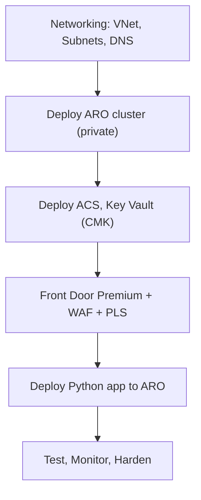

# Secure Telehealth Platform on Azure (Python + ARO)

---
## Slide 0 — Agenda (45 min)
1. Architecture (8 min) — patient/doctor flows, Azure components  
2. Security & Compliance (10 min) — HIPAA/HITRUST, ePHI safeguards  
3. Deployment (CLI/Bicep) (10 min) — automated provisioning  
4. Application Integration (7 min) — Python app, ACS SDK, Azure AD  
5. Operations & BCDR (6 min) — monitoring, DR, scaling  
6. Objections & Q&A (4 min) — legacy vs cloud concerns  

---
## Slide 1 — Why Secure Telehealth on Azure
- Enable virtual visits with **video, chat, scheduling**  
- Compliance: HIPAA, HITRUST, FHIR, ePHI protection  
- Traditional systems = slow, costly, fragile  
- Azure + ARO = **cloud-scale, secure, reliable**  

---
## Slide 2 — Terminology & Scope
- **ARO (Azure Red Hat OpenShift)**: managed OpenShift in Azure  
- **ACS**: Azure Communication Services (video, chat, SMS)  
- **Front Door Premium**: secure entry, WAF, Private Link  
- **Key Vault (CMK)**: secrets + encryption keys  
- **Entra ID (Azure AD)**: auth for patients, doctors, admins  
- **Scope**: U.S. regions only (HIPAA-compliant)  

---
## Slide 3 — Compliance Lens (HIPAA/HITRUST)
- HIPAA: encryption, access controls, audit trails  
- HITRUST CSF: leverage Azure’s certifications  
- Azure Policy HIPAA/HITRUST initiative for continuous audit  
- Shared responsibility: Azure infra + our app security  

---
## Slide 4 — Reference Architecture

```mermaid
flowchart LR
  User([Patient/Doctor]) --> FD[Azure Front Door Premium]
  FD --> WAF[WAF Policy]
  WAF --> PLS[Private Link Service → ARO Ingress]
  subgraph AROCluster["ARO Cluster (Private VNet)"]
    App[Telehealth App Pods (Python)] --> ACS[Azure Communication Services]
    App --> KV[Key Vault (Secrets, CMK)]
  end
  App --> DB[(Scheduling DB - Azure SQL/Postgres)]
  User -->|OAuth2| AAD[Azure AD (Entra ID)]
```

---
## Slide 5 — Deployment Flow



---
## Slide 6 — Application Integration
- Python Flask app containerized and deployed on ARO  
- Uses **ACS SDK** for video & chat calls  
- Issues ACS tokens via backend (short-lived, scoped)  
- Scheduling API: patient books, doctor confirms  
- Azure AD authentication (OIDC, MFA enforced)  
- Secrets from Key Vault via managed identity  

---
## Slide 7 — Security Controls Checklist
- **Identity**: Azure AD, RBAC, MFA, PIM  
- **Network**: private cluster, Private Link, NSGs  
- **Encryption**: TLS 1.2+, CMK in Key Vault, TDE for DB  
- **Monitoring**: Azure Monitor, Log Analytics, avoid PHI in logs  
- **Policy**: HIPAA/HITRUST initiative applied  

---
## Slide 8 — Performance & BCDR
- **Scale**: auto-scale pods & nodes, ACS scales globally  
- **HA**: multi-AZ ARO cluster, redundant Front Door POPs  
- **DR**: optional secondary region, DB geo-replication  
- **Backups**: Key Vault, DB PITR, Velero for cluster state  

---
## Slide 9 — Anticipated Objections
- “Cloud PHI risk” → HIPAA-eligible services, BAA in place  
- “Loss of control” → ARO = same OpenShift, but managed infra  
- “Performance” → Front Door + Azure backbone = low latency  
- “Cost” → scale down off-peak, pay-as-you-go, less capex  

---
## Slide 10 — Demo (Live)
1. Show ARO cluster (private, healthy) in portal  
2. Show ACS resource, Key Vault secret for ACS conn string  
3. Show Front Door WAF logs & private link connection  
4. Log in to app via Front Door URL, schedule appointment  
5. Launch video call between doctor & patient accounts  

---
## Slide 11 — Compliance Mapping Quick Ref
| Control | Implementation |
|---------|----------------|
| Access control | Azure AD, RBAC, PIM |
| Transmission security | TLS1.2+, Front Door, VPN/ER |
| Audit controls | Log Analytics, ARO audit, ACS logs |
| Data at rest | CMK via Key Vault, TDE on DB |
| Integrity | Azure SQL ACID, etcd encryption |

---
## Slide 12 — Conclusion
- Secure, compliant telehealth solution on Azure  
- Scalable, reliable, integrated with healthcare standards  
- IaC (Bicep/CLI) ensures repeatability & governance  
- Ready to pilot in U.S. healthcare environments  
