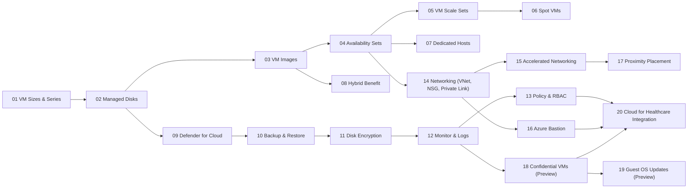

# Azure for Healthcare VM Workshop – Module Index

> [!IMPORTANT]  
> **HIPAA / HITRUST context:** Use **mock/test data only**. Treat all lab artifacts as **ePHI** for discipline. Enforce **least‑privilege RBAC**, **private access (no public SSH/RDP)**, **TLS 1.2+**, and **CMK** where indicated. **Log access and changes** for auditability.

This workshop is designed for **new computer engineers in healthcare** (providers and payors) with **zero prior Azure experience**. You’ll progress from **core VM fundamentals** to **hybrid** and **healthcare‑specific integrations**. Every module includes step‑by‑step labs, compliance callouts (HIPAA, HITRUST, **FHIR**, **DICOM**), and **working Bash/CLI scripts**.

---

## Quick Start

```bash
# 1) Configure environment
cp config/env.sample config/.env
code config/.env  # set AZ_SUBSCRIPTION_ID, AZ_RG, AZ_LOCATION, etc.

# 2) Prepare Azure prerequisites (providers, RG, VNet)
bash infra/00_prereqs.sh
bash infra/01_create_rg_vnet.sh
```

> [!TIP]  
> Work from **Windows + VS Code**. Use the **VS Code integrated terminal** or **Azure Cloud Shell (bash)**.  
> Recommended extensions are pre-configured in `.vscode/` (Azure CLI, Mermaid, Markdown, Bicep, Python, Docker).

---

## Learning Path (Recommended Order)



> [!CAUTION]  
> Some modules can incur extra cost (e.g., **Dedicated Hosts**, **Defender for Cloud standard**, **Log Analytics**, **Bastion**, **Confidential VM SKUs**). Use a **training** subscription and delete resources when finished:
> ```bash
> az group delete -n "$AZ_RG" --yes --no-wait
> ```

---

## Table of Modules

| # | Module | What you’ll learn | Core script(s) | Diagrams | Est. Time |
|---:|---|---|---|---|---|
| 1 | [Wide Range of VM Sizes & Series](<modules/Module01-Wide_Range_of_VM_Sizes_&_Series.md>) | Choose the right VM (Dv5/Ev5/Fsv5/NV) for EHR, PACS, analytics; deploy a baseline VM without public IP. | `infra/02_deploy_vm1.sh` | `assets/diagrams/module01_flow.mmd`, `assets/diagrams/module01_sequence.mmd` | ~40–60 min |
| 2 | [Managed Disks](<modules/Module02-Managed_Disks.md>) | Disk types (Std/Premium/Ultra), attach/format/mount, snapshots & resizing for DR. | `infra/03_managed_disk.sh` | `assets/diagrams/module02_flow.mmd`, `assets/diagrams/module02_sequence.mmd` | ~40–60 min |
| 3 | [Azure VM Images & Marketplace](<modules/Module03-Azure_VM_Images_&_Marketplace.md>) | Marketplace images, golden image strategy (CIS), and image versioning. | `infra/04_image_marketplace.sh` | `assets/diagrams/module03_flow.mmd`, `assets/diagrams/module03_sequence.mmd` | ~40–60 min |
| 4 | [VM Availability Sets](<modules/Module04-VM_Availability_Sets.md>) | Fault/update domains, intra‑region HA for clinic portals & APIs. | `infra/05_availability_set.sh` | `assets/diagrams/module04_flow.mmd`, `assets/diagrams/module04_sequence.mmd` | ~30–45 min |
| 5 | [VM Scale Sets](<modules/Module05-VM_Scale_Sets.md>) | Auto‑scaling frontends, health probes, upgrade strategies. | `infra/06_vm_scale_set.sh` | `assets/diagrams/module05_flow.mmd`, `assets/diagrams/module05_sequence.mmd` | ~45–75 min |
| 6 | [Azure Spot VMs](<modules/Module06-Azure_Spot_VMs.md>) | Low‑cost batch for de‑identified research; eviction‑aware design. | `infra/07_spot_vms.sh` | `assets/diagrams/module06_flow.mmd`, `assets/diagrams/module06_sequence.mmd` | ~30–45 min |
| 7 | [Azure Dedicated Hosts](<modules/Module07-Azure_Dedicated_Hosts.md>) | Single‑tenant isolation, host groups, audit evidence for isolation controls. | `infra/08_dedicated_host.sh` | `assets/diagrams/module07_flow.mmd`, `assets/diagrams/module07_sequence.mmd` | ~40–60 min |
| 8 | [Azure Hybrid Benefit](<modules/Module08-Azure_Hybrid_Benefit.md>) | Apply existing Windows/SQL licenses to save cost; eligibility & reporting. | *see module guide* | `assets/diagrams/module08_flow.mmd`, `assets/diagrams/module08_sequence.mmd` | ~25–40 min |
| 9 | [Azure Security Center Integration](<modules/Module09-Azure_Security_Center_Integration.md>) | Defender for Cloud posture, secure score, JIT access, compliance dashboard. | `infra/10_security_center.sh` | `assets/diagrams/module09_flow.mmd`, `assets/diagrams/module09_sequence.mmd` | ~40–60 min |
| 10 | [Azure Backup & Restore](<modules/Module10-Azure_Backup_&_Restore.md>) | Recovery Services Vault, policies, on‑demand backup and restore paths. | `infra/11_backup_vm.sh` | `assets/diagrams/module10_flow.mmd`, `assets/diagrams/module10_sequence.mmd` | ~45–75 min |
| 11 | [Azure Disk Encryption](<modules/Module11-Azure_Disk_Encryption.md>) | LUKS/BitLocker, CMK in Key Vault, Disk Encryption Set. | `infra/12_disk_encryption.sh` | `assets/diagrams/module11_flow.mmd`, `assets/diagrams/module11_sequence.mmd` | ~40–60 min |
| 12 | [Azure Monitor & Log Analytics](<modules/Module12-Azure_Monitor_&_Log_Analytics.md>) | VM insights, KQL for audit trails, alert rules and workbooks. | *see module guide* | `assets/diagrams/module12_flow.mmd`, `assets/diagrams/module12_sequence.mmd` | ~40–60 min |
| 13 | [Azure Policy & RBAC](<modules/Module13-Azure_Policy_&_RBAC.md>) | Deny open management ports, require encryption/tags, least‑privilege roles & PIM. | *see module guide* | `assets/diagrams/module13_flow.mmd`, `assets/diagrams/module13_sequence.mmd` | ~40–60 min |
| 14 | [VM Networking (VNet, NSG, Private Link)](<modules/Module14-VM_Networking_(VNET,_NSG,_Private_Link).md>) | Network isolation, NSGs, and Private Link to PaaS (e.g., FHIR/Storage). | `infra/14_networking.sh` | `assets/diagrams/module14_flow.mmd`, `assets/diagrams/module14_sequence.mmd` | ~45–75 min |
| 15 | [Accelerated Networking](<modules/Module15-Accelerated_Networking.md>) | SR‑IOV NICs, latency/jitter improvements for imaging and streaming. | `infra/15_accelerated_net.sh` | `assets/diagrams/module15_flow.mmd`, `assets/diagrams/module15_sequence.mmd` | ~25–40 min |
| 16 | [Azure Bastion](<modules/Module16-Azure_Bastion.md>) | Browser‑based SSH/RDP over SSL with no public IPs; session hygiene. | `infra/16_bastion.sh` | `assets/diagrams/module16_flow.mmd`, `assets/diagrams/module16_sequence.mmd` | ~30–45 min |
| 17 | [Proximity Placement Groups](<modules/Module17-Proximity_Placement_Groups.md>) | Co‑locate VMs to minimize latency between app and DB tiers. | `infra/18_ppg.sh` | `assets/diagrams/module17_flow.mmd`, `assets/diagrams/module17_sequence.mmd` | ~25–40 min |
| 18 | [Confidential VMs (Preview)](<modules/Module18-Confidential_VMs_(Preview).md>) | Data‑in‑use encryption (SEV‑SNP/TDX), attestation basics. | `infra/19_confidential_vm.sh` | `assets/diagrams/module18_flow.mmd`, `assets/diagrams/module18_sequence.mmd` | ~45–75 min |
| 19 | [VM Guest OS Updates (Preview)](<modules/Module19-VM_Guest_OS_Updates_(Preview).md>) | Automated patching windows, reboot orchestration, compliance evidence. | `infra/20_guest_patch.sh` | `assets/diagrams/module19_flow.mmd`, `assets/diagrams/module19_sequence.mmd` | ~30–45 min |
| 20 | [Integration with Microsoft Cloud for Healthcare](<modules/Module20-Integration_with_Microsoft_Cloud_for_Healthcare.md>) | Combine VM apps with **Azure Health Data Services (FHIR/DICOM)** and hybrid flows (VyOS VPN). | *see module guide* | `assets/diagrams/module20_flow.mmd`, `assets/diagrams/module20_sequence.mmd` | ~60–90 min |

> [!TIP]  
> Each module lists at least **three core features**, shows **module‑specific architecture and sequence diagrams**, and provides **CLI commands/scripts** you can run as‑is.

---

## Repository Layout (for reference)

```
Azure_for_Healthcare_VM_Workshop/
├─ README.md                    # This file (index + quick start)
├─ modules/                     # 20 module markdown guides + lab notes
├─ infra/                       # Bash scripts (Azure CLI) per module
├─ assets/
│  ├─ diagrams/                 # Mermaid .mmd flow/sequence per module
│  ├─ docs/                     # Supplemental PDFs/refs (optional)
│  └─ images/                   # Images embedded in modules
├─ app/
│  ├─ web/                      # PHP sample app (PostgreSQL-backed)
│  └─ ai/                       # Python AI demo (training only)
├─ scripts/                     # Mock ePHI generator, on‑prem helpers (VyOS, init)
├─ db/                          # Sample schema (FHIR/DICOM‑adjacent tables)
├─ config/                      # env.sample → .env for labs
└─ .vscode/                     # Editor settings + recommended extensions
```

---

## Compliance Focus by Module

- **Foundations (M01–M04):** Right‑sizing and intra‑region high availability directly support **Availability** for patient‑facing systems (EHR/portal).  
- **Scale & Cost (M05–M08):** Elastic capacity for clinician/portal peaks; **Dedicated Hosts** for isolation requirements; **Hybrid Benefit** for cost control of compliant stacks.  
- **Security & Resilience (M09–M11):** Posture management (**Defender for Cloud**), **backup/restore** (Contingency Plan), and **encryption at rest** with **CMK**.  
- **Observability & Governance (M12–M13):** **KQL** audit trails, alerts, and **Policy/RBAC** for preventative guardrails (e.g., deny public management ports, enforce encryption/tags).  
- **Network & Access (M14–M16):** **NSGs** and **Private Link** keep PHI off the internet; **Bastion** removes the need for public SSH/RDP.  
- **Advanced Compute (M17–M19):** **PPG** for low latency; **Confidential VMs** for data‑in‑use; **Guest OS Updates** for vulnerability management.  
- **Healthcare Integration (M20):** End‑to‑end pattern combining VM‑based apps with **AHDS (FHIR/DICOM)** and hybrid connectivity.

> [!IMPORTANT]  
> **FHIR/DICOM:** Use correct scopes/media types and **RBAC**. Prefer **Private Endpoints** and ensure changes are **logged** (audit trails).

---

## Common Tasks

- **Generate mock ePHI data:**  
  ```bash
  python3 scripts/generate_ephi_data.py
  ```
- **Run a module script:**  
  ```bash
  bash infra/02_deploy_vm1.sh     # replace with the module script you are working on
  ```
- **Clean up (delete lab resources):**  
  ```bash
  az group delete -n "$AZ_RG" --yes --no-wait
  ```

> [!CAUTION]  
> Never upload real PHI/PII into training environments. Keep secrets out of source (use **Key Vault/Managed Identity**). Avoid public IPs; prefer **Private Link** and **Bastion**.

---

## Troubleshooting

- **`az` not found**: Install Azure CLI or use **Azure Cloud Shell**.  
- **Insufficient privileges**: Ensure your user has **Owner** (or appropriate rights) on the subscription/resource group.  
- **SKU/Region availability**: Some SKUs (e.g., **Confidential VMs**, certain GPU sizes) may be unavailable in your region. Change `AZ_LOCATION` or pick supported sizes.  
- **Bastion/SSH issues**: Check **NSG** rules and ensure the VM has no conflicting deny rules.  
- **Private Link DNS**: Configure **Private DNS Zone** and link to the VNet; test name resolution from the VM.  
- **Policy propagation**: Policy effects may take time; re‑evaluate compliance and check activity logs.

---

## Lab Notes

Record observations and screenshots in `modules/lab-notes.md` for audit readiness (e.g., **before/after** of Policy assignments, **KQL** queries, **backup job IDs**, **attestation outputs** for Confidential VMs).

---

*End of README*
