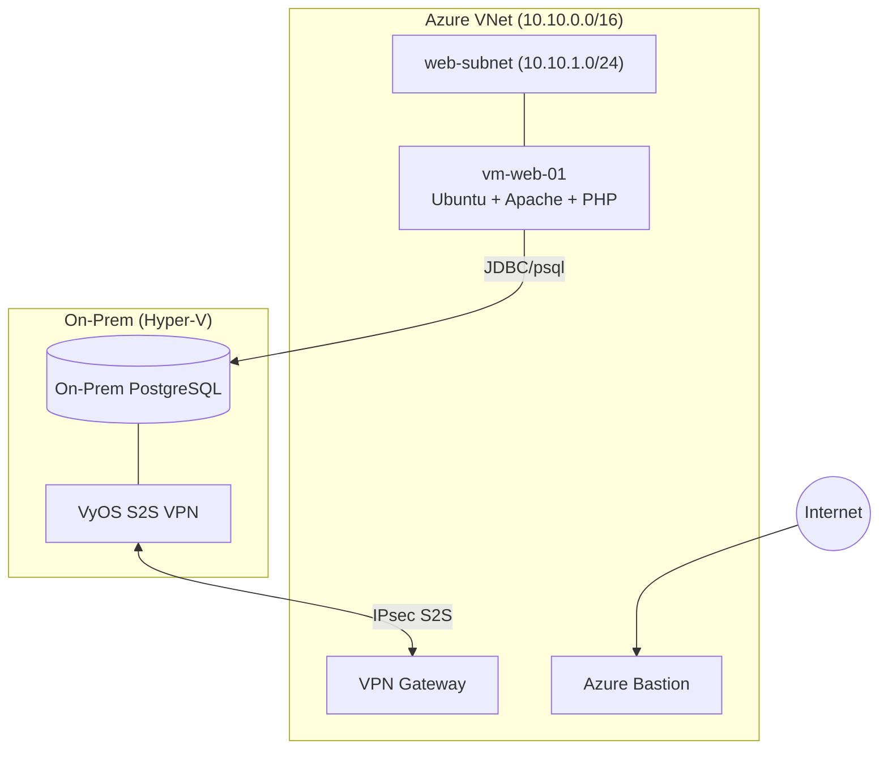
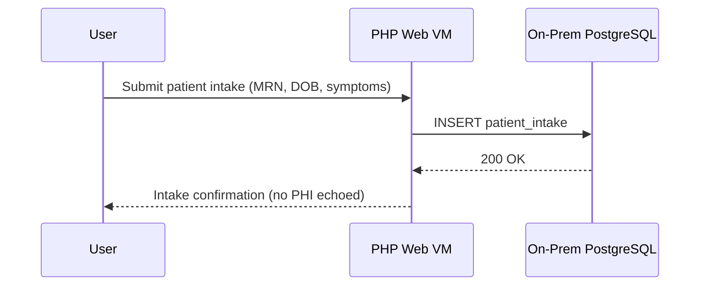

# Module 1 – Single VM Deployment (Patient Intake Web)

**Intent & Learning Objectives**  
Deploy a single Ubuntu VM that hosts a PHP-based *patient intake* web application. You will provision a VNet, subnet, NIC, and VM using Azure CLI, then verify end-to-end connectivity to a PostgreSQL database (on-prem via simulated VyOS S2S or a lab Postgres).  
You will learn: resource grouping, VNet/subnet basics, VM sizing, images, SSH auth, and cloud-init.

**Top 2 Problems/Features Solved**
1. **Rapid provisioning of a secure compute host** for a clinical web tier (patient registration/intake).
2. **Controlled network placement** (subnetting, NICs) to enforce segmentation aligned to HIPAA’s *transmission security* (§164.312(e)(1)).

> [!IMPORTANT]
> For training we use a public IP to simplify testing. For PHI, prefer **Azure Bastion**, **private endpoints**, and **WAF/Firewall**. Use TLS and never echo sensitive values in logs.

## Architecture

### Flowchat

### Sequence Diagram

## Step-by-Step
1. **Login & set subscription**
   ```bash
   az login
   az account set --subscription "<SUBSCRIPTION_ID>"
   ```
2. **Prepare environment**
   ```bash
   cp config/env.sample .env
   # Edit .env values (PREFIX, LOCATION, SSH key path, DB settings)
   ```
3. **Create network and VM**
   ```bash
   bash scripts/10_module1_single_vm.sh
   ```
4. **Deploy PHP app**
   Copy files from `app/web` to the VM (or host via cloud-init). Example:
   ```bash
   VMIP=$(az vm show -g ${PREFIX}-rg -n vm-web-01 -d --query publicIps -o tsv)
   scp -o StrictHostKeyChecking=no -r app/web/* ${ADMIN_USERNAME}@${VMIP}:/var/www/html/
   ```
5. **Initialize database (lab)**  
   On your on-prem PostgreSQL (or lab DB):
   ```bash
   psql -h $DB_HOST -U $DB_USER -d $DB_NAME -f db/schema.sql
   psql -h $DB_HOST -U $DB_USER -d $DB_NAME -f db/seed.sql
   ```
6. **Test**
   - Browse `http://$VMIP` and submit the intake form (synthetic data only).
   - Verify rows in `health.intake_forms`.

### Core Features Demonstrated
- Azure VM creation via CLI (image, size, SSH).
- NIC/VNet/Subnet placement.
- Bootstrapping with cloud-init.

### Pros/Cons (Commentary)
- **Pros**: Fast, simple; full control of OS; good for lift-and-shift.  
- **Cons**: Single point of failure; manual scaling; public exposure risks if misconfigured.

> [!CAUTION]
> Never store real PHI in training environments. Disable public IPs and require Bastion/Private access outside the lab.

> [!TIP]
> Tag resources (`--tags owner=training module=1`) to help with cost tracking and cleanup.
