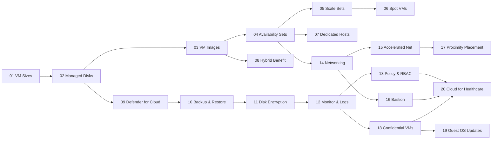

# Azure for Healthcare VM Workshop – Module Index

> [!IMPORTANT]
> **HIPAA Context:** Treat all lab data as ePHI. Use test data only. Follow minimum-necessary access and least-privilege RBAC.

## Quick Start
```bash
cp config/env.sample config/.env
code config/.env      # fill in your values
bash infra/00_prereqs.sh
bash infra/01_create_rg_vnet.sh
bash infra/02_deploy_vm1.sh
```

## Module Progression (Recommended Order)


## Table of Modules
See the `/modules` directory for all 20 modules. Each module contains:
- **Top two problems/features** it solves for healthcare.
- **Intent & Objectives** aligned to HIPAA/HITRUST and healthcare nomenclature (PHI/ePHI, FHIR, DICOM).
- **Step-by-step** Bash/Azure CLI labs (Cloud Shell or VS Code).
- **Mermaid** flow and sequence diagrams (also stored in `assets/diagrams`).
- **Pros/Cons/Tips/Cautions**.
- Cross-links to scripts in `/infra`, configs in `/config`, schemas in `/db`, and sample **PHP**/**Python** apps under `/app`.

## On-Prem Lab Tie-in (Hyper-V + VyOS)
- Configure S2S VPN using `scripts/onprem_vyos_ipsec_config.txt` (Module 14).
- Initialize on-prem services: `scripts/onprem_postgres_init.sh`, `scripts/onprem_apache_init.sh`, `scripts/onprem_ai_server_init.sh`.
- Generate **synthetic ePHI**: `python3 scripts/generate_ephi_data.py` after loading `db/schema.sql`.

> [!TIP]
> Capture screenshots and command outputs after each module to build your audit evidence package in `assets/docs/lab-notes.md`.
