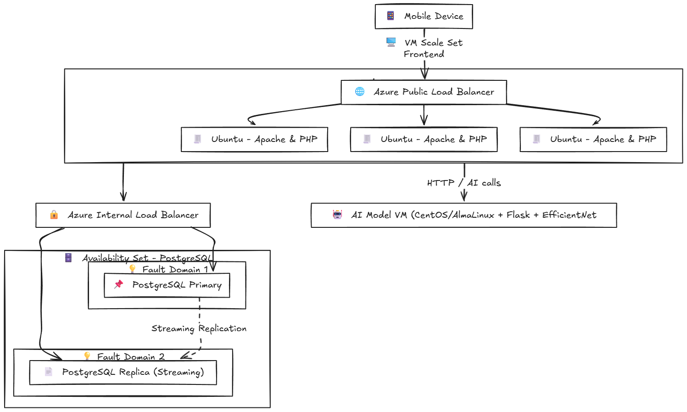

# Azure Web + AI Image Processing — GitHub Repo (VS Code Training)

This repository is designed for **students using Visual Studio Code**. It contains:
- **Infrastructure scripts** (Azure CLI) to create networking, VMSS web tier, PostgreSQL HA, and AI VM.
- **Application files** split into folders (PHP web app, AI Flask app, systemd, DB schema).
- **VS Code configuration** with recommended extensions and tasks.

> Students will clone this repo locally, run infra scripts from the VS Code terminal, and then push updates as needed. The web tier can pull the latest `app/web` from this repo using a GitHub ZIP URL.

---

## 📐 Architecture (Mermaid)



---

## 🧰 Requirements

- Azure subscription & **Azure CLI** (`az login`)
- Visual Studio Code with:
  - **Remote - SSH** (ms-vscode-remote.remote-ssh)
  - **Azure CLI Tools** (ms-vscode.azurecli) — optional
- SSH key available on your machine

---

## 🗂 Project Structure

```
config/
  env.sh                  # Environment variables you edit once
infra/
  10-network.sh           # VNet, Subnets, NSGs
  20-vmss-web.sh          # Web VMSS creation + Apache/PHP install
  25-web-update.sh        # Push app/web to all VMSS instances via GitHub ZIP URL
  25-web-update-from-this-repo.sh  # Helper to compute your repo ZIP URL from 'git remote'
  30-postgres.sh          # Create Postgres VMs (Availability Set)
  40-ai-vm.sh             # Create AI VM
scripts/
  db-setup.sh             # Run on PG VMs (primary/replica) via SSH
  ai-setup.sh             # Run on AI VM via SSH
app/
  web/                    # PHP webapp
    index.php
    upload.php
    view_images.php
  ai/
    ai_model.py           # Flask app (top-3 predictions + confidence)
systemd/
  ai_model.service        # systemd unit for Flask app
db/
  schema.sql              # images table
.vscode/
  extensions.json         # Recommended VS Code extensions
  tasks.json              # Ready-made tasks to run infra scripts
```

---

## 🚀 Quick Start (VS Code)

1. **Clone this repo** (your instructor will provide the GitHub URL):
   ```bash
   git clone https://github.com/<ORG>/<REPO>.git
   cd <REPO>
   ```

2. **Open in VS Code**: `code .` and accept recommended extensions.

3. **Configure variables**:
   ```bash
   source config/env.sh
   ```

4. **Provision network + security**:
   ```bash
   bash infra/10-network.sh
   ```

5. **Provision web VM Scale Set** (installs Apache/PHP on all instances):
   ```bash
   bash infra/20-vmss-web.sh
   ```

6. **Provision PostgreSQL VMs** (Availability Set):
   ```bash
   bash infra/30-postgres.sh
   ```

7. **Provision AI VM**:
   ```bash
   bash infra/40-ai-vm.sh
   ```

8. **Configure PostgreSQL** (from VS Code Remote SSH):
   ```bash
   # Primary VM:
   scp db/schema.sql $ADMIN_USER@$PG_PRIMARY_PUBLIC_IP:~/schema.sql
   scp scripts/db-setup.sh $ADMIN_USER@$PG_PRIMARY_PUBLIC_IP:~/db-setup.sh
   ssh $ADMIN_USER@$PG_PRIMARY_PUBLIC_IP 'sudo bash ~/db-setup.sh primary'

   # Replica VM:
   scp scripts/db-setup.sh $ADMIN_USER@$PG_REPLICA_PUBLIC_IP:~/db-setup.sh
   ssh $ADMIN_USER@$PG_REPLICA_PUBLIC_IP "sudo bash ~/db-setup.sh replica $PG_PRIMARY_PRIVATE_IP"
   ```

9. **Configure AI VM** (from VS Code Remote SSH):
   ```bash
   scp app/ai/ai_model.py systemd/ai_model.service $ADMIN_USER@$AI_PUBLIC_IP:~/
   scp scripts/ai-setup.sh $ADMIN_USER@$AI_PUBLIC_IP:~/ai-setup.sh
   ssh $ADMIN_USER@$AI_PUBLIC_IP "sudo bash ~/ai-setup.sh"
   ```

10. **Deploy web PHP files to all VMSS instances**:
    - Option A (explicit URL): Edit `config/env.sh` and set `REPO_ZIP_URL` to this repo’s public ZIP URL (e.g. `https://codeload.github.com/<ORG>/<REPO>/zip/refs/heads/main`), then:
      ```bash
      bash infra/25-web-update.sh
      ```
    - Option B (auto-detect from this repo):  
      ```bash
      bash infra/25-web-update-from-this-repo.sh
      ```

11. **Wire app with real IPs** (replace placeholders in PHP files across VMSS):
    ```bash
    source config/env.sh
    PGP_IP=$(az vm list-ip-addresses -g "$RG" -n "$PG_PRIMARY" --query "[0].virtualMachine.network.privateIpAddresses[0]" -o tsv)
    AI_IP=$(az vm list-ip-addresses -g "$RG" -n "$AI_VM_NAME" --query "[0].virtualMachine.network.privateIpAddresses[0]" -o tsv)

    az vmss run-command invoke -g "$RG" -n "$VMSS_NAME" --command-id RunShellScript --scripts "
    sudo sed -i 's/<DB_PRIVATE_IP>/$PGP_IP/g' /var/www/html/upload.php /var/www/html/view_images.php
    sudo sed -i 's/<AI_PRIVATE_IP>/$AI_IP/g' /var/www/html/upload.php
    sudo systemctl restart apache2
    "
    ```

12. **Test**:
    ```bash
    WEB_PUBLIC_IP=$(az network public-ip list -g "$RG" --query "[?contains(name,'lbPublicIP')].ipAddress | [0]" -o tsv)
    echo "Open: http://$WEB_PUBLIC_IP"
    ```

> **Private repo note:** VMSS instances won’t be able to download a private ZIP without credentials. Use a public repo for training or push `app/web` via `scp`/VS Code Remote SSH instead.

---

## 🧹 Cleanup

```bash
az group delete -n "$RG" --yes --no-wait
```