# Azure Web + AI Image Processing Project using Azure VM's

This guide walks students through deploying a full-stack solution on Azure using Azure Virtual Machines and realted VM capabilites. It includes a scalable PHP-based web front end, a PostgreSQL backend with high availability, and an AI image analysis server.

---

## 📐 Architecture Overview

```mermaid
flowchart TD
    %% Mobile Client
    Mobile["📱  Mobile Device "] --> PublicLB["🌐  Azure Public Load Balancer "]

    %% Front-end Webservers VMSS
    subgraph FrontEndVMSS["🖥️  VM Scale Set Frontend"]
        direction TB
        PublicLB --> VM1["🧾  Ubuntu - Apache & PHP"]
        PublicLB --> VM2["🧾  Ubuntu - Apache & PHP"]
        PublicLB --> VM3["🧾  Ubuntu - Apache & PHP"]
    end

    %% Internal Load Balancer to Database
    FrontEndVMSS --> InternalLB["🔒  Azure Internal Load Balancer "]

    %% PostgreSQL Availability Set with Replication
    subgraph PGSet["🗄️  Availability Set - PostgreSQL "]
        direction LR
        subgraph FaultDomain1["💡 Fault Domain 1"]
            VMPrimary["📌  PostgreSQL Primary"]
        end
        subgraph FaultDomain2["💡 Fault Domain 2"]
            VMReplica["📄  PostgreSQL Replica (Streaming)"]
        end
    end

    InternalLB --> VMPrimary
    InternalLB --> VMReplica

    %% AI Model Server
    FrontEndVMSS --> AIModel["🤖  AI Model VM (CentOS / AlmaLinux)"]

    %% Data Flow
    VMPrimary -.->|Streaming Replication| VMReplica
```



---

## 🧰 Prerequisites

- Azure CLI installed (`az login`)
- SSH key pair (auto-generated or existing)
- Familiarity with basic Linux and Azure concepts

---

## 1️⃣ Create Resource Group

```bash
az group create --name WebAIResourceGroup --location westus3
```

---

## 2️⃣ Deploy VM Scale Set (Apache + PHP)

Create `cloud-init.txt`:

```bash
#cloud-config
package_update: true
packages:
  - apache2
  - php
  - php-pgsql
  - libapache2-mod-php
runcmd:
  - systemctl enable apache2
  - systemctl restart apache2
```

Deploy:

```bash
az vmss create   --resource-group WebAIResourceGroup   --name ApacheScaleSet   --image Ubuntu2204   --upgrade-policy-mode automatic   --admin-username azureuser   --generate-ssh-keys   --instance-count 3   --vm-sku Standard_DS2_v2   --custom-data cloud-init.txt
```

---

## 3️⃣ Create Availability Set for PostgreSQL

```bash
az vm availability-set create   --resource-group WebAIResourceGroup   --name PGAvailabilitySet   --platform-fault-domain-count 2   --platform-update-domain-count 2
```

---

## 4️⃣ PostgreSQL VMs Setup

### Primary Init Script (`pg-cloud-init-1.txt`)

```bash
#cloud-config
package_update: true
packages:
  - postgresql
  - postgresql-contrib
write_files:
  - path: /etc/postgresql/14/main/postgresql.conf
    content: |
      listen_addresses = '*'
      wal_level = replica
      max_wal_senders = 3
      hot_standby = on
  - path: /etc/postgresql/14/main/pg_hba.conf
    content: |
      host all all 0.0.0.0/0 md5
      host replication replicator <REPLICA_VM_IP>/32 md5
runcmd:
  - sudo -u postgres psql -c "CREATE ROLE replicator REPLICATION LOGIN ENCRYPTED PASSWORD 'replicatorpass';"
  - sudo -u postgres psql -c "CREATE DATABASE imagedb;"
  - systemctl restart postgresql
```

### Replica Init Script (`pg-cloud-init-2.txt`)

```bash
#cloud-config
package_update: true
packages:
  - postgresql
  - postgresql-contrib
runcmd:
  - systemctl stop postgresql
  - rm -rf /var/lib/postgresql/14/main/*
  - sudo -u postgres pg_basebackup -h <PRIMARY_VM_IP> -D /var/lib/postgresql/14/main -U replicator -P -v --wal-method=stream
  - chown -R postgres:postgres /var/lib/postgresql/14/main
  - systemctl start postgresql
```

### Deploy both VMs

```bash
for i in 1 2; do
az vm create   --resource-group WebAIResourceGroup   --name PGServer$i   --image Ubuntu2204   --availability-set PGAvailabilitySet   --admin-username azureuser   --generate-ssh-keys   --custom-data pg-cloud-init-$i.txt
done
```

---

## 5️⃣ AI Model Server Deployment

### AI Init Script (`ai-cloud-init.txt`)

```bash
#!/bin/bash
dnf update -y
dnf install python39 python39-pip -y
pip3 install tensorflow flask pillow efficientnet
```

### Create AI VM

```bash
az vm create   --resource-group WebAIResourceGroup   --name AIModelVM   --image OpenLogic:CentOS:8_5-gen2:latest   --admin-username azureuser   --generate-ssh-keys   --vm-sku Standard_NC6   --custom-data ai-cloud-init.txt
```

### AI Flask App (`ai_model.py`)

```python
from flask import Flask, request, jsonify
from PIL import Image
import efficientnet.tfkeras as efn
import tensorflow as tf
import numpy as np

app = Flask(__name__)
model = efn.EfficientNetB0(weights='imagenet')

@app.route('/analyze', methods=['POST'])
def analyze_image():
    image = request.files['image']
    img = Image.open(image.stream).resize((224, 224))
    img_array = np.expand_dims(np.array(img), axis=0)
    preds = model.predict(img_array)
    decoded_preds = tf.keras.applications.imagenet_utils.decode_predictions(preds)
    return jsonify({"prediction": decoded_preds[0][0][1]})

app.run(host='0.0.0.0', port=5000)
```

---

## 6️⃣ PHP Frontend Code

### index.php

```php
<html>
<body>
<form action="upload.php" method="post" enctype="multipart/form-data">
    Select image to upload:
    <input type="file" name="image">
    <input type="submit" value="Upload">
</form>
</body>
</html>
```

### upload.php

```php
<?php
if ($_FILES['image']['error'] == 0) {
    $image = file_get_contents($_FILES['image']['tmp_name']);
    $conn = pg_connect("host=PGServer1 dbname=imagedb user=postgres password=YourPassword");
    $escaped_image = pg_escape_bytea($image);
    pg_query($conn, "INSERT INTO images (img_data) VALUES ('$escaped_image')");

    $curl = curl_init();
    curl_setopt_array($curl, [
        CURLOPT_URL => "http://AIModelVM:5000/analyze",
        CURLOPT_POST => true,
        CURLOPT_POSTFIELDS => ['image' => new CURLFILE($_FILES['image']['tmp_name'])],
        CURLOPT_RETURNTRANSFER => true
    ]);
    $response = curl_exec($curl);
    curl_close($curl);

    echo "Analyzed Result: " . $response;
} else {
    echo "Upload failed.";
}
?>
```

### view_images.php

```php
<?php
$conn = pg_connect("host=PGServer1 dbname=imagedb user=postgres password=YourPassword");
$result = pg_query($conn, "SELECT img_data FROM images");
while ($row = pg_fetch_assoc($result)) {
    echo '<br />';
}
?>
```

---

## 🧹 Optional: Clean Up Resources

```bash
az group delete --name WebAIResourceGroup --yes --no-wait
```

---

## ✅ Summary

This solution demonstrates:

- Azure VM Scale Sets and Load Balancing
- High-Availability PostgreSQL with streaming replication
- AI image recognition using EfficientNet
- End-to-end PHP-based web frontend with image handling

> Upload an image → Stored in DB → Analyzed by AI → Result returned to user.

Happy Building! 🚀