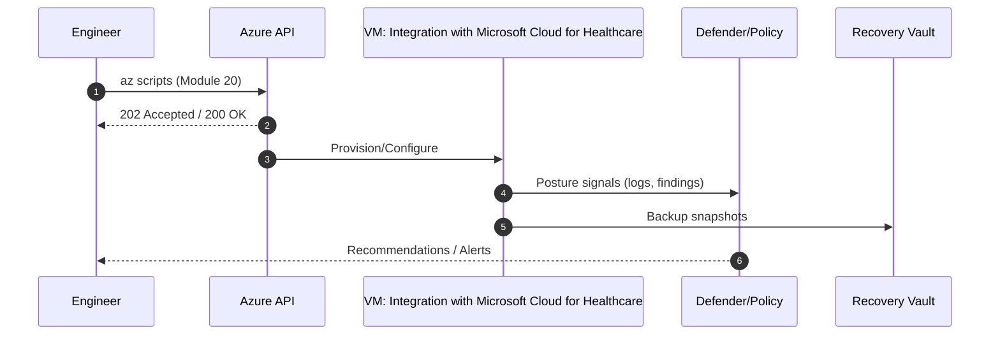

# Module 20: Integration with Microsoft Cloud for Healthcare

**Top Problems / Features Addressed**
- Combine VMs with Azure Health Data Services
- Azure API for FHIR integration

> [!IMPORTANT]
> Use *synthetic* data only. Follow HIPAA/HITRUST: least-privilege RBAC, encrypt data at rest and in transit.

## Intent & Learning Objectives
This module introduces **Integration with Microsoft Cloud for Healthcare** in the context of healthcare provider/payor workloads. You will:
- Understand healthcare-aligned use cases (e.g., EHR front-end, imaging pipeline, claims adjudication, HL7/FHIR gateway).
- Deploy and validate the feature using Azure CLI.
- Map the feature to **HIPAA** safeguards and **HITRUST CSF** controls (high level).

## Key Features Demonstrated
- Combine VMs with Azure Health Data Services
- Azure API for FHIR integration
- DICOM service ingestion path
- Hybrid flows via VyOS VPN

## Architecture Diagram – Integration with Microsoft Cloud for Healthcare
```mermaid
%% assets/diagrams/module20_flow.mmd
flowchart TB
  subgraph Azure["Azure Subscription"]
    RG["Resource Group"]
    VNET["VNet + Subnets"]
    VM["VM(s): Integration with Microsoft Cloud for Healthcare"]
  end
  subgraph OnPrem["On-Prem (Optional)"]
    VyOS["VyOS VPN"]
    DB["PostgreSQL"]
    Web["Apache/PHP"]
  end
  OnPrem <-->|IPsec (Module 14)| Azure
  Internet -->|Bastion/Private Link| VM
  VM -->|Logs| LA[(Log Analytics)]
  VM -->|Backup| RSV[(Recovery Vault)]

```


## Step-by-Step Lab
**Start here (zero Azure experience assumed):**
1. Open **VS Code** and a **Bash** terminal (or use **Azure Cloud Shell**).
2. Clone this repo and set environment:
   ```bash
   cp config/env.sample config/.env
   code config/.env  # set your values
   bash infra/00_prereqs.sh
   bash infra/01_create_rg_vnet.sh
   ```

3. Apply this module’s configuration:
   ```bash
   echo 'Deploy Azure API for FHIR and connect VM-based services; see module steps'
   ```

4. Validate results:
   - Verify resource creation with `az ... show` commands.
   - Confirm RBAC: ensure your user has only necessary roles.
   - Confirm encryption (where applicable), private access (NSG/Private Link), and logging.

> [!CAUTION]
> Do not expose management ports (SSH/RDP) on public IPs. Use **Azure Bastion** (Module 16) or Private access.

> [!TIP]
> Document changes in `assets/docs/lab-notes.md` with screenshots for audit readiness. Consider tagging resources (e.g., `env=lab`, `data=nonprod-ephi`).

## Healthcare Mapping (Compliance & Nomenclature)
- **PHI/ePHI**: Treat all stored/processed data as sensitive test data.
- **Standards**: Reference **HIPAA 164.308/310/312**, **HITRUST** control families; use **TLS 1.2+**; align with **NIST SP 800-53** where possible.
- **Interoperability**: Position with **FHIR**/HL7 gateways and **DICOM** imaging stores (as applicable).

## Pros, Cons & Insights
**Pros**
- Improves patient safety and clinician experience by ensuring performance/availability.
- Provides guardrails for continuous compliance.

**Cons**
- Additional cost and complexity (e.g., dedicated hosts, confidential compute SKUs).
- Region/SKU availability constraints for advanced features.

**Insights**
- Combine with **Azure Policy** to enforce encryption/NSG rules.
- Use **Log Analytics** to retain audit trails for investigations.

---
