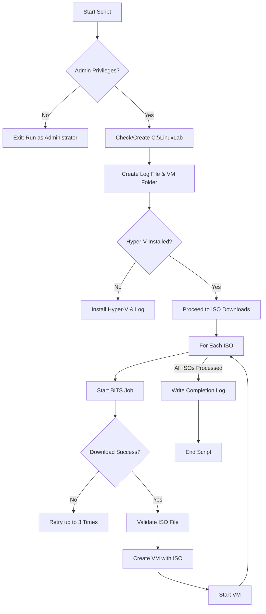
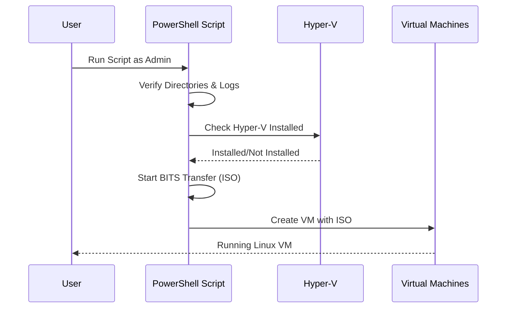

# Module 01: Linux Lab Builder with PowerShell & Hyper-V

**Intent & Learning Objectives:**  
This module explains **automated creation of a Linux Lab environment on Windows using PowerShell and Hyper-V.**  
By the end, you will:  
- Understand the core concepts and **three key features** of the automation script.  
- Configure Hyper-V and manage ISO downloads via **PowerShell**.  
- Automatically build and start Linux virtual machines for lab usage.

**Top Two Problems / Features**  
1. **Problem/Feature A:** Ensure consistent lab setup with logging and retry mechanisms for ISO downloads.  
2. **Problem/Feature B:** Automate Hyper-V VM provisioning with pre-configured CPU, memory, and storage.

> [!IMPORTANT]  
> Treat all downloaded ISOs as **lab-only media**. Use only in test environments. Apply least-privilege access to Hyper-V and log directories.

**Architecture Diagram**  
See: `assets/diagrams/LinuxLab_flow.mmd` and `assets/diagrams/LinuxLab_sequence.mmd`.





## Step-by-Step Lab

1. **Prepare environment**  
   Open PowerShell as Administrator:
   ```powershell
   Set-ExecutionPolicy RemoteSigned -Scope CurrentUser
   ```

2. **Run the Script**  
   ```powershell
   .\LinuxLabBuilder.ps1
   ```

3. **Monitor ISO Downloads**  
   Logs are written to:
   ```text
   C:\LinuxLab\LinuxLabBuilder.txt
   ```

4. **Verify VM Creation**  
   Use Hyper-V Manager or PowerShell:
   ```powershell
   Get-VM
   ```

5. **(Optional) Manual ISO Replacement**  
   If a download fails after 3 retries, manually place the ISO into `C:\LinuxLab`.

> [!CAUTION]  
> Verify that Hyper-V is supported on your system (Windows 10/11 Pro, Enterprise, or Server editions). Restart required after Hyper-V installation.

## Pros, Cons & Insights
**Pros:** Automates environment setup, reproducible VMs, centralized logging.  
**Cons:** Requires Windows with Hyper-V support, BITS jobs may fail on poor connections.  
**Insights:** Extendable—students can add more ISOs or customize VM parameters.

## Compliance Notes
- **Lab Use Only:** This module is not for production.  
- **Auditability:** Logs all events into `LinuxLabBuilder.txt`.  
- **Security:** Run scripts with least-privilege where possible.  

> [!TIP]  
> Commit your script and diagrams to source control and track changes like any production Infrastructure-as-Code (IaC).
