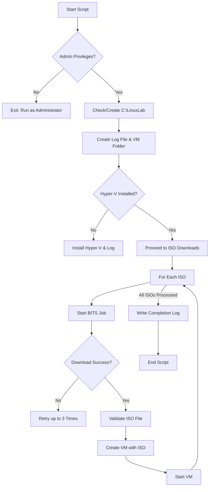

# Training Module: Automated Linux Lab Builder with PowerShell and Hyper-V

## 📌 Overview
This training module demonstrates how to use PowerShell to **automate the creation of a Linux Lab environment** on Windows using **Hyper-V**.  

The script performs the following high-level tasks:
1. **Privilege Verification** – Ensures the script runs with administrator rights.  
2. **Folder & Log Setup** – Creates required directories and log files for lab tracking.  
3. **Hyper-V Validation & Installation** – Confirms if Hyper-V is installed, and installs it if not.  
4. **ISO Downloads with BITS** – Uses Background Intelligent Transfer Service (BITS) to download Linux distribution ISOs.  
5. **Retry Logic & Validation** – Ensures each ISO exists, retries failed downloads up to 3 times.  
6. **VM Creation & Boot** – Builds Hyper-V VMs from downloaded ISOs with preset configurations.  
7. **Logging** – Writes status updates to a log file (`LinuxLabBuilder.txt`) for traceability.  

---

## ⚙️ Script Functionality Breakdown

### 1. Privilege Check
- Verifies the script is running with **Administrator privileges**.
- If not, the script **exits immediately** with a warning.

### 2. Directory & Log Preparation
- Creates a **root folder (`C:\LinuxLab`)** if missing.  
- Initializes a **log file (`LinuxLabBuilder.txt`)**.  
- Ensures a **VM storage folder (`C:\LinuxLab\VMFiles`)** exists.  

### 3. Logging Function
- Custom function `Write-Log` captures:
  - Timestamped messages.  
  - Script progress and errors.  
- Helps students **trace every step** and debug issues.

### 4. Hyper-V Management
- Confirms if **Hyper-V** is already installed.  
- If not installed, script enables it using:  
  ```powershell
  Enable-WindowsOptionalFeature -Online -FeatureName Microsoft-Hyper-V-All -All -NoRestart
  ```
- Requires a **restart** if newly installed.

### 5. ISO Download Management
- Maintains a list of **Linux distributions** to download:
  - CentOS Stream 10  
  - Ubuntu 18.04  
  - Rocky Linux 10  
  - openSUSE Leap 15.6  
  - AlmaLinux 10  
  - Fedora 42  
  - CentOS 7 (EOL archive)  
- Each ISO is downloaded using **BITS jobs**, with automatic retries.

### 6. Virtual Machine Creation
- Creates Hyper-V VMs automatically for each ISO:
  - **2 vCPUs**
  - **2 GB RAM**
  - **60 GB VHD**
  - **DVD boot from ISO**
- Starts the VM after creation.  

### 7. Final Output
- Once all ISOs are processed:
  - Confirms completion in console.  
  - Logs **“All BITS jobs completed, ISOs validated, and VMs created.”**  

---

## 📊 Workflow Diagram



---

## 🎓 Learning Objectives
By the end of this module, students will:
- Understand **automation with PowerShell** for virtualization tasks.  
- Gain experience with **BITS transfers for large file downloads**.  
- Learn how to **validate and retry downloads programmatically**.  
- Deploy multiple **Linux VMs automatically in Hyper-V**.  
- Interpret log files for **debugging automation scripts**. 