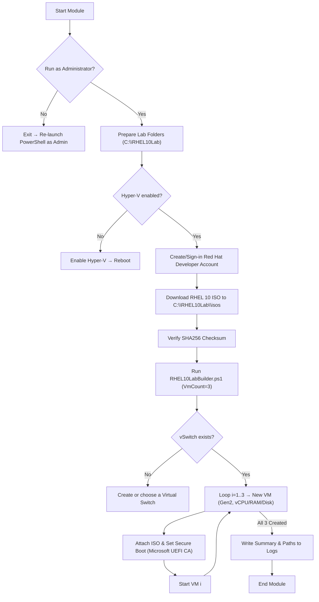
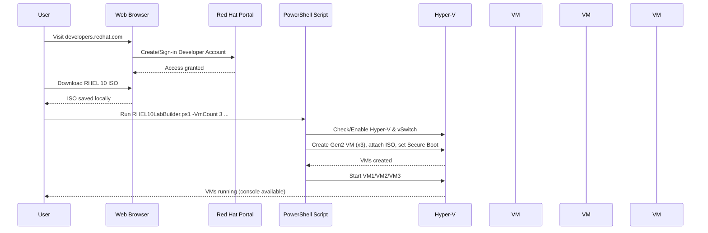

# Module 02: RHEL 10 Triple‑VM Lab Builder (PowerShell & Hyper‑V)

**Intent & Learning Objectives:**  
This module explains **automated creation of three Red Hat Enterprise Linux 10 (RHEL 10) virtual machines on Windows using PowerShell and Hyper‑V.**  
By the end, you will:  
- Understand the core concepts and **three key features** of the provisioning script.  
- Create a **Red Hat Developer** account and download the **RHEL 10 ISO** to your local machine.  
- Automatically build and start **three** RHEL 10 VMs for lab use.

**Estimated time:** 45–60 minutes (download time varies).

**Top Two Problems / Features**  
1. **Problem/Feature A:** Repeatable, consistent lab setup with idempotent scripting and logging.  
2. **Problem/Feature B:** Automated Hyper‑V provisioning (Gen 2, Secure Boot, CPU/RAM/disk) for **three** RHEL 10 VMs.

> [!IMPORTANT]  
> - Use the **Red Hat Developer** subscription **for non‑production use only** and follow the subscription terms.  
> - Do **not** redistribute ISOs. Keep ISOs **local** to your lab workstation unless your license permits otherwise.  
> - Apply least‑privilege permissions to script/log folders and Hyper‑V resources.

**Architecture Diagram**  
See: `assets/diagrams/RHEL10Lab_flow.mmd` and `assets/diagrams/RHEL10Lab_sequence.mmd`.





## Step‑by‑Step Lab

### 0) Prerequisites (Windows Host)
- **OS:** Windows 10/11 Pro/Enterprise (or Windows Server) with **Hyper‑V** support.  
- **Hardware:** Virtualization enabled in BIOS/UEFI; ≥ 12 GB free RAM recommended; ≥ 200 GB free disk (for 3× 64 GB VHDX + overhead).  
- **Permissions:** Local administrator on the machine.  
- **Networking:** Internet access to sign in and download the ISO.

Open **PowerShell as Administrator** and set the execution policy for this session:
```powershell
Set-ExecutionPolicy -Scope Process -ExecutionPolicy Bypass -Force
```

If Hyper‑V is not enabled, turn it on and reboot:
```powershell
Enable-WindowsOptionalFeature -Online -FeatureName Microsoft-Hyper-V -All
# After this completes, restart the computer.
```

### 1) Create a Red Hat Developer Account
1. In your browser, go to **developers.redhat.com**.  
2. Select **Register** (or **Sign in** if you already have an account).  
3. Complete registration (email verification) and accept the **Developer Subscription** terms (no‑cost, **non‑production** use).  
4. After sign‑in, confirm you can access the **Downloads** section and view **RHEL** downloads.

> [!CAUTION]  
> The Red Hat Developer subscription is for **individual, non‑production** use. Always review current terms on Red Hat’s site before downloading or using software for labs.

### 2) Download the RHEL 10 ISO Locally
1. From your Red Hat account, navigate to **Product Downloads → Red Hat Enterprise Linux → Version 10**.  
2. Choose the **Binary DVD ISO** (full install) for **x86_64**.  
3. Download the ISO to **`C:\LinuxLab`** (create the folder if it doesn’t exist).  

### 3) Run the Supplied PowerShell Script **`Mod02_RHEL10LabBuilder.ps1`**.

**Verify VMs:**
```powershell
Get-VM RHEL10* | Format-Table Name, State, CPUUsage, MemoryAssigned
# Optional: open a console
vmconnect.exe localhost "RHEL10-01"
```

### 5) Install RHEL 10 in Each VM
1. In the VM console, boot from the attached ISO and proceed with the graphical installer.  
2. Allocate storage on the VHDX (automatic partitioning is fine for labs).  
3. Create a local user and set a root password (store securely).  
4. Complete installation, then reboot into the installed OS.  
5. Repeat for all **three** VMs.

(Optional) Register each VM to obtain updates via the Developer subscription:
```bash
# inside each VM after first boot
sudo subscription-manager register
sudo subscription-manager attach --auto
sudo dnf update -y
```

### 6) Post‑Install Checks
From the host:
```powershell
Get-VMNetworkAdapter RHEL10* | Select-Object VMName, SwitchName, IPAddresses
```
Inside each VM:
```bash
hostnamectl
ip a
sudo dnf repolist
```

> [!TIP]  
> If Secure Boot prevents booting, set the VM to **Microsoft UEFI Certificate Authority** (recommended for RHEL) or temporarily disable Secure Boot for installation.

## Troubleshooting

- **Script requires Admin:** Re‑launch **PowerShell as Administrator**.  
- **Hyper‑V missing:** Enable with `Enable-WindowsOptionalFeature -Online -FeatureName Microsoft-Hyper-V -All` and **reboot**.  
- **ISO path not found:** Ensure the path and filename match. Avoid network paths for licensed media.  
- **No virtual switch:** Create one in Hyper‑V Manager (**Virtual Switch Manager**) or specify a different `-SwitchName`.  
- **Black screen/boot fail:** Use Secure Boot template `"MicrosoftUEFICertificateAuthority"` or disable Secure Boot.  
- **Insufficient resources:** Reduce `-CpuCount`/`-MemoryStartupBytes` or free disk space.  
- **Checksum mismatch:** Re‑download ISO and re‑run the hash check.

## Pros, Cons & Insights
**Pros:** Fast, repeatable lab setup; centralized logging; clean separation of ISO/VM/VHD paths.  
**Cons:** Requires Windows with Hyper‑V; RHEL ISO download gated by login; manual OS install per VM.  
**Insights:** Add a **Kickstart** file later for fully unattended installs; parameterize networking (static IPs, VLANs) for advanced labs.

## Compliance Notes
- **Non‑production only** under the Red Hat Developer subscription.  
- **No redistribution** of media; store ISOs according to license terms.  
- Log file (if configured) records actions for audit and troubleshooting.

> [!TIP]  
> Commit your script and these diagrams to source control like any IaC project.
